---
search:
  boost: 10.0
---

# Class: RS 


_Concept representing Country of Serbia_


<div data-search-exclude markdown="1">


URI: [loc:RS](https://w3id.org/lmodel/dpv/loc/RS)

```mermaid
 classDiagram
    class RS
    click RS href "../RS/"
      RS <|-- RS00
        click RS00 href "../RS00/"
      RS <|-- RS01
        click RS01 href "../RS01/"
      RS <|-- RS02
        click RS02 href "../RS02/"
      RS <|-- RS03
        click RS03 href "../RS03/"
      RS <|-- RS04
        click RS04 href "../RS04/"
      RS <|-- RS05
        click RS05 href "../RS05/"
      RS <|-- RS06
        click RS06 href "../RS06/"
      RS <|-- RS07
        click RS07 href "../RS07/"
      RS <|-- RS08
        click RS08 href "../RS08/"
      RS <|-- RS09
        click RS09 href "../RS09/"
      RS <|-- RS10
        click RS10 href "../RS10/"
      RS <|-- RS11
        click RS11 href "../RS11/"
      RS <|-- RS12
        click RS12 href "../RS12/"
      RS <|-- RS13
        click RS13 href "../RS13/"
      RS <|-- RS14
        click RS14 href "../RS14/"
      RS <|-- RS15
        click RS15 href "../RS15/"
      RS <|-- RS16
        click RS16 href "../RS16/"
      RS <|-- RS17
        click RS17 href "../RS17/"
      RS <|-- RS18
        click RS18 href "../RS18/"
      RS <|-- RS19
        click RS19 href "../RS19/"
      RS <|-- RS20
        click RS20 href "../RS20/"
      RS <|-- RS21
        click RS21 href "../RS21/"
      RS <|-- RS22
        click RS22 href "../RS22/"
      RS <|-- RS23
        click RS23 href "../RS23/"
      RS <|-- RS24
        click RS24 href "../RS24/"
      RS <|-- RS25
        click RS25 href "../RS25/"
      RS <|-- RS27
        click RS27 href "../RS27/"
      RS <|-- RSKM
        click RSKM href "../RSKM/"
      RS <|-- RSVO
        click RSVO href "../RSVO/"
      
      
```





## Inheritance
* **RS**
    * [RS00](RS00.md)
    * [RS01](RS01.md)
    * [RS02](RS02.md)
    * [RS03](RS03.md)
    * [RS04](RS04.md)
    * [RS05](RS05.md)
    * [RS06](RS06.md)
    * [RS07](RS07.md)
    * [RS08](RS08.md)
    * [RS09](RS09.md)
    * [RS10](RS10.md)
    * [RS11](RS11.md)
    * [RS12](RS12.md)
    * [RS13](RS13.md)
    * [RS14](RS14.md)
    * [RS15](RS15.md)
    * [RS16](RS16.md)
    * [RS17](RS17.md)
    * [RS18](RS18.md)
    * [RS19](RS19.md)
    * [RS20](RS20.md)
    * [RS21](RS21.md)
    * [RS22](RS22.md)
    * [RS23](RS23.md)
    * [RS24](RS24.md)
    * [RS25](RS25.md)
    * [RS27](RS27.md)
    * [RSKM](RSKM.md)
    * [RSVO](RSVO.md)


## Class Properties

| Property | Value |
| --- | --- |
| Class URI | [loc:RS](https://w3id.org/lmodel/dpv/loc/RS) |


## Slots

| Name | Cardinality and Range | Description | Inheritance |
| ---  | --- | --- | --- |


## In Subsets


* [LocSubset](LocSubset.md)


## Aliases


* Serbia


## Identifier and Mapping Information


### Annotations

| property | value |
| --- | --- |
| upstream_iri | https://w3id.org/dpv/loc/owl#RS |
| dpv_extension_slug | loc |


### Schema Source


* from schema: https://w3id.org/lmodel/dpv/loc


## Mappings

| Mapping Type | Mapped Value |
| ---  | ---  |
| self | loc:RS |
| native | loc:RS |
| exact | dpv_loc:RS, dpv_loc_owl:RS |


## LinkML Source

<!-- TODO: investigate https://stackoverflow.com/questions/37606292/how-to-create-tabbed-code-blocks-in-mkdocs-or-sphinx -->

### Direct

<details>
```yaml
name: RS
annotations:
  upstream_iri:
    tag: upstream_iri
    value: https://w3id.org/dpv/loc/owl#RS
  dpv_extension_slug:
    tag: dpv_extension_slug
    value: loc
description: Concept representing Country of Serbia
in_subset:
- loc_subset
from_schema: https://w3id.org/lmodel/dpv/loc
aliases:
- Serbia
exact_mappings:
- dpv_loc:RS
- dpv_loc_owl:RS
class_uri: loc:RS

```
</details>

### Induced

<details>
```yaml
name: RS
annotations:
  upstream_iri:
    tag: upstream_iri
    value: https://w3id.org/dpv/loc/owl#RS
  dpv_extension_slug:
    tag: dpv_extension_slug
    value: loc
description: Concept representing Country of Serbia
in_subset:
- loc_subset
from_schema: https://w3id.org/lmodel/dpv/loc
aliases:
- Serbia
exact_mappings:
- dpv_loc:RS
- dpv_loc_owl:RS
class_uri: loc:RS

```
</details></div>