---
search:
  boost: 10.0
---

# Class: RU 


_Concept representing Country of Russian Federation_


<div data-search-exclude markdown="1">


URI: [loc:RU](https://w3id.org/lmodel/dpv/loc/RU)

```mermaid
 classDiagram
    class RU
    click RU href "../RU/"
      RU <|-- RUAD
        click RUAD href "../RUAD/"
      RU <|-- RUAL
        click RUAL href "../RUAL/"
      RU <|-- RUALT
        click RUALT href "../RUALT/"
      RU <|-- RUAMU
        click RUAMU href "../RUAMU/"
      RU <|-- RUARK
        click RUARK href "../RUARK/"
      RU <|-- RUAST
        click RUAST href "../RUAST/"
      RU <|-- RUBA
        click RUBA href "../RUBA/"
      RU <|-- RUBEL
        click RUBEL href "../RUBEL/"
      RU <|-- RUBRY
        click RUBRY href "../RUBRY/"
      RU <|-- RUBU
        click RUBU href "../RUBU/"
      RU <|-- RUCE
        click RUCE href "../RUCE/"
      RU <|-- RUCHE
        click RUCHE href "../RUCHE/"
      RU <|-- RUCHU
        click RUCHU href "../RUCHU/"
      RU <|-- RUCU
        click RUCU href "../RUCU/"
      RU <|-- RUDA
        click RUDA href "../RUDA/"
      RU <|-- RUIN
        click RUIN href "../RUIN/"
      RU <|-- RUIRK
        click RUIRK href "../RUIRK/"
      RU <|-- RUIVA
        click RUIVA href "../RUIVA/"
      RU <|-- RUKAM
        click RUKAM href "../RUKAM/"
      RU <|-- RUKB
        click RUKB href "../RUKB/"
      RU <|-- RUKC
        click RUKC href "../RUKC/"
      RU <|-- RUKDA
        click RUKDA href "../RUKDA/"
      RU <|-- RUKEM
        click RUKEM href "../RUKEM/"
      RU <|-- RUKGD
        click RUKGD href "../RUKGD/"
      RU <|-- RUKGN
        click RUKGN href "../RUKGN/"
      RU <|-- RUKHA
        click RUKHA href "../RUKHA/"
      RU <|-- RUKHM
        click RUKHM href "../RUKHM/"
      RU <|-- RUKIR
        click RUKIR href "../RUKIR/"
      RU <|-- RUKK
        click RUKK href "../RUKK/"
      RU <|-- RUKL
        click RUKL href "../RUKL/"
      RU <|-- RUKLU
        click RUKLU href "../RUKLU/"
      RU <|-- RUKO
        click RUKO href "../RUKO/"
      RU <|-- RUKOS
        click RUKOS href "../RUKOS/"
      RU <|-- RUKR
        click RUKR href "../RUKR/"
      RU <|-- RUKRS
        click RUKRS href "../RUKRS/"
      RU <|-- RUKYA
        click RUKYA href "../RUKYA/"
      RU <|-- RULEN
        click RULEN href "../RULEN/"
      RU <|-- RULIP
        click RULIP href "../RULIP/"
      RU <|-- RUMAG
        click RUMAG href "../RUMAG/"
      RU <|-- RUME
        click RUME href "../RUME/"
      RU <|-- RUMO
        click RUMO href "../RUMO/"
      RU <|-- RUMOS
        click RUMOS href "../RUMOS/"
      RU <|-- RUMOW
        click RUMOW href "../RUMOW/"
      RU <|-- RUMUR
        click RUMUR href "../RUMUR/"
      RU <|-- RUNEN
        click RUNEN href "../RUNEN/"
      RU <|-- RUNGR
        click RUNGR href "../RUNGR/"
      RU <|-- RUNIZ
        click RUNIZ href "../RUNIZ/"
      RU <|-- RUNVS
        click RUNVS href "../RUNVS/"
      RU <|-- RUOMS
        click RUOMS href "../RUOMS/"
      RU <|-- RUORE
        click RUORE href "../RUORE/"
      RU <|-- RUORL
        click RUORL href "../RUORL/"
      RU <|-- RUPER
        click RUPER href "../RUPER/"
      RU <|-- RUPNZ
        click RUPNZ href "../RUPNZ/"
      RU <|-- RUPRI
        click RUPRI href "../RUPRI/"
      RU <|-- RUPSK
        click RUPSK href "../RUPSK/"
      RU <|-- RUROS
        click RUROS href "../RUROS/"
      RU <|-- RURYA
        click RURYA href "../RURYA/"
      RU <|-- RUSA
        click RUSA href "../RUSA/"
      RU <|-- RUSAK
        click RUSAK href "../RUSAK/"
      RU <|-- RUSAM
        click RUSAM href "../RUSAM/"
      RU <|-- RUSAR
        click RUSAR href "../RUSAR/"
      RU <|-- RUSE
        click RUSE href "../RUSE/"
      RU <|-- RUSMO
        click RUSMO href "../RUSMO/"
      RU <|-- RUSPE
        click RUSPE href "../RUSPE/"
      RU <|-- RUSTA
        click RUSTA href "../RUSTA/"
      RU <|-- RUSVE
        click RUSVE href "../RUSVE/"
      RU <|-- RUTA
        click RUTA href "../RUTA/"
      RU <|-- RUTAM
        click RUTAM href "../RUTAM/"
      RU <|-- RUTOM
        click RUTOM href "../RUTOM/"
      RU <|-- RUTUL
        click RUTUL href "../RUTUL/"
      RU <|-- RUTVE
        click RUTVE href "../RUTVE/"
      RU <|-- RUTY
        click RUTY href "../RUTY/"
      RU <|-- RUTYU
        click RUTYU href "../RUTYU/"
      RU <|-- RUUD
        click RUUD href "../RUUD/"
      RU <|-- RUULY
        click RUULY href "../RUULY/"
      RU <|-- RUVGG
        click RUVGG href "../RUVGG/"
      RU <|-- RUVLA
        click RUVLA href "../RUVLA/"
      RU <|-- RUVLG
        click RUVLG href "../RUVLG/"
      RU <|-- RUVOR
        click RUVOR href "../RUVOR/"
      RU <|-- RUYAN
        click RUYAN href "../RUYAN/"
      RU <|-- RUYAR
        click RUYAR href "../RUYAR/"
      RU <|-- RUYEV
        click RUYEV href "../RUYEV/"
      RU <|-- RUZAB
        click RUZAB href "../RUZAB/"
      
      
```





## Inheritance
* **RU**
    * [RUAD](RUAD.md)
    * [RUAL](RUAL.md)
    * [RUALT](RUALT.md)
    * [RUAMU](RUAMU.md)
    * [RUARK](RUARK.md)
    * [RUAST](RUAST.md)
    * [RUBA](RUBA.md)
    * [RUBEL](RUBEL.md)
    * [RUBRY](RUBRY.md)
    * [RUBU](RUBU.md)
    * [RUCE](RUCE.md)
    * [RUCHE](RUCHE.md)
    * [RUCHU](RUCHU.md)
    * [RUCU](RUCU.md)
    * [RUDA](RUDA.md)
    * [RUIN](RUIN.md)
    * [RUIRK](RUIRK.md)
    * [RUIVA](RUIVA.md)
    * [RUKAM](RUKAM.md)
    * [RUKB](RUKB.md)
    * [RUKC](RUKC.md)
    * [RUKDA](RUKDA.md)
    * [RUKEM](RUKEM.md)
    * [RUKGD](RUKGD.md)
    * [RUKGN](RUKGN.md)
    * [RUKHA](RUKHA.md)
    * [RUKHM](RUKHM.md)
    * [RUKIR](RUKIR.md)
    * [RUKK](RUKK.md)
    * [RUKL](RUKL.md)
    * [RUKLU](RUKLU.md)
    * [RUKO](RUKO.md)
    * [RUKOS](RUKOS.md)
    * [RUKR](RUKR.md)
    * [RUKRS](RUKRS.md)
    * [RUKYA](RUKYA.md)
    * [RULEN](RULEN.md)
    * [RULIP](RULIP.md)
    * [RUMAG](RUMAG.md)
    * [RUME](RUME.md)
    * [RUMO](RUMO.md)
    * [RUMOS](RUMOS.md)
    * [RUMOW](RUMOW.md)
    * [RUMUR](RUMUR.md)
    * [RUNEN](RUNEN.md)
    * [RUNGR](RUNGR.md)
    * [RUNIZ](RUNIZ.md)
    * [RUNVS](RUNVS.md)
    * [RUOMS](RUOMS.md)
    * [RUORE](RUORE.md)
    * [RUORL](RUORL.md)
    * [RUPER](RUPER.md)
    * [RUPNZ](RUPNZ.md)
    * [RUPRI](RUPRI.md)
    * [RUPSK](RUPSK.md)
    * [RUROS](RUROS.md)
    * [RURYA](RURYA.md)
    * [RUSA](RUSA.md)
    * [RUSAK](RUSAK.md)
    * [RUSAM](RUSAM.md)
    * [RUSAR](RUSAR.md)
    * [RUSE](RUSE.md)
    * [RUSMO](RUSMO.md)
    * [RUSPE](RUSPE.md)
    * [RUSTA](RUSTA.md)
    * [RUSVE](RUSVE.md)
    * [RUTA](RUTA.md)
    * [RUTAM](RUTAM.md)
    * [RUTOM](RUTOM.md)
    * [RUTUL](RUTUL.md)
    * [RUTVE](RUTVE.md)
    * [RUTY](RUTY.md)
    * [RUTYU](RUTYU.md)
    * [RUUD](RUUD.md)
    * [RUULY](RUULY.md)
    * [RUVGG](RUVGG.md)
    * [RUVLA](RUVLA.md)
    * [RUVLG](RUVLG.md)
    * [RUVOR](RUVOR.md)
    * [RUYAN](RUYAN.md)
    * [RUYAR](RUYAR.md)
    * [RUYEV](RUYEV.md)
    * [RUZAB](RUZAB.md)


## Class Properties

| Property | Value |
| --- | --- |
| Class URI | [loc:RU](https://w3id.org/lmodel/dpv/loc/RU) |


## Slots

| Name | Cardinality and Range | Description | Inheritance |
| ---  | --- | --- | --- |


## In Subsets


* [LocSubset](LocSubset.md)


## Aliases


* Russian Federation


## Identifier and Mapping Information


### Annotations

| property | value |
| --- | --- |
| upstream_iri | https://w3id.org/dpv/loc/owl#RU |
| dpv_extension_slug | loc |


### Schema Source


* from schema: https://w3id.org/lmodel/dpv/loc


## Mappings

| Mapping Type | Mapped Value |
| ---  | ---  |
| self | loc:RU |
| native | loc:RU |
| exact | dpv_loc:RU, dpv_loc_owl:RU |


## LinkML Source

<!-- TODO: investigate https://stackoverflow.com/questions/37606292/how-to-create-tabbed-code-blocks-in-mkdocs-or-sphinx -->

### Direct

<details>
```yaml
name: RU
annotations:
  upstream_iri:
    tag: upstream_iri
    value: https://w3id.org/dpv/loc/owl#RU
  dpv_extension_slug:
    tag: dpv_extension_slug
    value: loc
description: Concept representing Country of Russian Federation
in_subset:
- loc_subset
from_schema: https://w3id.org/lmodel/dpv/loc
aliases:
- Russian Federation
exact_mappings:
- dpv_loc:RU
- dpv_loc_owl:RU
class_uri: loc:RU

```
</details>

### Induced

<details>
```yaml
name: RU
annotations:
  upstream_iri:
    tag: upstream_iri
    value: https://w3id.org/dpv/loc/owl#RU
  dpv_extension_slug:
    tag: dpv_extension_slug
    value: loc
description: Concept representing Country of Russian Federation
in_subset:
- loc_subset
from_schema: https://w3id.org/lmodel/dpv/loc
aliases:
- Russian Federation
exact_mappings:
- dpv_loc:RU
- dpv_loc_owl:RU
class_uri: loc:RU

```
</details></div>