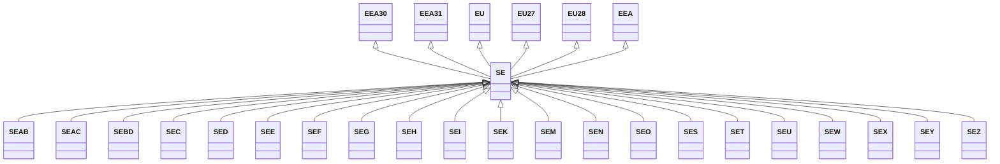

---
search:
  boost: 10.0
---

# Class: SE 


_Concept representing Country of Sweden_


<div data-search-exclude markdown="1">


URI: [loc:SE](https://w3id.org/lmodel/dpv/loc/SE)





## Inheritance
* [EEA](EEA.md)
    * **SE** [ [EEA30](EEA30.md) [EEA31](EEA31.md) [EU](EU.md) [EU27](EU27.md) [EU28](EU28.md)]
        * [SEAB](SEAB.md)
        * [SEAC](SEAC.md)
        * [SEBD](SEBD.md)
        * [SEC](SEC.md)
        * [SED](SED.md)
        * [SEE](SEE.md)
        * [SEF](SEF.md)
        * [SEG](SEG.md)
        * [SEH](SEH.md)
        * [SEI](SEI.md)
        * [SEK](SEK.md)
        * [SEM](SEM.md)
        * [SEN](SEN.md)
        * [SEO](SEO.md)
        * [SES](SES.md)
        * [SET](SET.md)
        * [SEU](SEU.md)
        * [SEW](SEW.md)
        * [SEX](SEX.md)
        * [SEY](SEY.md)
        * [SEZ](SEZ.md)


## Class Properties

| Property | Value |
| --- | --- |
| Class URI | [loc:SE](https://w3id.org/lmodel/dpv/loc/SE) |


## Slots

| Name | Cardinality and Range | Description | Inheritance |
| ---  | --- | --- | --- |


## In Subsets


* [LocSubset](LocSubset.md)


## Aliases


* Sweden


## Identifier and Mapping Information


### Annotations

| property | value |
| --- | --- |
| upstream_iri | https://w3id.org/dpv/loc/owl#SE |
| dpv_extension_slug | loc |


### Schema Source


* from schema: https://w3id.org/lmodel/dpv/loc


## Mappings

| Mapping Type | Mapped Value |
| ---  | ---  |
| self | loc:SE |
| native | loc:SE |
| exact | dpv_loc:SE, dpv_loc_owl:SE |


## LinkML Source

<!-- TODO: investigate https://stackoverflow.com/questions/37606292/how-to-create-tabbed-code-blocks-in-mkdocs-or-sphinx -->

### Direct

<details>
```yaml
name: SE
annotations:
  upstream_iri:
    tag: upstream_iri
    value: https://w3id.org/dpv/loc/owl#SE
  dpv_extension_slug:
    tag: dpv_extension_slug
    value: loc
description: Concept representing Country of Sweden
in_subset:
- loc_subset
from_schema: https://w3id.org/lmodel/dpv/loc
aliases:
- Sweden
exact_mappings:
- dpv_loc:SE
- dpv_loc_owl:SE
is_a: EEA
mixins:
- EEA30
- EEA31
- EU
- EU27
- EU28
class_uri: loc:SE

```
</details>

### Induced

<details>
```yaml
name: SE
annotations:
  upstream_iri:
    tag: upstream_iri
    value: https://w3id.org/dpv/loc/owl#SE
  dpv_extension_slug:
    tag: dpv_extension_slug
    value: loc
description: Concept representing Country of Sweden
in_subset:
- loc_subset
from_schema: https://w3id.org/lmodel/dpv/loc
aliases:
- Sweden
exact_mappings:
- dpv_loc:SE
- dpv_loc_owl:SE
is_a: EEA
mixins:
- EEA30
- EEA31
- EU
- EU27
- EU28
class_uri: loc:SE

```
</details></div>