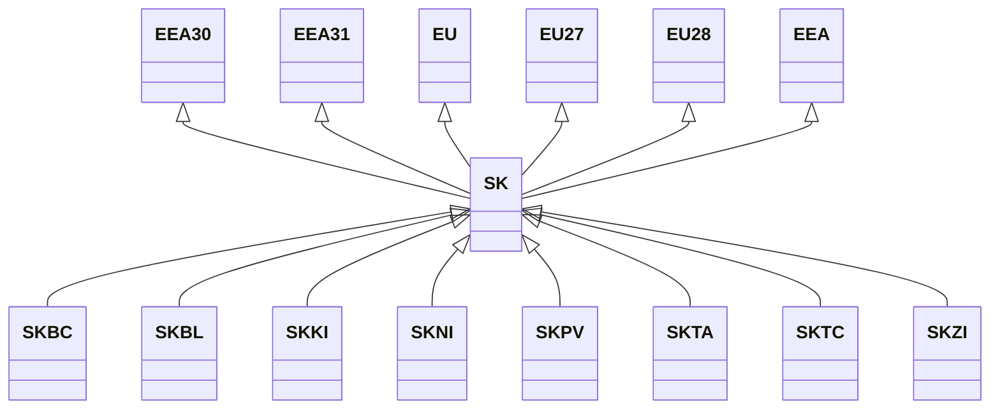

---
search:
  boost: 10.0
---

# Class: SK 


_Concept representing Country of Slovakia_


<div data-search-exclude markdown="1">


URI: [loc:SK](https://w3id.org/lmodel/dpv/loc/SK)





## Inheritance
* [EEA](EEA.md)
    * **SK** [ [EEA30](EEA30.md) [EEA31](EEA31.md) [EU](EU.md) [EU27](EU27.md) [EU28](EU28.md)]
        * [SKBC](SKBC.md)
        * [SKBL](SKBL.md)
        * [SKKI](SKKI.md)
        * [SKNI](SKNI.md)
        * [SKPV](SKPV.md)
        * [SKTA](SKTA.md)
        * [SKTC](SKTC.md)
        * [SKZI](SKZI.md)


## Class Properties

| Property | Value |
| --- | --- |
| Class URI | [loc:SK](https://w3id.org/lmodel/dpv/loc/SK) |


## Slots

| Name | Cardinality and Range | Description | Inheritance |
| ---  | --- | --- | --- |


## In Subsets


* [LocSubset](LocSubset.md)


## Aliases


* Slovakia


## Identifier and Mapping Information


### Annotations

| property | value |
| --- | --- |
| upstream_iri | https://w3id.org/dpv/loc/owl#SK |
| dpv_extension_slug | loc |


### Schema Source


* from schema: https://w3id.org/lmodel/dpv/loc


## Mappings

| Mapping Type | Mapped Value |
| ---  | ---  |
| self | loc:SK |
| native | loc:SK |
| exact | dpv_loc:SK, dpv_loc_owl:SK |


## LinkML Source

<!-- TODO: investigate https://stackoverflow.com/questions/37606292/how-to-create-tabbed-code-blocks-in-mkdocs-or-sphinx -->

### Direct

<details>
```yaml
name: SK
annotations:
  upstream_iri:
    tag: upstream_iri
    value: https://w3id.org/dpv/loc/owl#SK
  dpv_extension_slug:
    tag: dpv_extension_slug
    value: loc
description: Concept representing Country of Slovakia
in_subset:
- loc_subset
from_schema: https://w3id.org/lmodel/dpv/loc
aliases:
- Slovakia
exact_mappings:
- dpv_loc:SK
- dpv_loc_owl:SK
is_a: EEA
mixins:
- EEA30
- EEA31
- EU
- EU27
- EU28
class_uri: loc:SK

```
</details>

### Induced

<details>
```yaml
name: SK
annotations:
  upstream_iri:
    tag: upstream_iri
    value: https://w3id.org/dpv/loc/owl#SK
  dpv_extension_slug:
    tag: dpv_extension_slug
    value: loc
description: Concept representing Country of Slovakia
in_subset:
- loc_subset
from_schema: https://w3id.org/lmodel/dpv/loc
aliases:
- Slovakia
exact_mappings:
- dpv_loc:SK
- dpv_loc_owl:SK
is_a: EEA
mixins:
- EEA30
- EEA31
- EU
- EU27
- EU28
class_uri: loc:SK

```
</details></div>