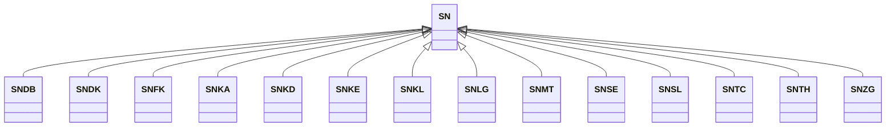

---
search:
  boost: 10.0
---

# Class: SN 


_Concept representing Country of Senegal_


<div data-search-exclude markdown="1">


URI: [loc:SN](https://w3id.org/lmodel/dpv/loc/SN)





## Inheritance
* **SN**
    * [SNDB](SNDB.md)
    * [SNDK](SNDK.md)
    * [SNFK](SNFK.md)
    * [SNKA](SNKA.md)
    * [SNKD](SNKD.md)
    * [SNKE](SNKE.md)
    * [SNKL](SNKL.md)
    * [SNLG](SNLG.md)
    * [SNMT](SNMT.md)
    * [SNSE](SNSE.md)
    * [SNSL](SNSL.md)
    * [SNTC](SNTC.md)
    * [SNTH](SNTH.md)
    * [SNZG](SNZG.md)


## Class Properties

| Property | Value |
| --- | --- |
| Class URI | [loc:SN](https://w3id.org/lmodel/dpv/loc/SN) |


## Slots

| Name | Cardinality and Range | Description | Inheritance |
| ---  | --- | --- | --- |


## In Subsets


* [LocSubset](LocSubset.md)


## Aliases


* Senegal


## Identifier and Mapping Information


### Annotations

| property | value |
| --- | --- |
| upstream_iri | https://w3id.org/dpv/loc/owl#SN |
| dpv_extension_slug | loc |


### Schema Source


* from schema: https://w3id.org/lmodel/dpv/loc


## Mappings

| Mapping Type | Mapped Value |
| ---  | ---  |
| self | loc:SN |
| native | loc:SN |
| exact | dpv_loc:SN, dpv_loc_owl:SN |


## LinkML Source

<!-- TODO: investigate https://stackoverflow.com/questions/37606292/how-to-create-tabbed-code-blocks-in-mkdocs-or-sphinx -->

### Direct

<details>
```yaml
name: SN
annotations:
  upstream_iri:
    tag: upstream_iri
    value: https://w3id.org/dpv/loc/owl#SN
  dpv_extension_slug:
    tag: dpv_extension_slug
    value: loc
description: Concept representing Country of Senegal
in_subset:
- loc_subset
from_schema: https://w3id.org/lmodel/dpv/loc
aliases:
- Senegal
exact_mappings:
- dpv_loc:SN
- dpv_loc_owl:SN
class_uri: loc:SN

```
</details>

### Induced

<details>
```yaml
name: SN
annotations:
  upstream_iri:
    tag: upstream_iri
    value: https://w3id.org/dpv/loc/owl#SN
  dpv_extension_slug:
    tag: dpv_extension_slug
    value: loc
description: Concept representing Country of Senegal
in_subset:
- loc_subset
from_schema: https://w3id.org/lmodel/dpv/loc
aliases:
- Senegal
exact_mappings:
- dpv_loc:SN
- dpv_loc_owl:SN
class_uri: loc:SN

```
</details></div>