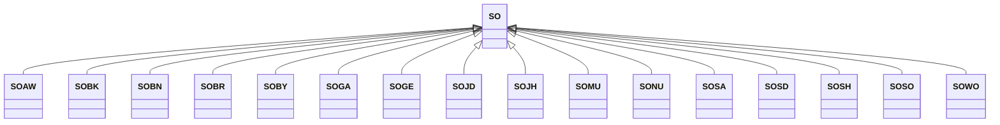

---
search:
  boost: 10.0
---

# Class: SO 


_Concept representing Country of Somalia_


<div data-search-exclude markdown="1">


URI: [loc:SO](https://w3id.org/lmodel/dpv/loc/SO)





## Inheritance
* **SO**
    * [SOAW](SOAW.md)
    * [SOBK](SOBK.md)
    * [SOBN](SOBN.md)
    * [SOBR](SOBR.md)
    * [SOBY](SOBY.md)
    * [SOGA](SOGA.md)
    * [SOGE](SOGE.md)
    * [SOJD](SOJD.md)
    * [SOJH](SOJH.md)
    * [SOMU](SOMU.md)
    * [SONU](SONU.md)
    * [SOSA](SOSA.md)
    * [SOSD](SOSD.md)
    * [SOSH](SOSH.md)
    * [SOSO](SOSO.md)
    * [SOWO](SOWO.md)


## Class Properties

| Property | Value |
| --- | --- |
| Class URI | [loc:SO](https://w3id.org/lmodel/dpv/loc/SO) |


## Slots

| Name | Cardinality and Range | Description | Inheritance |
| ---  | --- | --- | --- |


## In Subsets


* [LocSubset](LocSubset.md)


## Aliases


* Somalia


## Identifier and Mapping Information


### Annotations

| property | value |
| --- | --- |
| upstream_iri | https://w3id.org/dpv/loc/owl#SO |
| dpv_extension_slug | loc |


### Schema Source


* from schema: https://w3id.org/lmodel/dpv/loc


## Mappings

| Mapping Type | Mapped Value |
| ---  | ---  |
| self | loc:SO |
| native | loc:SO |
| exact | dpv_loc:SO, dpv_loc_owl:SO |


## LinkML Source

<!-- TODO: investigate https://stackoverflow.com/questions/37606292/how-to-create-tabbed-code-blocks-in-mkdocs-or-sphinx -->

### Direct

<details>
```yaml
name: SO
annotations:
  upstream_iri:
    tag: upstream_iri
    value: https://w3id.org/dpv/loc/owl#SO
  dpv_extension_slug:
    tag: dpv_extension_slug
    value: loc
description: Concept representing Country of Somalia
in_subset:
- loc_subset
from_schema: https://w3id.org/lmodel/dpv/loc
aliases:
- Somalia
exact_mappings:
- dpv_loc:SO
- dpv_loc_owl:SO
class_uri: loc:SO

```
</details>

### Induced

<details>
```yaml
name: SO
annotations:
  upstream_iri:
    tag: upstream_iri
    value: https://w3id.org/dpv/loc/owl#SO
  dpv_extension_slug:
    tag: dpv_extension_slug
    value: loc
description: Concept representing Country of Somalia
in_subset:
- loc_subset
from_schema: https://w3id.org/lmodel/dpv/loc
aliases:
- Somalia
exact_mappings:
- dpv_loc:SO
- dpv_loc_owl:SO
class_uri: loc:SO

```
</details></div>