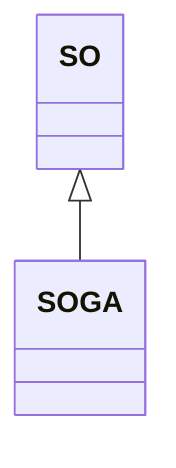

---
search:
  boost: 10.0
---

# Class: SOGA 


_Concept representing region Galguduud Region in country Somalia_


<div data-search-exclude markdown="1">


URI: [loc:SO-GA](https://w3id.org/lmodel/dpv/loc/SO-GA)





## Inheritance
* [SO](SO.md)
    * **SOGA**


## Class Properties

| Property | Value |
| --- | --- |
| Class URI | [loc:SO-GA](https://w3id.org/lmodel/dpv/loc/SO-GA) |


## Slots

| Name | Cardinality and Range | Description | Inheritance |
| ---  | --- | --- | --- |


## In Subsets


* [LocSubset](LocSubset.md)


## Aliases


* SO-GA
* Galguduud Region


## Identifier and Mapping Information


### Annotations

| property | value |
| --- | --- |
| upstream_iri | https://w3id.org/dpv/loc/owl#SO-GA |
| dpv_extension_slug | loc |


### Schema Source


* from schema: https://w3id.org/lmodel/dpv/loc


## Mappings

| Mapping Type | Mapped Value |
| ---  | ---  |
| self | loc:SO-GA |
| native | loc:SOGA |
| exact | dpv_loc:SO-GA, dpv_loc_owl:SO-GA |


## LinkML Source

<!-- TODO: investigate https://stackoverflow.com/questions/37606292/how-to-create-tabbed-code-blocks-in-mkdocs-or-sphinx -->

### Direct

<details>
```yaml
name: SOGA
annotations:
  upstream_iri:
    tag: upstream_iri
    value: https://w3id.org/dpv/loc/owl#SO-GA
  dpv_extension_slug:
    tag: dpv_extension_slug
    value: loc
description: Concept representing region Galguduud Region in country Somalia
in_subset:
- loc_subset
from_schema: https://w3id.org/lmodel/dpv/loc
aliases:
- SO-GA
- Galguduud Region
exact_mappings:
- dpv_loc:SO-GA
- dpv_loc_owl:SO-GA
is_a: SO
class_uri: loc:SO-GA

```
</details>

### Induced

<details>
```yaml
name: SOGA
annotations:
  upstream_iri:
    tag: upstream_iri
    value: https://w3id.org/dpv/loc/owl#SO-GA
  dpv_extension_slug:
    tag: dpv_extension_slug
    value: loc
description: Concept representing region Galguduud Region in country Somalia
in_subset:
- loc_subset
from_schema: https://w3id.org/lmodel/dpv/loc
aliases:
- SO-GA
- Galguduud Region
exact_mappings:
- dpv_loc:SO-GA
- dpv_loc_owl:SO-GA
is_a: SO
class_uri: loc:SO-GA

```
</details></div>