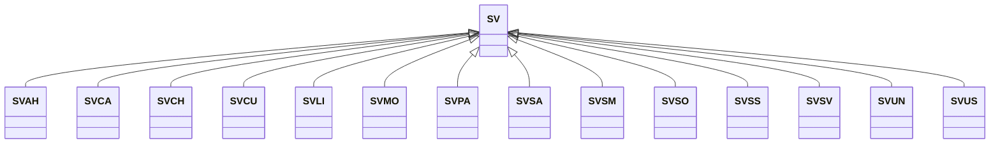

---
search:
  boost: 10.0
---

# Class: SV 


_Concept representing Country of El Salvador_


<div data-search-exclude markdown="1">


URI: [loc:SV](https://w3id.org/lmodel/dpv/loc/SV)





## Inheritance
* **SV**
    * [SVAH](SVAH.md)
    * [SVCA](SVCA.md)
    * [SVCH](SVCH.md)
    * [SVCU](SVCU.md)
    * [SVLI](SVLI.md)
    * [SVMO](SVMO.md)
    * [SVPA](SVPA.md)
    * [SVSA](SVSA.md)
    * [SVSM](SVSM.md)
    * [SVSO](SVSO.md)
    * [SVSS](SVSS.md)
    * [SVSV](SVSV.md)
    * [SVUN](SVUN.md)
    * [SVUS](SVUS.md)


## Class Properties

| Property | Value |
| --- | --- |
| Class URI | [loc:SV](https://w3id.org/lmodel/dpv/loc/SV) |


## Slots

| Name | Cardinality and Range | Description | Inheritance |
| ---  | --- | --- | --- |


## In Subsets


* [LocSubset](LocSubset.md)


## Aliases


* El Salvador


## Identifier and Mapping Information


### Annotations

| property | value |
| --- | --- |
| upstream_iri | https://w3id.org/dpv/loc/owl#SV |
| dpv_extension_slug | loc |


### Schema Source


* from schema: https://w3id.org/lmodel/dpv/loc


## Mappings

| Mapping Type | Mapped Value |
| ---  | ---  |
| self | loc:SV |
| native | loc:SV |
| exact | dpv_loc:SV, dpv_loc_owl:SV |


## LinkML Source

<!-- TODO: investigate https://stackoverflow.com/questions/37606292/how-to-create-tabbed-code-blocks-in-mkdocs-or-sphinx -->

### Direct

<details>
```yaml
name: SV
annotations:
  upstream_iri:
    tag: upstream_iri
    value: https://w3id.org/dpv/loc/owl#SV
  dpv_extension_slug:
    tag: dpv_extension_slug
    value: loc
description: Concept representing Country of El Salvador
in_subset:
- loc_subset
from_schema: https://w3id.org/lmodel/dpv/loc
aliases:
- El Salvador
exact_mappings:
- dpv_loc:SV
- dpv_loc_owl:SV
class_uri: loc:SV

```
</details>

### Induced

<details>
```yaml
name: SV
annotations:
  upstream_iri:
    tag: upstream_iri
    value: https://w3id.org/dpv/loc/owl#SV
  dpv_extension_slug:
    tag: dpv_extension_slug
    value: loc
description: Concept representing Country of El Salvador
in_subset:
- loc_subset
from_schema: https://w3id.org/lmodel/dpv/loc
aliases:
- El Salvador
exact_mappings:
- dpv_loc:SV
- dpv_loc_owl:SV
class_uri: loc:SV

```
</details></div>