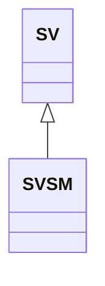

---
search:
  boost: 10.0
---

# Class: SVSM 


_Concept representing region San Miguel Department, El Salvador in_

_country El Salvador_


<div data-search-exclude markdown="1">


URI: [loc:SV-SM](https://w3id.org/lmodel/dpv/loc/SV-SM)





## Inheritance
* [SV](SV.md)
    * **SVSM**


## Class Properties

| Property | Value |
| --- | --- |
| Class URI | [loc:SV-SM](https://w3id.org/lmodel/dpv/loc/SV-SM) |


## Slots

| Name | Cardinality and Range | Description | Inheritance |
| ---  | --- | --- | --- |


## In Subsets


* [LocSubset](LocSubset.md)


## Aliases


* SV-SM
* San Miguel Department, El Salvador


## Identifier and Mapping Information


### Annotations

| property | value |
| --- | --- |
| upstream_iri | https://w3id.org/dpv/loc/owl#SV-SM |
| dpv_extension_slug | loc |


### Schema Source


* from schema: https://w3id.org/lmodel/dpv/loc


## Mappings

| Mapping Type | Mapped Value |
| ---  | ---  |
| self | loc:SV-SM |
| native | loc:SVSM |
| exact | dpv_loc:SV-SM, dpv_loc_owl:SV-SM |


## LinkML Source

<!-- TODO: investigate https://stackoverflow.com/questions/37606292/how-to-create-tabbed-code-blocks-in-mkdocs-or-sphinx -->

### Direct

<details>
```yaml
name: SVSM
annotations:
  upstream_iri:
    tag: upstream_iri
    value: https://w3id.org/dpv/loc/owl#SV-SM
  dpv_extension_slug:
    tag: dpv_extension_slug
    value: loc
description: 'Concept representing region San Miguel Department, El Salvador in

  country El Salvador'
in_subset:
- loc_subset
from_schema: https://w3id.org/lmodel/dpv/loc
aliases:
- SV-SM
- San Miguel Department, El Salvador
exact_mappings:
- dpv_loc:SV-SM
- dpv_loc_owl:SV-SM
is_a: SV
class_uri: loc:SV-SM

```
</details>

### Induced

<details>
```yaml
name: SVSM
annotations:
  upstream_iri:
    tag: upstream_iri
    value: https://w3id.org/dpv/loc/owl#SV-SM
  dpv_extension_slug:
    tag: dpv_extension_slug
    value: loc
description: 'Concept representing region San Miguel Department, El Salvador in

  country El Salvador'
in_subset:
- loc_subset
from_schema: https://w3id.org/lmodel/dpv/loc
aliases:
- SV-SM
- San Miguel Department, El Salvador
exact_mappings:
- dpv_loc:SV-SM
- dpv_loc_owl:SV-SM
is_a: SV
class_uri: loc:SV-SM

```
</details></div>