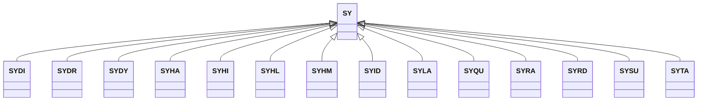

---
search:
  boost: 10.0
---

# Class: SY 


_Concept representing Country of Syrian Arab Republic_


<div data-search-exclude markdown="1">


URI: [loc:SY](https://w3id.org/lmodel/dpv/loc/SY)





## Inheritance
* **SY**
    * [SYDI](SYDI.md)
    * [SYDR](SYDR.md)
    * [SYDY](SYDY.md)
    * [SYHA](SYHA.md)
    * [SYHI](SYHI.md)
    * [SYHL](SYHL.md)
    * [SYHM](SYHM.md)
    * [SYID](SYID.md)
    * [SYLA](SYLA.md)
    * [SYQU](SYQU.md)
    * [SYRA](SYRA.md)
    * [SYRD](SYRD.md)
    * [SYSU](SYSU.md)
    * [SYTA](SYTA.md)


## Class Properties

| Property | Value |
| --- | --- |
| Class URI | [loc:SY](https://w3id.org/lmodel/dpv/loc/SY) |


## Slots

| Name | Cardinality and Range | Description | Inheritance |
| ---  | --- | --- | --- |


## In Subsets


* [LocSubset](LocSubset.md)


## Aliases


* Syrian Arab Republic


## Identifier and Mapping Information


### Annotations

| property | value |
| --- | --- |
| upstream_iri | https://w3id.org/dpv/loc/owl#SY |
| dpv_extension_slug | loc |


### Schema Source


* from schema: https://w3id.org/lmodel/dpv/loc


## Mappings

| Mapping Type | Mapped Value |
| ---  | ---  |
| self | loc:SY |
| native | loc:SY |
| exact | dpv_loc:SY, dpv_loc_owl:SY |


## LinkML Source

<!-- TODO: investigate https://stackoverflow.com/questions/37606292/how-to-create-tabbed-code-blocks-in-mkdocs-or-sphinx -->

### Direct

<details>
```yaml
name: SY
annotations:
  upstream_iri:
    tag: upstream_iri
    value: https://w3id.org/dpv/loc/owl#SY
  dpv_extension_slug:
    tag: dpv_extension_slug
    value: loc
description: Concept representing Country of Syrian Arab Republic
in_subset:
- loc_subset
from_schema: https://w3id.org/lmodel/dpv/loc
aliases:
- Syrian Arab Republic
exact_mappings:
- dpv_loc:SY
- dpv_loc_owl:SY
class_uri: loc:SY

```
</details>

### Induced

<details>
```yaml
name: SY
annotations:
  upstream_iri:
    tag: upstream_iri
    value: https://w3id.org/dpv/loc/owl#SY
  dpv_extension_slug:
    tag: dpv_extension_slug
    value: loc
description: Concept representing Country of Syrian Arab Republic
in_subset:
- loc_subset
from_schema: https://w3id.org/lmodel/dpv/loc
aliases:
- Syrian Arab Republic
exact_mappings:
- dpv_loc:SY
- dpv_loc_owl:SY
class_uri: loc:SY

```
</details></div>