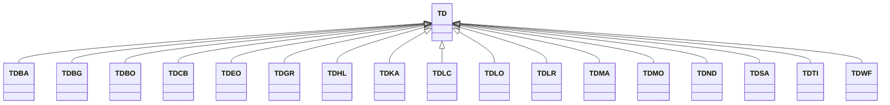

---
search:
  boost: 10.0
---

# Class: TD 


_Concept representing Country of Chad_


<div data-search-exclude markdown="1">


URI: [loc:TD](https://w3id.org/lmodel/dpv/loc/TD)





## Inheritance
* **TD**
    * [TDBA](TDBA.md)
    * [TDBG](TDBG.md)
    * [TDBO](TDBO.md)
    * [TDCB](TDCB.md)
    * [TDEO](TDEO.md)
    * [TDGR](TDGR.md)
    * [TDHL](TDHL.md)
    * [TDKA](TDKA.md)
    * [TDLC](TDLC.md)
    * [TDLO](TDLO.md)
    * [TDLR](TDLR.md)
    * [TDMA](TDMA.md)
    * [TDMO](TDMO.md)
    * [TDND](TDND.md)
    * [TDSA](TDSA.md)
    * [TDTI](TDTI.md)
    * [TDWF](TDWF.md)


## Class Properties

| Property | Value |
| --- | --- |
| Class URI | [loc:TD](https://w3id.org/lmodel/dpv/loc/TD) |


## Slots

| Name | Cardinality and Range | Description | Inheritance |
| ---  | --- | --- | --- |


## In Subsets


* [LocSubset](LocSubset.md)


## Aliases


* Chad


## Identifier and Mapping Information


### Annotations

| property | value |
| --- | --- |
| upstream_iri | https://w3id.org/dpv/loc/owl#TD |
| dpv_extension_slug | loc |


### Schema Source


* from schema: https://w3id.org/lmodel/dpv/loc


## Mappings

| Mapping Type | Mapped Value |
| ---  | ---  |
| self | loc:TD |
| native | loc:TD |
| exact | dpv_loc:TD, dpv_loc_owl:TD |


## LinkML Source

<!-- TODO: investigate https://stackoverflow.com/questions/37606292/how-to-create-tabbed-code-blocks-in-mkdocs-or-sphinx -->

### Direct

<details>
```yaml
name: TD
annotations:
  upstream_iri:
    tag: upstream_iri
    value: https://w3id.org/dpv/loc/owl#TD
  dpv_extension_slug:
    tag: dpv_extension_slug
    value: loc
description: Concept representing Country of Chad
in_subset:
- loc_subset
from_schema: https://w3id.org/lmodel/dpv/loc
aliases:
- Chad
exact_mappings:
- dpv_loc:TD
- dpv_loc_owl:TD
class_uri: loc:TD

```
</details>

### Induced

<details>
```yaml
name: TD
annotations:
  upstream_iri:
    tag: upstream_iri
    value: https://w3id.org/dpv/loc/owl#TD
  dpv_extension_slug:
    tag: dpv_extension_slug
    value: loc
description: Concept representing Country of Chad
in_subset:
- loc_subset
from_schema: https://w3id.org/lmodel/dpv/loc
aliases:
- Chad
exact_mappings:
- dpv_loc:TD
- dpv_loc_owl:TD
class_uri: loc:TD

```
</details></div>