---
search:
  boost: 10.0
---

# Class: TH 


_Concept representing Country of Thailand_


<div data-search-exclude markdown="1">


URI: [loc:TH](https://w3id.org/lmodel/dpv/loc/TH)

```mermaid
 classDiagram
    class TH
    click TH href "../TH/"
      TH <|-- TH10
        click TH10 href "../TH10/"
      TH <|-- TH11
        click TH11 href "../TH11/"
      TH <|-- TH12
        click TH12 href "../TH12/"
      TH <|-- TH13
        click TH13 href "../TH13/"
      TH <|-- TH14
        click TH14 href "../TH14/"
      TH <|-- TH15
        click TH15 href "../TH15/"
      TH <|-- TH16
        click TH16 href "../TH16/"
      TH <|-- TH17
        click TH17 href "../TH17/"
      TH <|-- TH18
        click TH18 href "../TH18/"
      TH <|-- TH19
        click TH19 href "../TH19/"
      TH <|-- TH20
        click TH20 href "../TH20/"
      TH <|-- TH21
        click TH21 href "../TH21/"
      TH <|-- TH22
        click TH22 href "../TH22/"
      TH <|-- TH23
        click TH23 href "../TH23/"
      TH <|-- TH24
        click TH24 href "../TH24/"
      TH <|-- TH25
        click TH25 href "../TH25/"
      TH <|-- TH26
        click TH26 href "../TH26/"
      TH <|-- TH27
        click TH27 href "../TH27/"
      TH <|-- TH30
        click TH30 href "../TH30/"
      TH <|-- TH31
        click TH31 href "../TH31/"
      TH <|-- TH32
        click TH32 href "../TH32/"
      TH <|-- TH33
        click TH33 href "../TH33/"
      TH <|-- TH34
        click TH34 href "../TH34/"
      TH <|-- TH35
        click TH35 href "../TH35/"
      TH <|-- TH36
        click TH36 href "../TH36/"
      TH <|-- TH37
        click TH37 href "../TH37/"
      TH <|-- TH38
        click TH38 href "../TH38/"
      TH <|-- TH39
        click TH39 href "../TH39/"
      TH <|-- TH40
        click TH40 href "../TH40/"
      TH <|-- TH41
        click TH41 href "../TH41/"
      TH <|-- TH42
        click TH42 href "../TH42/"
      TH <|-- TH43
        click TH43 href "../TH43/"
      TH <|-- TH44
        click TH44 href "../TH44/"
      TH <|-- TH45
        click TH45 href "../TH45/"
      TH <|-- TH46
        click TH46 href "../TH46/"
      TH <|-- TH47
        click TH47 href "../TH47/"
      TH <|-- TH48
        click TH48 href "../TH48/"
      TH <|-- TH49
        click TH49 href "../TH49/"
      TH <|-- TH50
        click TH50 href "../TH50/"
      TH <|-- TH51
        click TH51 href "../TH51/"
      TH <|-- TH52
        click TH52 href "../TH52/"
      TH <|-- TH53
        click TH53 href "../TH53/"
      TH <|-- TH54
        click TH54 href "../TH54/"
      TH <|-- TH55
        click TH55 href "../TH55/"
      TH <|-- TH56
        click TH56 href "../TH56/"
      TH <|-- TH57
        click TH57 href "../TH57/"
      TH <|-- TH58
        click TH58 href "../TH58/"
      TH <|-- TH60
        click TH60 href "../TH60/"
      TH <|-- TH61
        click TH61 href "../TH61/"
      TH <|-- TH62
        click TH62 href "../TH62/"
      TH <|-- TH63
        click TH63 href "../TH63/"
      TH <|-- TH64
        click TH64 href "../TH64/"
      TH <|-- TH65
        click TH65 href "../TH65/"
      TH <|-- TH66
        click TH66 href "../TH66/"
      TH <|-- TH67
        click TH67 href "../TH67/"
      TH <|-- TH70
        click TH70 href "../TH70/"
      TH <|-- TH71
        click TH71 href "../TH71/"
      TH <|-- TH72
        click TH72 href "../TH72/"
      TH <|-- TH73
        click TH73 href "../TH73/"
      TH <|-- TH74
        click TH74 href "../TH74/"
      TH <|-- TH75
        click TH75 href "../TH75/"
      TH <|-- TH76
        click TH76 href "../TH76/"
      TH <|-- TH77
        click TH77 href "../TH77/"
      TH <|-- TH80
        click TH80 href "../TH80/"
      TH <|-- TH81
        click TH81 href "../TH81/"
      TH <|-- TH82
        click TH82 href "../TH82/"
      TH <|-- TH83
        click TH83 href "../TH83/"
      TH <|-- TH84
        click TH84 href "../TH84/"
      TH <|-- TH85
        click TH85 href "../TH85/"
      TH <|-- TH86
        click TH86 href "../TH86/"
      TH <|-- TH90
        click TH90 href "../TH90/"
      TH <|-- TH91
        click TH91 href "../TH91/"
      TH <|-- TH92
        click TH92 href "../TH92/"
      TH <|-- TH93
        click TH93 href "../TH93/"
      TH <|-- TH94
        click TH94 href "../TH94/"
      TH <|-- TH95
        click TH95 href "../TH95/"
      TH <|-- TH96
        click TH96 href "../TH96/"
      TH <|-- THS
        click THS href "../THS/"
      
      
```





## Inheritance
* **TH**
    * [TH10](TH10.md)
    * [TH11](TH11.md)
    * [TH12](TH12.md)
    * [TH13](TH13.md)
    * [TH14](TH14.md)
    * [TH15](TH15.md)
    * [TH16](TH16.md)
    * [TH17](TH17.md)
    * [TH18](TH18.md)
    * [TH19](TH19.md)
    * [TH20](TH20.md)
    * [TH21](TH21.md)
    * [TH22](TH22.md)
    * [TH23](TH23.md)
    * [TH24](TH24.md)
    * [TH25](TH25.md)
    * [TH26](TH26.md)
    * [TH27](TH27.md)
    * [TH30](TH30.md)
    * [TH31](TH31.md)
    * [TH32](TH32.md)
    * [TH33](TH33.md)
    * [TH34](TH34.md)
    * [TH35](TH35.md)
    * [TH36](TH36.md)
    * [TH37](TH37.md)
    * [TH38](TH38.md)
    * [TH39](TH39.md)
    * [TH40](TH40.md)
    * [TH41](TH41.md)
    * [TH42](TH42.md)
    * [TH43](TH43.md)
    * [TH44](TH44.md)
    * [TH45](TH45.md)
    * [TH46](TH46.md)
    * [TH47](TH47.md)
    * [TH48](TH48.md)
    * [TH49](TH49.md)
    * [TH50](TH50.md)
    * [TH51](TH51.md)
    * [TH52](TH52.md)
    * [TH53](TH53.md)
    * [TH54](TH54.md)
    * [TH55](TH55.md)
    * [TH56](TH56.md)
    * [TH57](TH57.md)
    * [TH58](TH58.md)
    * [TH60](TH60.md)
    * [TH61](TH61.md)
    * [TH62](TH62.md)
    * [TH63](TH63.md)
    * [TH64](TH64.md)
    * [TH65](TH65.md)
    * [TH66](TH66.md)
    * [TH67](TH67.md)
    * [TH70](TH70.md)
    * [TH71](TH71.md)
    * [TH72](TH72.md)
    * [TH73](TH73.md)
    * [TH74](TH74.md)
    * [TH75](TH75.md)
    * [TH76](TH76.md)
    * [TH77](TH77.md)
    * [TH80](TH80.md)
    * [TH81](TH81.md)
    * [TH82](TH82.md)
    * [TH83](TH83.md)
    * [TH84](TH84.md)
    * [TH85](TH85.md)
    * [TH86](TH86.md)
    * [TH90](TH90.md)
    * [TH91](TH91.md)
    * [TH92](TH92.md)
    * [TH93](TH93.md)
    * [TH94](TH94.md)
    * [TH95](TH95.md)
    * [TH96](TH96.md)
    * [THS](THS.md)


## Class Properties

| Property | Value |
| --- | --- |
| Class URI | [loc:TH](https://w3id.org/lmodel/dpv/loc/TH) |


## Slots

| Name | Cardinality and Range | Description | Inheritance |
| ---  | --- | --- | --- |


## In Subsets


* [LocSubset](LocSubset.md)


## Aliases


* Thailand


## Identifier and Mapping Information


### Annotations

| property | value |
| --- | --- |
| upstream_iri | https://w3id.org/dpv/loc/owl#TH |
| dpv_extension_slug | loc |


### Schema Source


* from schema: https://w3id.org/lmodel/dpv/loc


## Mappings

| Mapping Type | Mapped Value |
| ---  | ---  |
| self | loc:TH |
| native | loc:TH |
| exact | dpv_loc:TH, dpv_loc_owl:TH |


## LinkML Source

<!-- TODO: investigate https://stackoverflow.com/questions/37606292/how-to-create-tabbed-code-blocks-in-mkdocs-or-sphinx -->

### Direct

<details>
```yaml
name: TH
annotations:
  upstream_iri:
    tag: upstream_iri
    value: https://w3id.org/dpv/loc/owl#TH
  dpv_extension_slug:
    tag: dpv_extension_slug
    value: loc
description: Concept representing Country of Thailand
in_subset:
- loc_subset
from_schema: https://w3id.org/lmodel/dpv/loc
aliases:
- Thailand
exact_mappings:
- dpv_loc:TH
- dpv_loc_owl:TH
class_uri: loc:TH

```
</details>

### Induced

<details>
```yaml
name: TH
annotations:
  upstream_iri:
    tag: upstream_iri
    value: https://w3id.org/dpv/loc/owl#TH
  dpv_extension_slug:
    tag: dpv_extension_slug
    value: loc
description: Concept representing Country of Thailand
in_subset:
- loc_subset
from_schema: https://w3id.org/lmodel/dpv/loc
aliases:
- Thailand
exact_mappings:
- dpv_loc:TH
- dpv_loc_owl:TH
class_uri: loc:TH

```
</details></div>