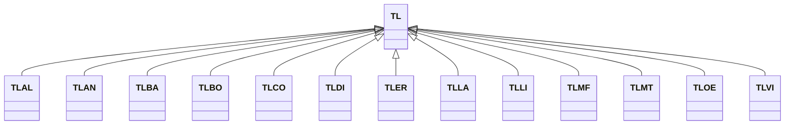

---
search:
  boost: 10.0
---

# Class: TL 


_Concept representing Country of Timor-Leste_


<div data-search-exclude markdown="1">


URI: [loc:TL](https://w3id.org/lmodel/dpv/loc/TL)





## Inheritance
* **TL**
    * [TLAL](TLAL.md)
    * [TLAN](TLAN.md)
    * [TLBA](TLBA.md)
    * [TLBO](TLBO.md)
    * [TLCO](TLCO.md)
    * [TLDI](TLDI.md)
    * [TLER](TLER.md)
    * [TLLA](TLLA.md)
    * [TLLI](TLLI.md)
    * [TLMF](TLMF.md)
    * [TLMT](TLMT.md)
    * [TLOE](TLOE.md)
    * [TLVI](TLVI.md)


## Class Properties

| Property | Value |
| --- | --- |
| Class URI | [loc:TL](https://w3id.org/lmodel/dpv/loc/TL) |


## Slots

| Name | Cardinality and Range | Description | Inheritance |
| ---  | --- | --- | --- |


## In Subsets


* [LocSubset](LocSubset.md)


## Aliases


* Timor-Leste


## Identifier and Mapping Information


### Annotations

| property | value |
| --- | --- |
| upstream_iri | https://w3id.org/dpv/loc/owl#TL |
| dpv_extension_slug | loc |


### Schema Source


* from schema: https://w3id.org/lmodel/dpv/loc


## Mappings

| Mapping Type | Mapped Value |
| ---  | ---  |
| self | loc:TL |
| native | loc:TL |
| exact | dpv_loc:TL, dpv_loc_owl:TL |


## LinkML Source

<!-- TODO: investigate https://stackoverflow.com/questions/37606292/how-to-create-tabbed-code-blocks-in-mkdocs-or-sphinx -->

### Direct

<details>
```yaml
name: TL
annotations:
  upstream_iri:
    tag: upstream_iri
    value: https://w3id.org/dpv/loc/owl#TL
  dpv_extension_slug:
    tag: dpv_extension_slug
    value: loc
description: Concept representing Country of Timor-Leste
in_subset:
- loc_subset
from_schema: https://w3id.org/lmodel/dpv/loc
aliases:
- Timor-Leste
exact_mappings:
- dpv_loc:TL
- dpv_loc_owl:TL
class_uri: loc:TL

```
</details>

### Induced

<details>
```yaml
name: TL
annotations:
  upstream_iri:
    tag: upstream_iri
    value: https://w3id.org/dpv/loc/owl#TL
  dpv_extension_slug:
    tag: dpv_extension_slug
    value: loc
description: Concept representing Country of Timor-Leste
in_subset:
- loc_subset
from_schema: https://w3id.org/lmodel/dpv/loc
aliases:
- Timor-Leste
exact_mappings:
- dpv_loc:TL
- dpv_loc_owl:TL
class_uri: loc:TL

```
</details></div>