---
search:
  boost: 10.0
---

# Class: TN 


_Concept representing Country of Tunisia_


<div data-search-exclude markdown="1">


URI: [loc:TN](https://w3id.org/lmodel/dpv/loc/TN)

```mermaid
 classDiagram
    class TN
    click TN href "../TN/"
      TN <|-- TN11
        click TN11 href "../TN11/"
      TN <|-- TN12
        click TN12 href "../TN12/"
      TN <|-- TN13
        click TN13 href "../TN13/"
      TN <|-- TN14
        click TN14 href "../TN14/"
      TN <|-- TN21
        click TN21 href "../TN21/"
      TN <|-- TN22
        click TN22 href "../TN22/"
      TN <|-- TN23
        click TN23 href "../TN23/"
      TN <|-- TN31
        click TN31 href "../TN31/"
      TN <|-- TN32
        click TN32 href "../TN32/"
      TN <|-- TN33
        click TN33 href "../TN33/"
      TN <|-- TN34
        click TN34 href "../TN34/"
      TN <|-- TN41
        click TN41 href "../TN41/"
      TN <|-- TN42
        click TN42 href "../TN42/"
      TN <|-- TN43
        click TN43 href "../TN43/"
      TN <|-- TN51
        click TN51 href "../TN51/"
      TN <|-- TN52
        click TN52 href "../TN52/"
      TN <|-- TN53
        click TN53 href "../TN53/"
      TN <|-- TN61
        click TN61 href "../TN61/"
      TN <|-- TN71
        click TN71 href "../TN71/"
      TN <|-- TN72
        click TN72 href "../TN72/"
      TN <|-- TN73
        click TN73 href "../TN73/"
      TN <|-- TN81
        click TN81 href "../TN81/"
      TN <|-- TN82
        click TN82 href "../TN82/"
      TN <|-- TN83
        click TN83 href "../TN83/"
      
      
```





## Inheritance
* **TN**
    * [TN11](TN11.md)
    * [TN12](TN12.md)
    * [TN13](TN13.md)
    * [TN14](TN14.md)
    * [TN21](TN21.md)
    * [TN22](TN22.md)
    * [TN23](TN23.md)
    * [TN31](TN31.md)
    * [TN32](TN32.md)
    * [TN33](TN33.md)
    * [TN34](TN34.md)
    * [TN41](TN41.md)
    * [TN42](TN42.md)
    * [TN43](TN43.md)
    * [TN51](TN51.md)
    * [TN52](TN52.md)
    * [TN53](TN53.md)
    * [TN61](TN61.md)
    * [TN71](TN71.md)
    * [TN72](TN72.md)
    * [TN73](TN73.md)
    * [TN81](TN81.md)
    * [TN82](TN82.md)
    * [TN83](TN83.md)


## Class Properties

| Property | Value |
| --- | --- |
| Class URI | [loc:TN](https://w3id.org/lmodel/dpv/loc/TN) |


## Slots

| Name | Cardinality and Range | Description | Inheritance |
| ---  | --- | --- | --- |


## In Subsets


* [LocSubset](LocSubset.md)


## Aliases


* Tunisia


## Identifier and Mapping Information


### Annotations

| property | value |
| --- | --- |
| upstream_iri | https://w3id.org/dpv/loc/owl#TN |
| dpv_extension_slug | loc |


### Schema Source


* from schema: https://w3id.org/lmodel/dpv/loc


## Mappings

| Mapping Type | Mapped Value |
| ---  | ---  |
| self | loc:TN |
| native | loc:TN |
| exact | dpv_loc:TN, dpv_loc_owl:TN |


## LinkML Source

<!-- TODO: investigate https://stackoverflow.com/questions/37606292/how-to-create-tabbed-code-blocks-in-mkdocs-or-sphinx -->

### Direct

<details>
```yaml
name: TN
annotations:
  upstream_iri:
    tag: upstream_iri
    value: https://w3id.org/dpv/loc/owl#TN
  dpv_extension_slug:
    tag: dpv_extension_slug
    value: loc
description: Concept representing Country of Tunisia
in_subset:
- loc_subset
from_schema: https://w3id.org/lmodel/dpv/loc
aliases:
- Tunisia
exact_mappings:
- dpv_loc:TN
- dpv_loc_owl:TN
class_uri: loc:TN

```
</details>

### Induced

<details>
```yaml
name: TN
annotations:
  upstream_iri:
    tag: upstream_iri
    value: https://w3id.org/dpv/loc/owl#TN
  dpv_extension_slug:
    tag: dpv_extension_slug
    value: loc
description: Concept representing Country of Tunisia
in_subset:
- loc_subset
from_schema: https://w3id.org/lmodel/dpv/loc
aliases:
- Tunisia
exact_mappings:
- dpv_loc:TN
- dpv_loc_owl:TN
class_uri: loc:TN

```
</details></div>