---
search:
  boost: 10.0
---

# Class: TR 


_Concept representing Country of Turkey_


<div data-search-exclude markdown="1">


URI: [loc:TR](https://w3id.org/lmodel/dpv/loc/TR)

```mermaid
 classDiagram
    class TR
    click TR href "../TR/"
      TR <|-- TR01
        click TR01 href "../TR01/"
      TR <|-- TR02
        click TR02 href "../TR02/"
      TR <|-- TR03
        click TR03 href "../TR03/"
      TR <|-- TR04
        click TR04 href "../TR04/"
      TR <|-- TR05
        click TR05 href "../TR05/"
      TR <|-- TR06
        click TR06 href "../TR06/"
      TR <|-- TR07
        click TR07 href "../TR07/"
      TR <|-- TR08
        click TR08 href "../TR08/"
      TR <|-- TR09
        click TR09 href "../TR09/"
      TR <|-- TR10
        click TR10 href "../TR10/"
      TR <|-- TR11
        click TR11 href "../TR11/"
      TR <|-- TR12
        click TR12 href "../TR12/"
      TR <|-- TR13
        click TR13 href "../TR13/"
      TR <|-- TR14
        click TR14 href "../TR14/"
      TR <|-- TR15
        click TR15 href "../TR15/"
      TR <|-- TR16
        click TR16 href "../TR16/"
      TR <|-- TR17
        click TR17 href "../TR17/"
      TR <|-- TR18
        click TR18 href "../TR18/"
      TR <|-- TR19
        click TR19 href "../TR19/"
      TR <|-- TR20
        click TR20 href "../TR20/"
      TR <|-- TR21
        click TR21 href "../TR21/"
      TR <|-- TR22
        click TR22 href "../TR22/"
      TR <|-- TR23
        click TR23 href "../TR23/"
      TR <|-- TR24
        click TR24 href "../TR24/"
      TR <|-- TR25
        click TR25 href "../TR25/"
      TR <|-- TR26
        click TR26 href "../TR26/"
      TR <|-- TR27
        click TR27 href "../TR27/"
      TR <|-- TR28
        click TR28 href "../TR28/"
      TR <|-- TR29
        click TR29 href "../TR29/"
      TR <|-- TR30
        click TR30 href "../TR30/"
      TR <|-- TR31
        click TR31 href "../TR31/"
      TR <|-- TR32
        click TR32 href "../TR32/"
      TR <|-- TR33
        click TR33 href "../TR33/"
      TR <|-- TR34
        click TR34 href "../TR34/"
      TR <|-- TR35
        click TR35 href "../TR35/"
      TR <|-- TR36
        click TR36 href "../TR36/"
      TR <|-- TR37
        click TR37 href "../TR37/"
      TR <|-- TR38
        click TR38 href "../TR38/"
      TR <|-- TR39
        click TR39 href "../TR39/"
      TR <|-- TR40
        click TR40 href "../TR40/"
      TR <|-- TR41
        click TR41 href "../TR41/"
      TR <|-- TR42
        click TR42 href "../TR42/"
      TR <|-- TR43
        click TR43 href "../TR43/"
      TR <|-- TR44
        click TR44 href "../TR44/"
      TR <|-- TR45
        click TR45 href "../TR45/"
      TR <|-- TR46
        click TR46 href "../TR46/"
      TR <|-- TR47
        click TR47 href "../TR47/"
      TR <|-- TR48
        click TR48 href "../TR48/"
      TR <|-- TR49
        click TR49 href "../TR49/"
      TR <|-- TR50
        click TR50 href "../TR50/"
      TR <|-- TR51
        click TR51 href "../TR51/"
      TR <|-- TR52
        click TR52 href "../TR52/"
      TR <|-- TR53
        click TR53 href "../TR53/"
      TR <|-- TR54
        click TR54 href "../TR54/"
      TR <|-- TR55
        click TR55 href "../TR55/"
      TR <|-- TR56
        click TR56 href "../TR56/"
      TR <|-- TR57
        click TR57 href "../TR57/"
      TR <|-- TR58
        click TR58 href "../TR58/"
      TR <|-- TR59
        click TR59 href "../TR59/"
      TR <|-- TR60
        click TR60 href "../TR60/"
      TR <|-- TR61
        click TR61 href "../TR61/"
      TR <|-- TR62
        click TR62 href "../TR62/"
      TR <|-- TR63
        click TR63 href "../TR63/"
      TR <|-- TR64
        click TR64 href "../TR64/"
      TR <|-- TR65
        click TR65 href "../TR65/"
      TR <|-- TR66
        click TR66 href "../TR66/"
      TR <|-- TR67
        click TR67 href "../TR67/"
      TR <|-- TR68
        click TR68 href "../TR68/"
      TR <|-- TR69
        click TR69 href "../TR69/"
      TR <|-- TR70
        click TR70 href "../TR70/"
      TR <|-- TR71
        click TR71 href "../TR71/"
      TR <|-- TR72
        click TR72 href "../TR72/"
      TR <|-- TR73
        click TR73 href "../TR73/"
      TR <|-- TR74
        click TR74 href "../TR74/"
      TR <|-- TR75
        click TR75 href "../TR75/"
      TR <|-- TR76
        click TR76 href "../TR76/"
      TR <|-- TR77
        click TR77 href "../TR77/"
      TR <|-- TR78
        click TR78 href "../TR78/"
      TR <|-- TR79
        click TR79 href "../TR79/"
      TR <|-- TR80
        click TR80 href "../TR80/"
      TR <|-- TR81
        click TR81 href "../TR81/"
      
      
```





## Inheritance
* **TR**
    * [TR01](TR01.md)
    * [TR02](TR02.md)
    * [TR03](TR03.md)
    * [TR04](TR04.md)
    * [TR05](TR05.md)
    * [TR06](TR06.md)
    * [TR07](TR07.md)
    * [TR08](TR08.md)
    * [TR09](TR09.md)
    * [TR10](TR10.md)
    * [TR11](TR11.md)
    * [TR12](TR12.md)
    * [TR13](TR13.md)
    * [TR14](TR14.md)
    * [TR15](TR15.md)
    * [TR16](TR16.md)
    * [TR17](TR17.md)
    * [TR18](TR18.md)
    * [TR19](TR19.md)
    * [TR20](TR20.md)
    * [TR21](TR21.md)
    * [TR22](TR22.md)
    * [TR23](TR23.md)
    * [TR24](TR24.md)
    * [TR25](TR25.md)
    * [TR26](TR26.md)
    * [TR27](TR27.md)
    * [TR28](TR28.md)
    * [TR29](TR29.md)
    * [TR30](TR30.md)
    * [TR31](TR31.md)
    * [TR32](TR32.md)
    * [TR33](TR33.md)
    * [TR34](TR34.md)
    * [TR35](TR35.md)
    * [TR36](TR36.md)
    * [TR37](TR37.md)
    * [TR38](TR38.md)
    * [TR39](TR39.md)
    * [TR40](TR40.md)
    * [TR41](TR41.md)
    * [TR42](TR42.md)
    * [TR43](TR43.md)
    * [TR44](TR44.md)
    * [TR45](TR45.md)
    * [TR46](TR46.md)
    * [TR47](TR47.md)
    * [TR48](TR48.md)
    * [TR49](TR49.md)
    * [TR50](TR50.md)
    * [TR51](TR51.md)
    * [TR52](TR52.md)
    * [TR53](TR53.md)
    * [TR54](TR54.md)
    * [TR55](TR55.md)
    * [TR56](TR56.md)
    * [TR57](TR57.md)
    * [TR58](TR58.md)
    * [TR59](TR59.md)
    * [TR60](TR60.md)
    * [TR61](TR61.md)
    * [TR62](TR62.md)
    * [TR63](TR63.md)
    * [TR64](TR64.md)
    * [TR65](TR65.md)
    * [TR66](TR66.md)
    * [TR67](TR67.md)
    * [TR68](TR68.md)
    * [TR69](TR69.md)
    * [TR70](TR70.md)
    * [TR71](TR71.md)
    * [TR72](TR72.md)
    * [TR73](TR73.md)
    * [TR74](TR74.md)
    * [TR75](TR75.md)
    * [TR76](TR76.md)
    * [TR77](TR77.md)
    * [TR78](TR78.md)
    * [TR79](TR79.md)
    * [TR80](TR80.md)
    * [TR81](TR81.md)


## Class Properties

| Property | Value |
| --- | --- |
| Class URI | [loc:TR](https://w3id.org/lmodel/dpv/loc/TR) |


## Slots

| Name | Cardinality and Range | Description | Inheritance |
| ---  | --- | --- | --- |


## In Subsets


* [LocSubset](LocSubset.md)


## Aliases


* Turkey


## Identifier and Mapping Information


### Annotations

| property | value |
| --- | --- |
| upstream_iri | https://w3id.org/dpv/loc/owl#TR |
| dpv_extension_slug | loc |


### Schema Source


* from schema: https://w3id.org/lmodel/dpv/loc


## Mappings

| Mapping Type | Mapped Value |
| ---  | ---  |
| self | loc:TR |
| native | loc:TR |
| exact | dpv_loc:TR, dpv_loc_owl:TR |


## LinkML Source

<!-- TODO: investigate https://stackoverflow.com/questions/37606292/how-to-create-tabbed-code-blocks-in-mkdocs-or-sphinx -->

### Direct

<details>
```yaml
name: TR
annotations:
  upstream_iri:
    tag: upstream_iri
    value: https://w3id.org/dpv/loc/owl#TR
  dpv_extension_slug:
    tag: dpv_extension_slug
    value: loc
description: Concept representing Country of Turkey
in_subset:
- loc_subset
from_schema: https://w3id.org/lmodel/dpv/loc
aliases:
- Turkey
exact_mappings:
- dpv_loc:TR
- dpv_loc_owl:TR
class_uri: loc:TR

```
</details>

### Induced

<details>
```yaml
name: TR
annotations:
  upstream_iri:
    tag: upstream_iri
    value: https://w3id.org/dpv/loc/owl#TR
  dpv_extension_slug:
    tag: dpv_extension_slug
    value: loc
description: Concept representing Country of Turkey
in_subset:
- loc_subset
from_schema: https://w3id.org/lmodel/dpv/loc
aliases:
- Turkey
exact_mappings:
- dpv_loc:TR
- dpv_loc_owl:TR
class_uri: loc:TR

```
</details></div>