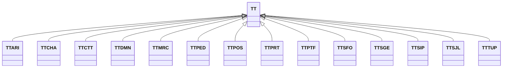

---
search:
  boost: 10.0
---

# Class: TT 


_Concept representing Country of Trinidad and Tobago_


<div data-search-exclude markdown="1">


URI: [loc:TT](https://w3id.org/lmodel/dpv/loc/TT)





## Inheritance
* **TT**
    * [TTARI](TTARI.md)
    * [TTCHA](TTCHA.md)
    * [TTCTT](TTCTT.md)
    * [TTDMN](TTDMN.md)
    * [TTMRC](TTMRC.md)
    * [TTPED](TTPED.md)
    * [TTPOS](TTPOS.md)
    * [TTPRT](TTPRT.md)
    * [TTPTF](TTPTF.md)
    * [TTSFO](TTSFO.md)
    * [TTSGE](TTSGE.md)
    * [TTSIP](TTSIP.md)
    * [TTSJL](TTSJL.md)
    * [TTTUP](TTTUP.md)


## Class Properties

| Property | Value |
| --- | --- |
| Class URI | [loc:TT](https://w3id.org/lmodel/dpv/loc/TT) |


## Slots

| Name | Cardinality and Range | Description | Inheritance |
| ---  | --- | --- | --- |


## In Subsets


* [LocSubset](LocSubset.md)


## Aliases


* Trinidad and Tobago


## Identifier and Mapping Information


### Annotations

| property | value |
| --- | --- |
| upstream_iri | https://w3id.org/dpv/loc/owl#TT |
| dpv_extension_slug | loc |


### Schema Source


* from schema: https://w3id.org/lmodel/dpv/loc


## Mappings

| Mapping Type | Mapped Value |
| ---  | ---  |
| self | loc:TT |
| native | loc:TT |
| exact | dpv_loc:TT, dpv_loc_owl:TT |


## LinkML Source

<!-- TODO: investigate https://stackoverflow.com/questions/37606292/how-to-create-tabbed-code-blocks-in-mkdocs-or-sphinx -->

### Direct

<details>
```yaml
name: TT
annotations:
  upstream_iri:
    tag: upstream_iri
    value: https://w3id.org/dpv/loc/owl#TT
  dpv_extension_slug:
    tag: dpv_extension_slug
    value: loc
description: Concept representing Country of Trinidad and Tobago
in_subset:
- loc_subset
from_schema: https://w3id.org/lmodel/dpv/loc
aliases:
- Trinidad and Tobago
exact_mappings:
- dpv_loc:TT
- dpv_loc_owl:TT
class_uri: loc:TT

```
</details>

### Induced

<details>
```yaml
name: TT
annotations:
  upstream_iri:
    tag: upstream_iri
    value: https://w3id.org/dpv/loc/owl#TT
  dpv_extension_slug:
    tag: dpv_extension_slug
    value: loc
description: Concept representing Country of Trinidad and Tobago
in_subset:
- loc_subset
from_schema: https://w3id.org/lmodel/dpv/loc
aliases:
- Trinidad and Tobago
exact_mappings:
- dpv_loc:TT
- dpv_loc_owl:TT
class_uri: loc:TT

```
</details></div>