---
search:
  boost: 10.0
---

# Class: TW 


_Concept representing Country of Taiwan (Province of China)_


<div data-search-exclude markdown="1">


URI: [loc:TW](https://w3id.org/lmodel/dpv/loc/TW)

```mermaid
 classDiagram
    class TW
    click TW href "../TW/"
      TW <|-- TWCHA
        click TWCHA href "../TWCHA/"
      TW <|-- TWCYI
        click TWCYI href "../TWCYI/"
      TW <|-- TWCYQ
        click TWCYQ href "../TWCYQ/"
      TW <|-- TWHSQ
        click TWHSQ href "../TWHSQ/"
      TW <|-- TWHSZ
        click TWHSZ href "../TWHSZ/"
      TW <|-- TWHUA
        click TWHUA href "../TWHUA/"
      TW <|-- TWILA
        click TWILA href "../TWILA/"
      TW <|-- TWKEE
        click TWKEE href "../TWKEE/"
      TW <|-- TWKHH
        click TWKHH href "../TWKHH/"
      TW <|-- TWKHQ
        click TWKHQ href "../TWKHQ/"
      TW <|-- TWKIN
        click TWKIN href "../TWKIN/"
      TW <|-- TWLIE
        click TWLIE href "../TWLIE/"
      TW <|-- TWMIA
        click TWMIA href "../TWMIA/"
      TW <|-- TWNAN
        click TWNAN href "../TWNAN/"
      TW <|-- TWNWT
        click TWNWT href "../TWNWT/"
      TW <|-- TWPEN
        click TWPEN href "../TWPEN/"
      TW <|-- TWPIF
        click TWPIF href "../TWPIF/"
      TW <|-- TWTAO
        click TWTAO href "../TWTAO/"
      TW <|-- TWTNN
        click TWTNN href "../TWTNN/"
      TW <|-- TWTNQ
        click TWTNQ href "../TWTNQ/"
      TW <|-- TWTPE
        click TWTPE href "../TWTPE/"
      TW <|-- TWTTT
        click TWTTT href "../TWTTT/"
      TW <|-- TWTXG
        click TWTXG href "../TWTXG/"
      TW <|-- TWTXQ
        click TWTXQ href "../TWTXQ/"
      TW <|-- TWYUN
        click TWYUN href "../TWYUN/"
      
      
```





## Inheritance
* **TW**
    * [TWCHA](TWCHA.md)
    * [TWCYI](TWCYI.md)
    * [TWCYQ](TWCYQ.md)
    * [TWHSQ](TWHSQ.md)
    * [TWHSZ](TWHSZ.md)
    * [TWHUA](TWHUA.md)
    * [TWILA](TWILA.md)
    * [TWKEE](TWKEE.md)
    * [TWKHH](TWKHH.md)
    * [TWKHQ](TWKHQ.md)
    * [TWKIN](TWKIN.md)
    * [TWLIE](TWLIE.md)
    * [TWMIA](TWMIA.md)
    * [TWNAN](TWNAN.md)
    * [TWNWT](TWNWT.md)
    * [TWPEN](TWPEN.md)
    * [TWPIF](TWPIF.md)
    * [TWTAO](TWTAO.md)
    * [TWTNN](TWTNN.md)
    * [TWTNQ](TWTNQ.md)
    * [TWTPE](TWTPE.md)
    * [TWTTT](TWTTT.md)
    * [TWTXG](TWTXG.md)
    * [TWTXQ](TWTXQ.md)
    * [TWYUN](TWYUN.md)


## Class Properties

| Property | Value |
| --- | --- |
| Class URI | [loc:TW](https://w3id.org/lmodel/dpv/loc/TW) |


## Slots

| Name | Cardinality and Range | Description | Inheritance |
| ---  | --- | --- | --- |


## In Subsets


* [LocSubset](LocSubset.md)


## Aliases


* Taiwan (Province of China)


## Identifier and Mapping Information


### Annotations

| property | value |
| --- | --- |
| upstream_iri | https://w3id.org/dpv/loc/owl#TW |
| dpv_extension_slug | loc |


### Schema Source


* from schema: https://w3id.org/lmodel/dpv/loc


## Mappings

| Mapping Type | Mapped Value |
| ---  | ---  |
| self | loc:TW |
| native | loc:TW |
| exact | dpv_loc:TW, dpv_loc_owl:TW |


## LinkML Source

<!-- TODO: investigate https://stackoverflow.com/questions/37606292/how-to-create-tabbed-code-blocks-in-mkdocs-or-sphinx -->

### Direct

<details>
```yaml
name: TW
annotations:
  upstream_iri:
    tag: upstream_iri
    value: https://w3id.org/dpv/loc/owl#TW
  dpv_extension_slug:
    tag: dpv_extension_slug
    value: loc
description: Concept representing Country of Taiwan (Province of China)
in_subset:
- loc_subset
from_schema: https://w3id.org/lmodel/dpv/loc
aliases:
- Taiwan (Province of China)
exact_mappings:
- dpv_loc:TW
- dpv_loc_owl:TW
class_uri: loc:TW

```
</details>

### Induced

<details>
```yaml
name: TW
annotations:
  upstream_iri:
    tag: upstream_iri
    value: https://w3id.org/dpv/loc/owl#TW
  dpv_extension_slug:
    tag: dpv_extension_slug
    value: loc
description: Concept representing Country of Taiwan (Province of China)
in_subset:
- loc_subset
from_schema: https://w3id.org/lmodel/dpv/loc
aliases:
- Taiwan (Province of China)
exact_mappings:
- dpv_loc:TW
- dpv_loc_owl:TW
class_uri: loc:TW

```
</details></div>