---
search:
  boost: 10.0
---

# Class: TZ 


_Concept representing Country of United Republic of Tanzania_


<div data-search-exclude markdown="1">


URI: [loc:TZ](https://w3id.org/lmodel/dpv/loc/TZ)

```mermaid
 classDiagram
    class TZ
    click TZ href "../TZ/"
      TZ <|-- TZ01
        click TZ01 href "../TZ01/"
      TZ <|-- TZ02
        click TZ02 href "../TZ02/"
      TZ <|-- TZ03
        click TZ03 href "../TZ03/"
      TZ <|-- TZ04
        click TZ04 href "../TZ04/"
      TZ <|-- TZ05
        click TZ05 href "../TZ05/"
      TZ <|-- TZ06
        click TZ06 href "../TZ06/"
      TZ <|-- TZ07
        click TZ07 href "../TZ07/"
      TZ <|-- TZ08
        click TZ08 href "../TZ08/"
      TZ <|-- TZ09
        click TZ09 href "../TZ09/"
      TZ <|-- TZ10
        click TZ10 href "../TZ10/"
      TZ <|-- TZ11
        click TZ11 href "../TZ11/"
      TZ <|-- TZ12
        click TZ12 href "../TZ12/"
      TZ <|-- TZ13
        click TZ13 href "../TZ13/"
      TZ <|-- TZ14
        click TZ14 href "../TZ14/"
      TZ <|-- TZ15
        click TZ15 href "../TZ15/"
      TZ <|-- TZ16
        click TZ16 href "../TZ16/"
      TZ <|-- TZ17
        click TZ17 href "../TZ17/"
      TZ <|-- TZ18
        click TZ18 href "../TZ18/"
      TZ <|-- TZ19
        click TZ19 href "../TZ19/"
      TZ <|-- TZ20
        click TZ20 href "../TZ20/"
      TZ <|-- TZ21
        click TZ21 href "../TZ21/"
      TZ <|-- TZ22
        click TZ22 href "../TZ22/"
      TZ <|-- TZ23
        click TZ23 href "../TZ23/"
      TZ <|-- TZ24
        click TZ24 href "../TZ24/"
      TZ <|-- TZ25
        click TZ25 href "../TZ25/"
      TZ <|-- TZ26
        click TZ26 href "../TZ26/"
      TZ <|-- TZ27
        click TZ27 href "../TZ27/"
      TZ <|-- TZ28
        click TZ28 href "../TZ28/"
      TZ <|-- TZ29
        click TZ29 href "../TZ29/"
      TZ <|-- TZ30
        click TZ30 href "../TZ30/"
      
      
```





## Inheritance
* **TZ**
    * [TZ01](TZ01.md)
    * [TZ02](TZ02.md)
    * [TZ03](TZ03.md)
    * [TZ04](TZ04.md)
    * [TZ05](TZ05.md)
    * [TZ06](TZ06.md)
    * [TZ07](TZ07.md)
    * [TZ08](TZ08.md)
    * [TZ09](TZ09.md)
    * [TZ10](TZ10.md)
    * [TZ11](TZ11.md)
    * [TZ12](TZ12.md)
    * [TZ13](TZ13.md)
    * [TZ14](TZ14.md)
    * [TZ15](TZ15.md)
    * [TZ16](TZ16.md)
    * [TZ17](TZ17.md)
    * [TZ18](TZ18.md)
    * [TZ19](TZ19.md)
    * [TZ20](TZ20.md)
    * [TZ21](TZ21.md)
    * [TZ22](TZ22.md)
    * [TZ23](TZ23.md)
    * [TZ24](TZ24.md)
    * [TZ25](TZ25.md)
    * [TZ26](TZ26.md)
    * [TZ27](TZ27.md)
    * [TZ28](TZ28.md)
    * [TZ29](TZ29.md)
    * [TZ30](TZ30.md)


## Class Properties

| Property | Value |
| --- | --- |
| Class URI | [loc:TZ](https://w3id.org/lmodel/dpv/loc/TZ) |


## Slots

| Name | Cardinality and Range | Description | Inheritance |
| ---  | --- | --- | --- |


## In Subsets


* [LocSubset](LocSubset.md)


## Aliases


* United Republic of Tanzania


## Identifier and Mapping Information


### Annotations

| property | value |
| --- | --- |
| upstream_iri | https://w3id.org/dpv/loc/owl#TZ |
| dpv_extension_slug | loc |


### Schema Source


* from schema: https://w3id.org/lmodel/dpv/loc


## Mappings

| Mapping Type | Mapped Value |
| ---  | ---  |
| self | loc:TZ |
| native | loc:TZ |
| exact | dpv_loc:TZ, dpv_loc_owl:TZ |


## LinkML Source

<!-- TODO: investigate https://stackoverflow.com/questions/37606292/how-to-create-tabbed-code-blocks-in-mkdocs-or-sphinx -->

### Direct

<details>
```yaml
name: TZ
annotations:
  upstream_iri:
    tag: upstream_iri
    value: https://w3id.org/dpv/loc/owl#TZ
  dpv_extension_slug:
    tag: dpv_extension_slug
    value: loc
description: Concept representing Country of United Republic of Tanzania
in_subset:
- loc_subset
from_schema: https://w3id.org/lmodel/dpv/loc
aliases:
- United Republic of Tanzania
exact_mappings:
- dpv_loc:TZ
- dpv_loc_owl:TZ
class_uri: loc:TZ

```
</details>

### Induced

<details>
```yaml
name: TZ
annotations:
  upstream_iri:
    tag: upstream_iri
    value: https://w3id.org/dpv/loc/owl#TZ
  dpv_extension_slug:
    tag: dpv_extension_slug
    value: loc
description: Concept representing Country of United Republic of Tanzania
in_subset:
- loc_subset
from_schema: https://w3id.org/lmodel/dpv/loc
aliases:
- United Republic of Tanzania
exact_mappings:
- dpv_loc:TZ
- dpv_loc_owl:TZ
class_uri: loc:TZ

```
</details></div>