---
search:
  boost: 10.0
---

# Class: UA 


_Concept representing Country of Ukraine_


<div data-search-exclude markdown="1">


URI: [loc:UA](https://w3id.org/lmodel/dpv/loc/UA)

```mermaid
 classDiagram
    class UA
    click UA href "../UA/"
      UA <|-- UA05
        click UA05 href "../UA05/"
      UA <|-- UA07
        click UA07 href "../UA07/"
      UA <|-- UA09
        click UA09 href "../UA09/"
      UA <|-- UA12
        click UA12 href "../UA12/"
      UA <|-- UA14
        click UA14 href "../UA14/"
      UA <|-- UA18
        click UA18 href "../UA18/"
      UA <|-- UA21
        click UA21 href "../UA21/"
      UA <|-- UA23
        click UA23 href "../UA23/"
      UA <|-- UA26
        click UA26 href "../UA26/"
      UA <|-- UA30
        click UA30 href "../UA30/"
      UA <|-- UA32
        click UA32 href "../UA32/"
      UA <|-- UA35
        click UA35 href "../UA35/"
      UA <|-- UA40
        click UA40 href "../UA40/"
      UA <|-- UA43
        click UA43 href "../UA43/"
      UA <|-- UA46
        click UA46 href "../UA46/"
      UA <|-- UA48
        click UA48 href "../UA48/"
      UA <|-- UA51
        click UA51 href "../UA51/"
      UA <|-- UA53
        click UA53 href "../UA53/"
      UA <|-- UA56
        click UA56 href "../UA56/"
      UA <|-- UA59
        click UA59 href "../UA59/"
      UA <|-- UA61
        click UA61 href "../UA61/"
      UA <|-- UA63
        click UA63 href "../UA63/"
      UA <|-- UA65
        click UA65 href "../UA65/"
      UA <|-- UA68
        click UA68 href "../UA68/"
      UA <|-- UA71
        click UA71 href "../UA71/"
      UA <|-- UA74
        click UA74 href "../UA74/"
      UA <|-- UA77
        click UA77 href "../UA77/"
      
      
```





## Inheritance
* **UA**
    * [UA05](UA05.md)
    * [UA07](UA07.md)
    * [UA09](UA09.md)
    * [UA12](UA12.md)
    * [UA14](UA14.md)
    * [UA18](UA18.md)
    * [UA21](UA21.md)
    * [UA23](UA23.md)
    * [UA26](UA26.md)
    * [UA30](UA30.md)
    * [UA32](UA32.md)
    * [UA35](UA35.md)
    * [UA40](UA40.md)
    * [UA43](UA43.md)
    * [UA46](UA46.md)
    * [UA48](UA48.md)
    * [UA51](UA51.md)
    * [UA53](UA53.md)
    * [UA56](UA56.md)
    * [UA59](UA59.md)
    * [UA61](UA61.md)
    * [UA63](UA63.md)
    * [UA65](UA65.md)
    * [UA68](UA68.md)
    * [UA71](UA71.md)
    * [UA74](UA74.md)
    * [UA77](UA77.md)


## Class Properties

| Property | Value |
| --- | --- |
| Class URI | [loc:UA](https://w3id.org/lmodel/dpv/loc/UA) |


## Slots

| Name | Cardinality and Range | Description | Inheritance |
| ---  | --- | --- | --- |


## In Subsets


* [LocSubset](LocSubset.md)


## Aliases


* Ukraine


## Identifier and Mapping Information


### Annotations

| property | value |
| --- | --- |
| upstream_iri | https://w3id.org/dpv/loc/owl#UA |
| dpv_extension_slug | loc |


### Schema Source


* from schema: https://w3id.org/lmodel/dpv/loc


## Mappings

| Mapping Type | Mapped Value |
| ---  | ---  |
| self | loc:UA |
| native | loc:UA |
| exact | dpv_loc:UA, dpv_loc_owl:UA |


## LinkML Source

<!-- TODO: investigate https://stackoverflow.com/questions/37606292/how-to-create-tabbed-code-blocks-in-mkdocs-or-sphinx -->

### Direct

<details>
```yaml
name: UA
annotations:
  upstream_iri:
    tag: upstream_iri
    value: https://w3id.org/dpv/loc/owl#UA
  dpv_extension_slug:
    tag: dpv_extension_slug
    value: loc
description: Concept representing Country of Ukraine
in_subset:
- loc_subset
from_schema: https://w3id.org/lmodel/dpv/loc
aliases:
- Ukraine
exact_mappings:
- dpv_loc:UA
- dpv_loc_owl:UA
class_uri: loc:UA

```
</details>

### Induced

<details>
```yaml
name: UA
annotations:
  upstream_iri:
    tag: upstream_iri
    value: https://w3id.org/dpv/loc/owl#UA
  dpv_extension_slug:
    tag: dpv_extension_slug
    value: loc
description: Concept representing Country of Ukraine
in_subset:
- loc_subset
from_schema: https://w3id.org/lmodel/dpv/loc
aliases:
- Ukraine
exact_mappings:
- dpv_loc:UA
- dpv_loc_owl:UA
class_uri: loc:UA

```
</details></div>