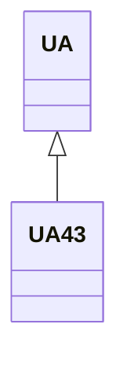

---
search:
  boost: 10.0
---

# Class: UA43 


_Concept representing region Autonomous Republic of Crimea in country_

_Ukraine_


<div data-search-exclude markdown="1">


URI: [loc:UA-43](https://w3id.org/lmodel/dpv/loc/UA-43)





## Inheritance
* [UA](UA.md)
    * **UA43**


## Class Properties

| Property | Value |
| --- | --- |
| Class URI | [loc:UA-43](https://w3id.org/lmodel/dpv/loc/UA-43) |


## Slots

| Name | Cardinality and Range | Description | Inheritance |
| ---  | --- | --- | --- |


## In Subsets


* [LocSubset](LocSubset.md)


## Aliases


* UA-43
* Autonomous Republic of Crimea


## Identifier and Mapping Information


### Annotations

| property | value |
| --- | --- |
| upstream_iri | https://w3id.org/dpv/loc/owl#UA-43 |
| dpv_extension_slug | loc |


### Schema Source


* from schema: https://w3id.org/lmodel/dpv/loc


## Mappings

| Mapping Type | Mapped Value |
| ---  | ---  |
| self | loc:UA-43 |
| native | loc:UA43 |
| exact | dpv_loc:UA-43, dpv_loc_owl:UA-43 |


## LinkML Source

<!-- TODO: investigate https://stackoverflow.com/questions/37606292/how-to-create-tabbed-code-blocks-in-mkdocs-or-sphinx -->

### Direct

<details>
```yaml
name: UA43
annotations:
  upstream_iri:
    tag: upstream_iri
    value: https://w3id.org/dpv/loc/owl#UA-43
  dpv_extension_slug:
    tag: dpv_extension_slug
    value: loc
description: 'Concept representing region Autonomous Republic of Crimea in country

  Ukraine'
in_subset:
- loc_subset
from_schema: https://w3id.org/lmodel/dpv/loc
aliases:
- UA-43
- Autonomous Republic of Crimea
exact_mappings:
- dpv_loc:UA-43
- dpv_loc_owl:UA-43
is_a: UA
class_uri: loc:UA-43

```
</details>

### Induced

<details>
```yaml
name: UA43
annotations:
  upstream_iri:
    tag: upstream_iri
    value: https://w3id.org/dpv/loc/owl#UA-43
  dpv_extension_slug:
    tag: dpv_extension_slug
    value: loc
description: 'Concept representing region Autonomous Republic of Crimea in country

  Ukraine'
in_subset:
- loc_subset
from_schema: https://w3id.org/lmodel/dpv/loc
aliases:
- UA-43
- Autonomous Republic of Crimea
exact_mappings:
- dpv_loc:UA-43
- dpv_loc_owl:UA-43
is_a: UA
class_uri: loc:UA-43

```
</details></div>