---
search:
  boost: 10.0
---

# Class: UG 


_Concept representing Country of Uganda_


<div data-search-exclude markdown="1">


URI: [loc:UG](https://w3id.org/lmodel/dpv/loc/UG)

```mermaid
 classDiagram
    class UG
    click UG href "../UG/"
      UG <|-- UG105
        click UG105 href "../UG105/"
      UG <|-- UG107
        click UG107 href "../UG107/"
      UG <|-- UG113
        click UG113 href "../UG113/"
      UG <|-- UG202
        click UG202 href "../UG202/"
      UG <|-- UG204
        click UG204 href "../UG204/"
      UG <|-- UG207
        click UG207 href "../UG207/"
      UG <|-- UG208
        click UG208 href "../UG208/"
      UG <|-- UG212
        click UG212 href "../UG212/"
      UG <|-- UG220
        click UG220 href "../UG220/"
      UG <|-- UG225
        click UG225 href "../UG225/"
      UG <|-- UG303
        click UG303 href "../UG303/"
      UG <|-- UG304
        click UG304 href "../UG304/"
      UG <|-- UG305
        click UG305 href "../UG305/"
      UG <|-- UG307
        click UG307 href "../UG307/"
      UG <|-- UG310
        click UG310 href "../UG310/"
      UG <|-- UG315
        click UG315 href "../UG315/"
      UG <|-- UG316
        click UG316 href "../UG316/"
      UG <|-- UG317
        click UG317 href "../UG317/"
      UG <|-- UG318
        click UG318 href "../UG318/"
      UG <|-- UG321
        click UG321 href "../UG321/"
      UG <|-- UG401
        click UG401 href "../UG401/"
      UG <|-- UG406
        click UG406 href "../UG406/"
      UG <|-- UG408
        click UG408 href "../UG408/"
      UG <|-- UG409
        click UG409 href "../UG409/"
      UG <|-- UG412
        click UG412 href "../UG412/"
      UG <|-- UG414
        click UG414 href "../UG414/"
      UG <|-- UG416
        click UG416 href "../UG416/"
      UG <|-- UG417
        click UG417 href "../UG417/"
      UG <|-- UG418
        click UG418 href "../UG418/"
      UG <|-- UG422
        click UG422 href "../UG422/"
      UG <|-- UG423
        click UG423 href "../UG423/"
      UG <|-- UG429
        click UG429 href "../UG429/"
      UG <|-- UG435
        click UG435 href "../UG435/"
      UG <|-- UGE
        click UGE href "../UGE/"
      UG <|-- UGN
        click UGN href "../UGN/"
      
      
```





## Inheritance
* **UG**
    * [UG105](UG105.md)
    * [UG107](UG107.md)
    * [UG113](UG113.md)
    * [UG202](UG202.md)
    * [UG204](UG204.md)
    * [UG207](UG207.md)
    * [UG208](UG208.md)
    * [UG212](UG212.md)
    * [UG220](UG220.md)
    * [UG225](UG225.md)
    * [UG303](UG303.md)
    * [UG304](UG304.md)
    * [UG305](UG305.md)
    * [UG307](UG307.md)
    * [UG310](UG310.md)
    * [UG315](UG315.md)
    * [UG316](UG316.md)
    * [UG317](UG317.md)
    * [UG318](UG318.md)
    * [UG321](UG321.md)
    * [UG401](UG401.md)
    * [UG406](UG406.md)
    * [UG408](UG408.md)
    * [UG409](UG409.md)
    * [UG412](UG412.md)
    * [UG414](UG414.md)
    * [UG416](UG416.md)
    * [UG417](UG417.md)
    * [UG418](UG418.md)
    * [UG422](UG422.md)
    * [UG423](UG423.md)
    * [UG429](UG429.md)
    * [UG435](UG435.md)
    * [UGE](UGE.md)
    * [UGN](UGN.md)


## Class Properties

| Property | Value |
| --- | --- |
| Class URI | [loc:UG](https://w3id.org/lmodel/dpv/loc/UG) |


## Slots

| Name | Cardinality and Range | Description | Inheritance |
| ---  | --- | --- | --- |


## In Subsets


* [LocSubset](LocSubset.md)


## Aliases


* Uganda


## Identifier and Mapping Information


### Annotations

| property | value |
| --- | --- |
| upstream_iri | https://w3id.org/dpv/loc/owl#UG |
| dpv_extension_slug | loc |


### Schema Source


* from schema: https://w3id.org/lmodel/dpv/loc


## Mappings

| Mapping Type | Mapped Value |
| ---  | ---  |
| self | loc:UG |
| native | loc:UG |
| exact | dpv_loc:UG, dpv_loc_owl:UG |


## LinkML Source

<!-- TODO: investigate https://stackoverflow.com/questions/37606292/how-to-create-tabbed-code-blocks-in-mkdocs-or-sphinx -->

### Direct

<details>
```yaml
name: UG
annotations:
  upstream_iri:
    tag: upstream_iri
    value: https://w3id.org/dpv/loc/owl#UG
  dpv_extension_slug:
    tag: dpv_extension_slug
    value: loc
description: Concept representing Country of Uganda
in_subset:
- loc_subset
from_schema: https://w3id.org/lmodel/dpv/loc
aliases:
- Uganda
exact_mappings:
- dpv_loc:UG
- dpv_loc_owl:UG
class_uri: loc:UG

```
</details>

### Induced

<details>
```yaml
name: UG
annotations:
  upstream_iri:
    tag: upstream_iri
    value: https://w3id.org/dpv/loc/owl#UG
  dpv_extension_slug:
    tag: dpv_extension_slug
    value: loc
description: Concept representing Country of Uganda
in_subset:
- loc_subset
from_schema: https://w3id.org/lmodel/dpv/loc
aliases:
- Uganda
exact_mappings:
- dpv_loc:UG
- dpv_loc_owl:UG
class_uri: loc:UG

```
</details></div>