---
search:
  boost: 10.0
---

# Class: US 


_Concept representing Country of United States of America_


<div data-search-exclude markdown="1">


URI: [loc:US](https://w3id.org/lmodel/dpv/loc/US)

```mermaid
 classDiagram
    class US
    click US href "../US/"
      US <|-- AS
        click AS href "../AS/"
      US <|-- GU
        click GU href "../GU/"
      US <|-- MP
        click MP href "../MP/"
      US <|-- PR
        click PR href "../PR/"
      US <|-- UM
        click UM href "../UM/"
      US <|-- USAK
        click USAK href "../USAK/"
      US <|-- USAL
        click USAL href "../USAL/"
      US <|-- USAR
        click USAR href "../USAR/"
      US <|-- USAS
        click USAS href "../USAS/"
      US <|-- USAZ
        click USAZ href "../USAZ/"
      US <|-- USCA
        click USCA href "../USCA/"
      US <|-- USCO
        click USCO href "../USCO/"
      US <|-- USCT
        click USCT href "../USCT/"
      US <|-- USDC
        click USDC href "../USDC/"
      US <|-- USDE
        click USDE href "../USDE/"
      US <|-- USFL
        click USFL href "../USFL/"
      US <|-- USGA
        click USGA href "../USGA/"
      US <|-- USGU
        click USGU href "../USGU/"
      US <|-- USHI
        click USHI href "../USHI/"
      US <|-- USIA
        click USIA href "../USIA/"
      US <|-- USID
        click USID href "../USID/"
      US <|-- USIL
        click USIL href "../USIL/"
      US <|-- USIN
        click USIN href "../USIN/"
      US <|-- USKS
        click USKS href "../USKS/"
      US <|-- USKY
        click USKY href "../USKY/"
      US <|-- USLA
        click USLA href "../USLA/"
      US <|-- USMA
        click USMA href "../USMA/"
      US <|-- USMD
        click USMD href "../USMD/"
      US <|-- USME
        click USME href "../USME/"
      US <|-- USMI
        click USMI href "../USMI/"
      US <|-- USMN
        click USMN href "../USMN/"
      US <|-- USMO
        click USMO href "../USMO/"
      US <|-- USMP
        click USMP href "../USMP/"
      US <|-- USMS
        click USMS href "../USMS/"
      US <|-- USMT
        click USMT href "../USMT/"
      US <|-- USNC
        click USNC href "../USNC/"
      US <|-- USND
        click USND href "../USND/"
      US <|-- USNE
        click USNE href "../USNE/"
      US <|-- USNH
        click USNH href "../USNH/"
      US <|-- USNJ
        click USNJ href "../USNJ/"
      US <|-- USNM
        click USNM href "../USNM/"
      US <|-- USNV
        click USNV href "../USNV/"
      US <|-- USNY
        click USNY href "../USNY/"
      US <|-- USOH
        click USOH href "../USOH/"
      US <|-- USOK
        click USOK href "../USOK/"
      US <|-- USOR
        click USOR href "../USOR/"
      US <|-- USPA
        click USPA href "../USPA/"
      US <|-- USPR
        click USPR href "../USPR/"
      US <|-- USRI
        click USRI href "../USRI/"
      US <|-- USSC
        click USSC href "../USSC/"
      US <|-- USSD
        click USSD href "../USSD/"
      US <|-- USTN
        click USTN href "../USTN/"
      US <|-- USTX
        click USTX href "../USTX/"
      US <|-- USUM
        click USUM href "../USUM/"
      US <|-- USUT
        click USUT href "../USUT/"
      US <|-- USVA
        click USVA href "../USVA/"
      US <|-- USVI
        click USVI href "../USVI/"
      US <|-- USVT
        click USVT href "../USVT/"
      US <|-- USWA
        click USWA href "../USWA/"
      US <|-- USWI
        click USWI href "../USWI/"
      US <|-- USWV
        click USWV href "../USWV/"
      US <|-- USWY
        click USWY href "../USWY/"
      US <|-- VI
        click VI href "../VI/"
      
      
```





## Inheritance
* **US**
    * [AS](AS.md)
    * [GU](GU.md)
    * [MP](MP.md)
    * [PR](PR.md)
    * [UM](UM.md)
    * [USAK](USAK.md)
    * [USAL](USAL.md)
    * [USAR](USAR.md)
    * [USAS](USAS.md)
    * [USAZ](USAZ.md)
    * [USCA](USCA.md)
    * [USCO](USCO.md)
    * [USCT](USCT.md)
    * [USDC](USDC.md)
    * [USDE](USDE.md)
    * [USFL](USFL.md)
    * [USGA](USGA.md)
    * [USGU](USGU.md)
    * [USHI](USHI.md)
    * [USIA](USIA.md)
    * [USID](USID.md)
    * [USIL](USIL.md)
    * [USIN](USIN.md)
    * [USKS](USKS.md)
    * [USKY](USKY.md)
    * [USLA](USLA.md)
    * [USMA](USMA.md)
    * [USMD](USMD.md)
    * [USME](USME.md)
    * [USMI](USMI.md)
    * [USMN](USMN.md)
    * [USMO](USMO.md)
    * [USMP](USMP.md)
    * [USMS](USMS.md)
    * [USMT](USMT.md)
    * [USNC](USNC.md)
    * [USND](USND.md)
    * [USNE](USNE.md)
    * [USNH](USNH.md)
    * [USNJ](USNJ.md)
    * [USNM](USNM.md)
    * [USNV](USNV.md)
    * [USNY](USNY.md)
    * [USOH](USOH.md)
    * [USOK](USOK.md)
    * [USOR](USOR.md)
    * [USPA](USPA.md)
    * [USPR](USPR.md)
    * [USRI](USRI.md)
    * [USSC](USSC.md)
    * [USSD](USSD.md)
    * [USTN](USTN.md)
    * [USTX](USTX.md)
    * [USUM](USUM.md)
    * [USUT](USUT.md)
    * [USVA](USVA.md)
    * [USVI](USVI.md)
    * [USVT](USVT.md)
    * [USWA](USWA.md)
    * [USWI](USWI.md)
    * [USWV](USWV.md)
    * [USWY](USWY.md)
    * [VI](VI.md)


## Class Properties

| Property | Value |
| --- | --- |
| Class URI | [loc:US](https://w3id.org/lmodel/dpv/loc/US) |


## Slots

| Name | Cardinality and Range | Description | Inheritance |
| ---  | --- | --- | --- |


## In Subsets


* [LocSubset](LocSubset.md)


## Aliases


* United States of America


## Identifier and Mapping Information


### Annotations

| property | value |
| --- | --- |
| upstream_iri | https://w3id.org/dpv/loc/owl#US |
| dpv_extension_slug | loc |


### Schema Source


* from schema: https://w3id.org/lmodel/dpv/loc


## Mappings

| Mapping Type | Mapped Value |
| ---  | ---  |
| self | loc:US |
| native | loc:US |
| exact | dpv_loc:US, dpv_loc_owl:US, iso3166:US |


## LinkML Source

<!-- TODO: investigate https://stackoverflow.com/questions/37606292/how-to-create-tabbed-code-blocks-in-mkdocs-or-sphinx -->

### Direct

<details>
```yaml
name: US
annotations:
  upstream_iri:
    tag: upstream_iri
    value: https://w3id.org/dpv/loc/owl#US
  dpv_extension_slug:
    tag: dpv_extension_slug
    value: loc
description: Concept representing Country of United States of America
in_subset:
- loc_subset
from_schema: https://w3id.org/lmodel/dpv/loc
aliases:
- United States of America
exact_mappings:
- dpv_loc:US
- dpv_loc_owl:US
- iso3166:US
class_uri: loc:US

```
</details>

### Induced

<details>
```yaml
name: US
annotations:
  upstream_iri:
    tag: upstream_iri
    value: https://w3id.org/dpv/loc/owl#US
  dpv_extension_slug:
    tag: dpv_extension_slug
    value: loc
description: Concept representing Country of United States of America
in_subset:
- loc_subset
from_schema: https://w3id.org/lmodel/dpv/loc
aliases:
- United States of America
exact_mappings:
- dpv_loc:US
- dpv_loc_owl:US
- iso3166:US
class_uri: loc:US

```
</details></div>