---
search:
  boost: 10.0
---

# Class: UY 


_Concept representing Country of Uruguay_


<div data-search-exclude markdown="1">


URI: [loc:UY](https://w3id.org/lmodel/dpv/loc/UY)

```mermaid
 classDiagram
    class UY
    click UY href "../UY/"
      UY <|-- UYAR
        click UYAR href "../UYAR/"
      UY <|-- UYCA
        click UYCA href "../UYCA/"
      UY <|-- UYCL
        click UYCL href "../UYCL/"
      UY <|-- UYCO
        click UYCO href "../UYCO/"
      UY <|-- UYDU
        click UYDU href "../UYDU/"
      UY <|-- UYFD
        click UYFD href "../UYFD/"
      UY <|-- UYFS
        click UYFS href "../UYFS/"
      UY <|-- UYLA
        click UYLA href "../UYLA/"
      UY <|-- UYMA
        click UYMA href "../UYMA/"
      UY <|-- UYMO
        click UYMO href "../UYMO/"
      UY <|-- UYPA
        click UYPA href "../UYPA/"
      UY <|-- UYRN
        click UYRN href "../UYRN/"
      UY <|-- UYRO
        click UYRO href "../UYRO/"
      UY <|-- UYRV
        click UYRV href "../UYRV/"
      UY <|-- UYSA
        click UYSA href "../UYSA/"
      UY <|-- UYSJ
        click UYSJ href "../UYSJ/"
      UY <|-- UYSO
        click UYSO href "../UYSO/"
      UY <|-- UYTA
        click UYTA href "../UYTA/"
      UY <|-- UYTT
        click UYTT href "../UYTT/"
      
      
```





## Inheritance
* **UY**
    * [UYAR](UYAR.md)
    * [UYCA](UYCA.md)
    * [UYCL](UYCL.md)
    * [UYCO](UYCO.md)
    * [UYDU](UYDU.md)
    * [UYFD](UYFD.md)
    * [UYFS](UYFS.md)
    * [UYLA](UYLA.md)
    * [UYMA](UYMA.md)
    * [UYMO](UYMO.md)
    * [UYPA](UYPA.md)
    * [UYRN](UYRN.md)
    * [UYRO](UYRO.md)
    * [UYRV](UYRV.md)
    * [UYSA](UYSA.md)
    * [UYSJ](UYSJ.md)
    * [UYSO](UYSO.md)
    * [UYTA](UYTA.md)
    * [UYTT](UYTT.md)


## Class Properties

| Property | Value |
| --- | --- |
| Class URI | [loc:UY](https://w3id.org/lmodel/dpv/loc/UY) |


## Slots

| Name | Cardinality and Range | Description | Inheritance |
| ---  | --- | --- | --- |


## In Subsets


* [LocSubset](LocSubset.md)


## Aliases


* Uruguay


## Identifier and Mapping Information


### Annotations

| property | value |
| --- | --- |
| upstream_iri | https://w3id.org/dpv/loc/owl#UY |
| dpv_extension_slug | loc |


### Schema Source


* from schema: https://w3id.org/lmodel/dpv/loc


## Mappings

| Mapping Type | Mapped Value |
| ---  | ---  |
| self | loc:UY |
| native | loc:UY |
| exact | dpv_loc:UY, dpv_loc_owl:UY |


## LinkML Source

<!-- TODO: investigate https://stackoverflow.com/questions/37606292/how-to-create-tabbed-code-blocks-in-mkdocs-or-sphinx -->

### Direct

<details>
```yaml
name: UY
annotations:
  upstream_iri:
    tag: upstream_iri
    value: https://w3id.org/dpv/loc/owl#UY
  dpv_extension_slug:
    tag: dpv_extension_slug
    value: loc
description: Concept representing Country of Uruguay
in_subset:
- loc_subset
from_schema: https://w3id.org/lmodel/dpv/loc
aliases:
- Uruguay
exact_mappings:
- dpv_loc:UY
- dpv_loc_owl:UY
class_uri: loc:UY

```
</details>

### Induced

<details>
```yaml
name: UY
annotations:
  upstream_iri:
    tag: upstream_iri
    value: https://w3id.org/dpv/loc/owl#UY
  dpv_extension_slug:
    tag: dpv_extension_slug
    value: loc
description: Concept representing Country of Uruguay
in_subset:
- loc_subset
from_schema: https://w3id.org/lmodel/dpv/loc
aliases:
- Uruguay
exact_mappings:
- dpv_loc:UY
- dpv_loc_owl:UY
class_uri: loc:UY

```
</details></div>