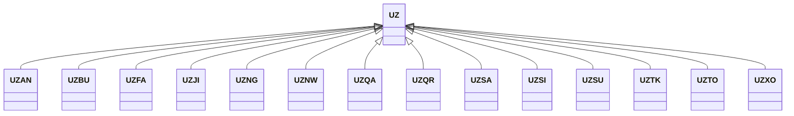

---
search:
  boost: 10.0
---

# Class: UZ 


_Concept representing Country of Uzbekistan_


<div data-search-exclude markdown="1">


URI: [loc:UZ](https://w3id.org/lmodel/dpv/loc/UZ)





## Inheritance
* **UZ**
    * [UZAN](UZAN.md)
    * [UZBU](UZBU.md)
    * [UZFA](UZFA.md)
    * [UZJI](UZJI.md)
    * [UZNG](UZNG.md)
    * [UZNW](UZNW.md)
    * [UZQA](UZQA.md)
    * [UZQR](UZQR.md)
    * [UZSA](UZSA.md)
    * [UZSI](UZSI.md)
    * [UZSU](UZSU.md)
    * [UZTK](UZTK.md)
    * [UZTO](UZTO.md)
    * [UZXO](UZXO.md)


## Class Properties

| Property | Value |
| --- | --- |
| Class URI | [loc:UZ](https://w3id.org/lmodel/dpv/loc/UZ) |


## Slots

| Name | Cardinality and Range | Description | Inheritance |
| ---  | --- | --- | --- |


## In Subsets


* [LocSubset](LocSubset.md)


## Aliases


* Uzbekistan


## Identifier and Mapping Information


### Annotations

| property | value |
| --- | --- |
| upstream_iri | https://w3id.org/dpv/loc/owl#UZ |
| dpv_extension_slug | loc |


### Schema Source


* from schema: https://w3id.org/lmodel/dpv/loc


## Mappings

| Mapping Type | Mapped Value |
| ---  | ---  |
| self | loc:UZ |
| native | loc:UZ |
| exact | dpv_loc:UZ, dpv_loc_owl:UZ |


## LinkML Source

<!-- TODO: investigate https://stackoverflow.com/questions/37606292/how-to-create-tabbed-code-blocks-in-mkdocs-or-sphinx -->

### Direct

<details>
```yaml
name: UZ
annotations:
  upstream_iri:
    tag: upstream_iri
    value: https://w3id.org/dpv/loc/owl#UZ
  dpv_extension_slug:
    tag: dpv_extension_slug
    value: loc
description: Concept representing Country of Uzbekistan
in_subset:
- loc_subset
from_schema: https://w3id.org/lmodel/dpv/loc
aliases:
- Uzbekistan
exact_mappings:
- dpv_loc:UZ
- dpv_loc_owl:UZ
class_uri: loc:UZ

```
</details>

### Induced

<details>
```yaml
name: UZ
annotations:
  upstream_iri:
    tag: upstream_iri
    value: https://w3id.org/dpv/loc/owl#UZ
  dpv_extension_slug:
    tag: dpv_extension_slug
    value: loc
description: Concept representing Country of Uzbekistan
in_subset:
- loc_subset
from_schema: https://w3id.org/lmodel/dpv/loc
aliases:
- Uzbekistan
exact_mappings:
- dpv_loc:UZ
- dpv_loc_owl:UZ
class_uri: loc:UZ

```
</details></div>