---
search:
  boost: 10.0
---

# Class: VE 


_Concept representing Country of Venezuela (Bolivarian Republic of)_


<div data-search-exclude markdown="1">


URI: [loc:VE](https://w3id.org/lmodel/dpv/loc/VE)

```mermaid
 classDiagram
    class VE
    click VE href "../VE/"
      VE <|-- VEA
        click VEA href "../VEA/"
      VE <|-- VEB
        click VEB href "../VEB/"
      VE <|-- VEC
        click VEC href "../VEC/"
      VE <|-- VED
        click VED href "../VED/"
      VE <|-- VEE
        click VEE href "../VEE/"
      VE <|-- VEF
        click VEF href "../VEF/"
      VE <|-- VEG
        click VEG href "../VEG/"
      VE <|-- VEH
        click VEH href "../VEH/"
      VE <|-- VEI
        click VEI href "../VEI/"
      VE <|-- VEJ
        click VEJ href "../VEJ/"
      VE <|-- VEK
        click VEK href "../VEK/"
      VE <|-- VEL
        click VEL href "../VEL/"
      VE <|-- VEM
        click VEM href "../VEM/"
      VE <|-- VEN
        click VEN href "../VEN/"
      VE <|-- VEO
        click VEO href "../VEO/"
      VE <|-- VEP
        click VEP href "../VEP/"
      VE <|-- VER
        click VER href "../VER/"
      VE <|-- VES
        click VES href "../VES/"
      VE <|-- VET
        click VET href "../VET/"
      VE <|-- VEU
        click VEU href "../VEU/"
      VE <|-- VEV
        click VEV href "../VEV/"
      VE <|-- VEW
        click VEW href "../VEW/"
      VE <|-- VEX
        click VEX href "../VEX/"
      VE <|-- VEY
        click VEY href "../VEY/"
      VE <|-- VEZ
        click VEZ href "../VEZ/"
      
      
```





## Inheritance
* **VE**
    * [VEA](VEA.md)
    * [VEB](VEB.md)
    * [VEC](VEC.md)
    * [VED](VED.md)
    * [VEE](VEE.md)
    * [VEF](VEF.md)
    * [VEG](VEG.md)
    * [VEH](VEH.md)
    * [VEI](VEI.md)
    * [VEJ](VEJ.md)
    * [VEK](VEK.md)
    * [VEL](VEL.md)
    * [VEM](VEM.md)
    * [VEN](VEN.md)
    * [VEO](VEO.md)
    * [VEP](VEP.md)
    * [VER](VER.md)
    * [VES](VES.md)
    * [VET](VET.md)
    * [VEU](VEU.md)
    * [VEV](VEV.md)
    * [VEW](VEW.md)
    * [VEX](VEX.md)
    * [VEY](VEY.md)
    * [VEZ](VEZ.md)


## Class Properties

| Property | Value |
| --- | --- |
| Class URI | [loc:VE](https://w3id.org/lmodel/dpv/loc/VE) |


## Slots

| Name | Cardinality and Range | Description | Inheritance |
| ---  | --- | --- | --- |


## In Subsets


* [LocSubset](LocSubset.md)


## Aliases


* Venezuela (Bolivarian Republic of)


## Identifier and Mapping Information


### Annotations

| property | value |
| --- | --- |
| upstream_iri | https://w3id.org/dpv/loc/owl#VE |
| dpv_extension_slug | loc |


### Schema Source


* from schema: https://w3id.org/lmodel/dpv/loc


## Mappings

| Mapping Type | Mapped Value |
| ---  | ---  |
| self | loc:VE |
| native | loc:VE |
| exact | dpv_loc:VE, dpv_loc_owl:VE |


## LinkML Source

<!-- TODO: investigate https://stackoverflow.com/questions/37606292/how-to-create-tabbed-code-blocks-in-mkdocs-or-sphinx -->

### Direct

<details>
```yaml
name: VE
annotations:
  upstream_iri:
    tag: upstream_iri
    value: https://w3id.org/dpv/loc/owl#VE
  dpv_extension_slug:
    tag: dpv_extension_slug
    value: loc
description: Concept representing Country of Venezuela (Bolivarian Republic of)
in_subset:
- loc_subset
from_schema: https://w3id.org/lmodel/dpv/loc
aliases:
- Venezuela (Bolivarian Republic of)
exact_mappings:
- dpv_loc:VE
- dpv_loc_owl:VE
class_uri: loc:VE

```
</details>

### Induced

<details>
```yaml
name: VE
annotations:
  upstream_iri:
    tag: upstream_iri
    value: https://w3id.org/dpv/loc/owl#VE
  dpv_extension_slug:
    tag: dpv_extension_slug
    value: loc
description: Concept representing Country of Venezuela (Bolivarian Republic of)
in_subset:
- loc_subset
from_schema: https://w3id.org/lmodel/dpv/loc
aliases:
- Venezuela (Bolivarian Republic of)
exact_mappings:
- dpv_loc:VE
- dpv_loc_owl:VE
class_uri: loc:VE

```
</details></div>