---
search:
  boost: 10.0
---

# Class: VN 


_Concept representing Country of Vietnam_


<div data-search-exclude markdown="1">


URI: [loc:VN](https://w3id.org/lmodel/dpv/loc/VN)

```mermaid
 classDiagram
    class VN
    click VN href "../VN/"
      VN <|-- VN01
        click VN01 href "../VN01/"
      VN <|-- VN02
        click VN02 href "../VN02/"
      VN <|-- VN03
        click VN03 href "../VN03/"
      VN <|-- VN04
        click VN04 href "../VN04/"
      VN <|-- VN05
        click VN05 href "../VN05/"
      VN <|-- VN06
        click VN06 href "../VN06/"
      VN <|-- VN07
        click VN07 href "../VN07/"
      VN <|-- VN09
        click VN09 href "../VN09/"
      VN <|-- VN13
        click VN13 href "../VN13/"
      VN <|-- VN14
        click VN14 href "../VN14/"
      VN <|-- VN15
        click VN15 href "../VN15/"
      VN <|-- VN18
        click VN18 href "../VN18/"
      VN <|-- VN20
        click VN20 href "../VN20/"
      VN <|-- VN21
        click VN21 href "../VN21/"
      VN <|-- VN22
        click VN22 href "../VN22/"
      VN <|-- VN23
        click VN23 href "../VN23/"
      VN <|-- VN24
        click VN24 href "../VN24/"
      VN <|-- VN25
        click VN25 href "../VN25/"
      VN <|-- VN26
        click VN26 href "../VN26/"
      VN <|-- VN27
        click VN27 href "../VN27/"
      VN <|-- VN28
        click VN28 href "../VN28/"
      VN <|-- VN29
        click VN29 href "../VN29/"
      VN <|-- VN30
        click VN30 href "../VN30/"
      VN <|-- VN31
        click VN31 href "../VN31/"
      VN <|-- VN32
        click VN32 href "../VN32/"
      VN <|-- VN33
        click VN33 href "../VN33/"
      VN <|-- VN34
        click VN34 href "../VN34/"
      VN <|-- VN35
        click VN35 href "../VN35/"
      VN <|-- VN36
        click VN36 href "../VN36/"
      VN <|-- VN37
        click VN37 href "../VN37/"
      VN <|-- VN39
        click VN39 href "../VN39/"
      VN <|-- VN40
        click VN40 href "../VN40/"
      VN <|-- VN41
        click VN41 href "../VN41/"
      VN <|-- VN43
        click VN43 href "../VN43/"
      VN <|-- VN44
        click VN44 href "../VN44/"
      VN <|-- VN45
        click VN45 href "../VN45/"
      VN <|-- VN46
        click VN46 href "../VN46/"
      VN <|-- VN47
        click VN47 href "../VN47/"
      VN <|-- VN49
        click VN49 href "../VN49/"
      VN <|-- VN50
        click VN50 href "../VN50/"
      VN <|-- VN51
        click VN51 href "../VN51/"
      VN <|-- VN52
        click VN52 href "../VN52/"
      VN <|-- VN53
        click VN53 href "../VN53/"
      VN <|-- VN54
        click VN54 href "../VN54/"
      VN <|-- VN55
        click VN55 href "../VN55/"
      VN <|-- VN56
        click VN56 href "../VN56/"
      VN <|-- VN57
        click VN57 href "../VN57/"
      VN <|-- VN58
        click VN58 href "../VN58/"
      VN <|-- VN59
        click VN59 href "../VN59/"
      VN <|-- VN61
        click VN61 href "../VN61/"
      VN <|-- VN63
        click VN63 href "../VN63/"
      VN <|-- VN66
        click VN66 href "../VN66/"
      VN <|-- VN67
        click VN67 href "../VN67/"
      VN <|-- VN68
        click VN68 href "../VN68/"
      VN <|-- VN69
        click VN69 href "../VN69/"
      VN <|-- VN70
        click VN70 href "../VN70/"
      VN <|-- VN71
        click VN71 href "../VN71/"
      VN <|-- VN72
        click VN72 href "../VN72/"
      VN <|-- VN73
        click VN73 href "../VN73/"
      VN <|-- VNCT
        click VNCT href "../VNCT/"
      VN <|-- VNDN
        click VNDN href "../VNDN/"
      VN <|-- VNHN
        click VNHN href "../VNHN/"
      VN <|-- VNHP
        click VNHP href "../VNHP/"
      VN <|-- VNSG
        click VNSG href "../VNSG/"
      
      
```





## Inheritance
* **VN**
    * [VN01](VN01.md)
    * [VN02](VN02.md)
    * [VN03](VN03.md)
    * [VN04](VN04.md)
    * [VN05](VN05.md)
    * [VN06](VN06.md)
    * [VN07](VN07.md)
    * [VN09](VN09.md)
    * [VN13](VN13.md)
    * [VN14](VN14.md)
    * [VN15](VN15.md)
    * [VN18](VN18.md)
    * [VN20](VN20.md)
    * [VN21](VN21.md)
    * [VN22](VN22.md)
    * [VN23](VN23.md)
    * [VN24](VN24.md)
    * [VN25](VN25.md)
    * [VN26](VN26.md)
    * [VN27](VN27.md)
    * [VN28](VN28.md)
    * [VN29](VN29.md)
    * [VN30](VN30.md)
    * [VN31](VN31.md)
    * [VN32](VN32.md)
    * [VN33](VN33.md)
    * [VN34](VN34.md)
    * [VN35](VN35.md)
    * [VN36](VN36.md)
    * [VN37](VN37.md)
    * [VN39](VN39.md)
    * [VN40](VN40.md)
    * [VN41](VN41.md)
    * [VN43](VN43.md)
    * [VN44](VN44.md)
    * [VN45](VN45.md)
    * [VN46](VN46.md)
    * [VN47](VN47.md)
    * [VN49](VN49.md)
    * [VN50](VN50.md)
    * [VN51](VN51.md)
    * [VN52](VN52.md)
    * [VN53](VN53.md)
    * [VN54](VN54.md)
    * [VN55](VN55.md)
    * [VN56](VN56.md)
    * [VN57](VN57.md)
    * [VN58](VN58.md)
    * [VN59](VN59.md)
    * [VN61](VN61.md)
    * [VN63](VN63.md)
    * [VN66](VN66.md)
    * [VN67](VN67.md)
    * [VN68](VN68.md)
    * [VN69](VN69.md)
    * [VN70](VN70.md)
    * [VN71](VN71.md)
    * [VN72](VN72.md)
    * [VN73](VN73.md)
    * [VNCT](VNCT.md)
    * [VNDN](VNDN.md)
    * [VNHN](VNHN.md)
    * [VNHP](VNHP.md)
    * [VNSG](VNSG.md)


## Class Properties

| Property | Value |
| --- | --- |
| Class URI | [loc:VN](https://w3id.org/lmodel/dpv/loc/VN) |


## Slots

| Name | Cardinality and Range | Description | Inheritance |
| ---  | --- | --- | --- |


## In Subsets


* [LocSubset](LocSubset.md)


## Aliases


* Viet Nam


## Identifier and Mapping Information


### Annotations

| property | value |
| --- | --- |
| upstream_iri | https://w3id.org/dpv/loc/owl#VN |
| dpv_extension_slug | loc |


### Schema Source


* from schema: https://w3id.org/lmodel/dpv/loc


## Mappings

| Mapping Type | Mapped Value |
| ---  | ---  |
| self | loc:VN |
| native | loc:VN |
| exact | dpv_loc:VN, dpv_loc_owl:VN |


## LinkML Source

<!-- TODO: investigate https://stackoverflow.com/questions/37606292/how-to-create-tabbed-code-blocks-in-mkdocs-or-sphinx -->

### Direct

<details>
```yaml
name: VN
annotations:
  upstream_iri:
    tag: upstream_iri
    value: https://w3id.org/dpv/loc/owl#VN
  dpv_extension_slug:
    tag: dpv_extension_slug
    value: loc
description: Concept representing Country of Vietnam
in_subset:
- loc_subset
from_schema: https://w3id.org/lmodel/dpv/loc
aliases:
- Viet Nam
exact_mappings:
- dpv_loc:VN
- dpv_loc_owl:VN
class_uri: loc:VN

```
</details>

### Induced

<details>
```yaml
name: VN
annotations:
  upstream_iri:
    tag: upstream_iri
    value: https://w3id.org/dpv/loc/owl#VN
  dpv_extension_slug:
    tag: dpv_extension_slug
    value: loc
description: Concept representing Country of Vietnam
in_subset:
- loc_subset
from_schema: https://w3id.org/lmodel/dpv/loc
aliases:
- Viet Nam
exact_mappings:
- dpv_loc:VN
- dpv_loc_owl:VN
class_uri: loc:VN

```
</details></div>