---
search:
  boost: 10.0
---

# Class: YE 


_Concept representing Country of Yemen_


<div data-search-exclude markdown="1">


URI: [loc:YE](https://w3id.org/lmodel/dpv/loc/YE)

```mermaid
 classDiagram
    class YE
    click YE href "../YE/"
      YE <|-- YEAB
        click YEAB href "../YEAB/"
      YE <|-- YEAD
        click YEAD href "../YEAD/"
      YE <|-- YEAM
        click YEAM href "../YEAM/"
      YE <|-- YEBA
        click YEBA href "../YEBA/"
      YE <|-- YEDA
        click YEDA href "../YEDA/"
      YE <|-- YEDH
        click YEDH href "../YEDH/"
      YE <|-- YEHD
        click YEHD href "../YEHD/"
      YE <|-- YEHJ
        click YEHJ href "../YEHJ/"
      YE <|-- YEHU
        click YEHU href "../YEHU/"
      YE <|-- YEIB
        click YEIB href "../YEIB/"
      YE <|-- YELA
        click YELA href "../YELA/"
      YE <|-- YEMA
        click YEMA href "../YEMA/"
      YE <|-- YEMR
        click YEMR href "../YEMR/"
      YE <|-- YEMW
        click YEMW href "../YEMW/"
      YE <|-- YERA
        click YERA href "../YERA/"
      YE <|-- YESD
        click YESD href "../YESD/"
      YE <|-- YESH
        click YESH href "../YESH/"
      YE <|-- YESN
        click YESN href "../YESN/"
      YE <|-- YESU
        click YESU href "../YESU/"
      YE <|-- YETA
        click YETA href "../YETA/"
      
      
```





## Inheritance
* **YE**
    * [YEAB](YEAB.md)
    * [YEAD](YEAD.md)
    * [YEAM](YEAM.md)
    * [YEBA](YEBA.md)
    * [YEDA](YEDA.md)
    * [YEDH](YEDH.md)
    * [YEHD](YEHD.md)
    * [YEHJ](YEHJ.md)
    * [YEHU](YEHU.md)
    * [YEIB](YEIB.md)
    * [YELA](YELA.md)
    * [YEMA](YEMA.md)
    * [YEMR](YEMR.md)
    * [YEMW](YEMW.md)
    * [YERA](YERA.md)
    * [YESD](YESD.md)
    * [YESH](YESH.md)
    * [YESN](YESN.md)
    * [YESU](YESU.md)
    * [YETA](YETA.md)


## Class Properties

| Property | Value |
| --- | --- |
| Class URI | [loc:YE](https://w3id.org/lmodel/dpv/loc/YE) |


## Slots

| Name | Cardinality and Range | Description | Inheritance |
| ---  | --- | --- | --- |


## In Subsets


* [LocSubset](LocSubset.md)


## Aliases


* Yemen


## Identifier and Mapping Information


### Annotations

| property | value |
| --- | --- |
| upstream_iri | https://w3id.org/dpv/loc/owl#YE |
| dpv_extension_slug | loc |


### Schema Source


* from schema: https://w3id.org/lmodel/dpv/loc


## Mappings

| Mapping Type | Mapped Value |
| ---  | ---  |
| self | loc:YE |
| native | loc:YE |
| exact | dpv_loc:YE, dpv_loc_owl:YE |


## LinkML Source

<!-- TODO: investigate https://stackoverflow.com/questions/37606292/how-to-create-tabbed-code-blocks-in-mkdocs-or-sphinx -->

### Direct

<details>
```yaml
name: YE
annotations:
  upstream_iri:
    tag: upstream_iri
    value: https://w3id.org/dpv/loc/owl#YE
  dpv_extension_slug:
    tag: dpv_extension_slug
    value: loc
description: Concept representing Country of Yemen
in_subset:
- loc_subset
from_schema: https://w3id.org/lmodel/dpv/loc
aliases:
- Yemen
exact_mappings:
- dpv_loc:YE
- dpv_loc_owl:YE
class_uri: loc:YE

```
</details>

### Induced

<details>
```yaml
name: YE
annotations:
  upstream_iri:
    tag: upstream_iri
    value: https://w3id.org/dpv/loc/owl#YE
  dpv_extension_slug:
    tag: dpv_extension_slug
    value: loc
description: Concept representing Country of Yemen
in_subset:
- loc_subset
from_schema: https://w3id.org/lmodel/dpv/loc
aliases:
- Yemen
exact_mappings:
- dpv_loc:YE
- dpv_loc_owl:YE
class_uri: loc:YE

```
</details></div>