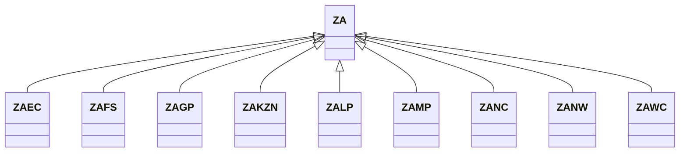

---
search:
  boost: 10.0
---

# Class: ZA 


_Concept representing Country of South Africa_


<div data-search-exclude markdown="1">


URI: [loc:ZA](https://w3id.org/lmodel/dpv/loc/ZA)





## Inheritance
* **ZA**
    * [ZAEC](ZAEC.md)
    * [ZAFS](ZAFS.md)
    * [ZAGP](ZAGP.md)
    * [ZAKZN](ZAKZN.md)
    * [ZALP](ZALP.md)
    * [ZAMP](ZAMP.md)
    * [ZANC](ZANC.md)
    * [ZANW](ZANW.md)
    * [ZAWC](ZAWC.md)


## Class Properties

| Property | Value |
| --- | --- |
| Class URI | [loc:ZA](https://w3id.org/lmodel/dpv/loc/ZA) |


## Slots

| Name | Cardinality and Range | Description | Inheritance |
| ---  | --- | --- | --- |


## In Subsets


* [LocSubset](LocSubset.md)


## Aliases


* South Africa


## Identifier and Mapping Information


### Annotations

| property | value |
| --- | --- |
| upstream_iri | https://w3id.org/dpv/loc/owl#ZA |
| dpv_extension_slug | loc |


### Schema Source


* from schema: https://w3id.org/lmodel/dpv/loc


## Mappings

| Mapping Type | Mapped Value |
| ---  | ---  |
| self | loc:ZA |
| native | loc:ZA |
| exact | dpv_loc:ZA, dpv_loc_owl:ZA |


## LinkML Source

<!-- TODO: investigate https://stackoverflow.com/questions/37606292/how-to-create-tabbed-code-blocks-in-mkdocs-or-sphinx -->

### Direct

<details>
```yaml
name: ZA
annotations:
  upstream_iri:
    tag: upstream_iri
    value: https://w3id.org/dpv/loc/owl#ZA
  dpv_extension_slug:
    tag: dpv_extension_slug
    value: loc
description: Concept representing Country of South Africa
in_subset:
- loc_subset
from_schema: https://w3id.org/lmodel/dpv/loc
aliases:
- South Africa
exact_mappings:
- dpv_loc:ZA
- dpv_loc_owl:ZA
class_uri: loc:ZA

```
</details>

### Induced

<details>
```yaml
name: ZA
annotations:
  upstream_iri:
    tag: upstream_iri
    value: https://w3id.org/dpv/loc/owl#ZA
  dpv_extension_slug:
    tag: dpv_extension_slug
    value: loc
description: Concept representing Country of South Africa
in_subset:
- loc_subset
from_schema: https://w3id.org/lmodel/dpv/loc
aliases:
- South Africa
exact_mappings:
- dpv_loc:ZA
- dpv_loc_owl:ZA
class_uri: loc:ZA

```
</details></div>