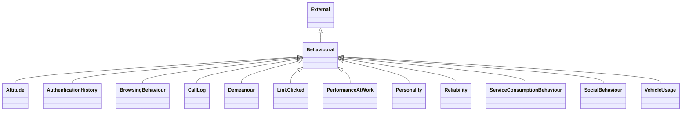

---
search:
  boost: 10.0
---

# Class: Behavioural 


_Information about behaviour or activity_


<div data-search-exclude markdown="1">


URI: [pd:Behavioural](https://w3id.org/lmodel/dpv/pd/Behavioural)





## Inheritance
* [External](External.md)
    * **Behavioural**
        * [Attitude](Attitude.md)
        * [AuthenticationHistory](AuthenticationHistory.md)
        * [BrowsingBehaviour](BrowsingBehaviour.md)
        * [CallLog](CallLog.md)
        * [Demeanour](Demeanour.md)
        * [LinkClicked](LinkClicked.md)
        * [PerformanceAtWork](PerformanceAtWork.md) [ [Professional](Professional.md)]
        * [Personality](Personality.md)
        * [Reliability](Reliability.md)
        * [ServiceConsumptionBehaviour](ServiceConsumptionBehaviour.md)
        * [SocialBehaviour](SocialBehaviour.md) [ [Social](Social.md)]
        * [VehicleUsage](VehicleUsage.md) [ [Vehicle](Vehicle.md)]


## Class Properties

| Property | Value |
| --- | --- |
| Class URI | [pd:Behavioural](https://w3id.org/lmodel/dpv/pd/Behavioural) |


## Slots

| Name | Cardinality and Range | Description | Inheritance |
| ---  | --- | --- | --- |


## In Subsets


* [PdSubset](PdSubset.md)


## Aliases


* Behavioural


## Identifier and Mapping Information


### Annotations

| property | value |
| --- | --- |
| upstream_iri | https://w3id.org/dpv/pd/owl#Behavioural |
| dpv_extension_slug | pd |


### Schema Source


* from schema: https://w3id.org/lmodel/dpv/pd


## Mappings

| Mapping Type | Mapped Value |
| ---  | ---  |
| self | pd:Behavioural |
| native | pd:Behavioural |
| exact | dpv_pd:Behavioural, dpv_pd_owl:Behavioural |
| related | svd:Activity, iso29100:PIIProcessingActivity |


## LinkML Source

<!-- TODO: investigate https://stackoverflow.com/questions/37606292/how-to-create-tabbed-code-blocks-in-mkdocs-or-sphinx -->

### Direct

<details>
```yaml
name: Behavioural
annotations:
  upstream_iri:
    tag: upstream_iri
    value: https://w3id.org/dpv/pd/owl#Behavioural
  dpv_extension_slug:
    tag: dpv_extension_slug
    value: pd
description: Information about behaviour or activity
in_subset:
- pd_subset
from_schema: https://w3id.org/lmodel/dpv/pd
aliases:
- Behavioural
exact_mappings:
- dpv_pd:Behavioural
- dpv_pd_owl:Behavioural
related_mappings:
- svd:Activity
- iso29100:PIIProcessingActivity
is_a: External
class_uri: pd:Behavioural

```
</details>

### Induced

<details>
```yaml
name: Behavioural
annotations:
  upstream_iri:
    tag: upstream_iri
    value: https://w3id.org/dpv/pd/owl#Behavioural
  dpv_extension_slug:
    tag: dpv_extension_slug
    value: pd
description: Information about behaviour or activity
in_subset:
- pd_subset
from_schema: https://w3id.org/lmodel/dpv/pd
aliases:
- Behavioural
exact_mappings:
- dpv_pd:Behavioural
- dpv_pd_owl:Behavioural
related_mappings:
- svd:Activity
- iso29100:PIIProcessingActivity
is_a: External
class_uri: pd:Behavioural

```
</details></div>