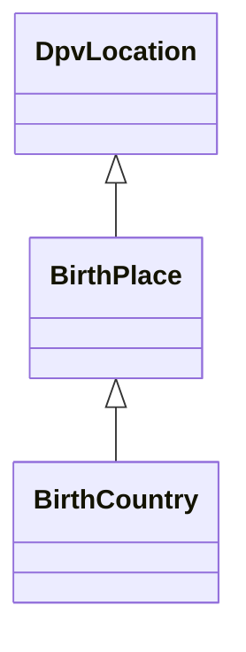

---
search:
  boost: 10.0
---

# Class: BirthPlace 


_Information about birth place_


<div data-search-exclude markdown="1">


URI: [pd:BirthPlace](https://w3id.org/lmodel/dpv/pd/BirthPlace)





## Inheritance
* [Tracking](Tracking.md)
    * [DpvLocation](DpvLocation.md)
        * **BirthPlace**
            * [BirthCountry](BirthCountry.md) [ [DpvLocation](DpvLocation.md) [DpvCountry](DpvCountry.md)]


## Class Properties

| Property | Value |
| --- | --- |
| Class URI | [pd:BirthPlace](https://w3id.org/lmodel/dpv/pd/BirthPlace) |


## Slots

| Name | Cardinality and Range | Description | Inheritance |
| ---  | --- | --- | --- |


## In Subsets


* [PdSubset](PdSubset.md)


## Aliases


* Birth Place


## Identifier and Mapping Information


### Annotations

| property | value |
| --- | --- |
| upstream_iri | https://w3id.org/dpv/pd/owl#BirthPlace |
| dpv_extension_slug | pd |


### Schema Source


* from schema: https://w3id.org/lmodel/dpv/pd


## Mappings

| Mapping Type | Mapped Value |
| ---  | ---  |
| self | pd:BirthPlace |
| native | pd:BirthPlace |
| exact | dpv_pd:BirthPlace, dpv_pd_owl:BirthPlace |


## LinkML Source

<!-- TODO: investigate https://stackoverflow.com/questions/37606292/how-to-create-tabbed-code-blocks-in-mkdocs-or-sphinx -->

### Direct

<details>
```yaml
name: BirthPlace
annotations:
  upstream_iri:
    tag: upstream_iri
    value: https://w3id.org/dpv/pd/owl#BirthPlace
  dpv_extension_slug:
    tag: dpv_extension_slug
    value: pd
description: Information about birth place
in_subset:
- pd_subset
from_schema: https://w3id.org/lmodel/dpv/pd
aliases:
- Birth Place
exact_mappings:
- dpv_pd:BirthPlace
- dpv_pd_owl:BirthPlace
is_a: DpvLocation
class_uri: pd:BirthPlace

```
</details>

### Induced

<details>
```yaml
name: BirthPlace
annotations:
  upstream_iri:
    tag: upstream_iri
    value: https://w3id.org/dpv/pd/owl#BirthPlace
  dpv_extension_slug:
    tag: dpv_extension_slug
    value: pd
description: Information about birth place
in_subset:
- pd_subset
from_schema: https://w3id.org/lmodel/dpv/pd
aliases:
- Birth Place
exact_mappings:
- dpv_pd:BirthPlace
- dpv_pd_owl:BirthPlace
is_a: DpvLocation
class_uri: pd:BirthPlace

```
</details></div>