---
search:
  boost: 10.0
---

# Class: DpvLocation 


_Information about location_


<div data-search-exclude markdown="1">


URI: [pd:Location](https://w3id.org/lmodel/dpv/pd/Location)

```mermaid
 classDiagram
    class DpvLocation
    click DpvLocation href "../DpvLocation/"
      Tracking <|-- DpvLocation
        click Tracking href "../Tracking/"
      

      DpvLocation <|-- BirthCountry
        click BirthCountry href "../BirthCountry/"
      DpvLocation <|-- BirthPlace
        click BirthPlace href "../BirthPlace/"
      DpvLocation <|-- City
        click City href "../City/"
      DpvLocation <|-- CurrentLocation
        click CurrentLocation href "../CurrentLocation/"
      DpvLocation <|-- Domicile
        click Domicile href "../Domicile/"
      DpvLocation <|-- DpvCountry
        click DpvCountry href "../DpvCountry/"
      DpvLocation <|-- DpvRegion
        click DpvRegion href "../DpvRegion/"
      DpvLocation <|-- GPSCoordinate
        click GPSCoordinate href "../GPSCoordinate/"
      DpvLocation <|-- HomeLocation
        click HomeLocation href "../HomeLocation/"
      DpvLocation <|-- HouseNumber
        click HouseNumber href "../HouseNumber/"
      DpvLocation <|-- Locality
        click Locality href "../Locality/"
      DpvLocation <|-- PhysicalAddress
        click PhysicalAddress href "../PhysicalAddress/"
      DpvLocation <|-- PostalCode
        click PostalCode href "../PostalCode/"
      DpvLocation <|-- Residency
        click Residency href "../Residency/"
      DpvLocation <|-- RoomNumber
        click RoomNumber href "../RoomNumber/"
      DpvLocation <|-- Street
        click Street href "../Street/"
      DpvLocation <|-- TravelHistory
        click TravelHistory href "../TravelHistory/"
      DpvLocation <|-- WorkLocation
        click WorkLocation href "../WorkLocation/"
      

      
```





## Inheritance
* [Tracking](Tracking.md)
    * **DpvLocation**
        * [BirthPlace](BirthPlace.md)
        * [CurrentLocation](CurrentLocation.md)
        * [Domicile](Domicile.md)
        * [DpvCountry](DpvCountry.md)
        * [HomeLocation](HomeLocation.md)
        * [Residency](Residency.md)
        * [TravelHistory](TravelHistory.md)
        * [WorkLocation](WorkLocation.md)


## Class Properties

| Property | Value |
| --- | --- |
| Class URI | [pd:Location](https://w3id.org/lmodel/dpv/pd/Location) |


## Slots

| Name | Cardinality and Range | Description | Inheritance |
| ---  | --- | --- | --- |


## In Subsets


* [PdSubset](PdSubset.md)


## Aliases


* Location


## Identifier and Mapping Information


### Annotations

| property | value |
| --- | --- |
| upstream_iri | https://w3id.org/dpv/pd/owl#Location |
| dpv_extension_slug | pd |


### Schema Source


* from schema: https://w3id.org/lmodel/dpv/pd


## Mappings

| Mapping Type | Mapped Value |
| ---  | ---  |
| self | pd:Location |
| native | pd:DpvLocation |
| exact | dpv_pd:Location, dpv_pd_owl:Location |
| related | svd:Location |
| close | iso29100:PersonallyIdentifiableInformation |


## LinkML Source

<!-- TODO: investigate https://stackoverflow.com/questions/37606292/how-to-create-tabbed-code-blocks-in-mkdocs-or-sphinx -->

### Direct

<details>
```yaml
name: DpvLocation
annotations:
  upstream_iri:
    tag: upstream_iri
    value: https://w3id.org/dpv/pd/owl#Location
  dpv_extension_slug:
    tag: dpv_extension_slug
    value: pd
description: Information about location
in_subset:
- pd_subset
from_schema: https://w3id.org/lmodel/dpv/pd
aliases:
- Location
exact_mappings:
- dpv_pd:Location
- dpv_pd_owl:Location
close_mappings:
- iso29100:PersonallyIdentifiableInformation
related_mappings:
- svd:Location
is_a: Tracking
class_uri: pd:Location

```
</details>

### Induced

<details>
```yaml
name: DpvLocation
annotations:
  upstream_iri:
    tag: upstream_iri
    value: https://w3id.org/dpv/pd/owl#Location
  dpv_extension_slug:
    tag: dpv_extension_slug
    value: pd
description: Information about location
in_subset:
- pd_subset
from_schema: https://w3id.org/lmodel/dpv/pd
aliases:
- Location
exact_mappings:
- dpv_pd:Location
- dpv_pd_owl:Location
close_mappings:
- iso29100:PersonallyIdentifiableInformation
related_mappings:
- svd:Location
is_a: Tracking
class_uri: pd:Location

```
</details></div>