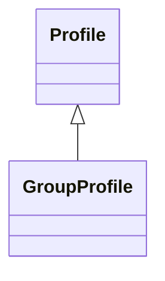

---
search:
  boost: 10.0
---

# Class: GroupProfile 


_Group profile or category profile is information and representation of_

_characteristics associated with a group or category of individuals_


<div data-search-exclude markdown="1">


URI: [pd:GroupProfile](https://w3id.org/lmodel/dpv/pd/GroupProfile)





## Inheritance
* [Profile](Profile.md)
    * **GroupProfile**


## Class Properties

| Property | Value |
| --- | --- |
| Class URI | [pd:GroupProfile](https://w3id.org/lmodel/dpv/pd/GroupProfile) |


## Slots

| Name | Cardinality and Range | Description | Inheritance |
| ---  | --- | --- | --- |


## In Subsets


* [PdSubset](PdSubset.md)


## Aliases


* Group Profile


## Identifier and Mapping Information


### Annotations

| property | value |
| --- | --- |
| upstream_iri | https://w3id.org/dpv/pd/owl#GroupProfile |
| dpv_extension_slug | pd |


### Schema Source


* from schema: https://w3id.org/lmodel/dpv/pd


## Mappings

| Mapping Type | Mapped Value |
| ---  | ---  |
| self | pd:GroupProfile |
| native | pd:GroupProfile |
| exact | dpv_pd:GroupProfile, dpv_pd_owl:GroupProfile |


## LinkML Source

<!-- TODO: investigate https://stackoverflow.com/questions/37606292/how-to-create-tabbed-code-blocks-in-mkdocs-or-sphinx -->

### Direct

<details>
```yaml
name: GroupProfile
annotations:
  upstream_iri:
    tag: upstream_iri
    value: https://w3id.org/dpv/pd/owl#GroupProfile
  dpv_extension_slug:
    tag: dpv_extension_slug
    value: pd
description: 'Group profile or category profile is information and representation
  of

  characteristics associated with a group or category of individuals'
in_subset:
- pd_subset
from_schema: https://w3id.org/lmodel/dpv/pd
aliases:
- Group Profile
exact_mappings:
- dpv_pd:GroupProfile
- dpv_pd_owl:GroupProfile
is_a: Profile
class_uri: pd:GroupProfile

```
</details>

### Induced

<details>
```yaml
name: GroupProfile
annotations:
  upstream_iri:
    tag: upstream_iri
    value: https://w3id.org/dpv/pd/owl#GroupProfile
  dpv_extension_slug:
    tag: dpv_extension_slug
    value: pd
description: 'Group profile or category profile is information and representation
  of

  characteristics associated with a group or category of individuals'
in_subset:
- pd_subset
from_schema: https://w3id.org/lmodel/dpv/pd
aliases:
- Group Profile
exact_mappings:
- dpv_pd:GroupProfile
- dpv_pd_owl:GroupProfile
is_a: Profile
class_uri: pd:GroupProfile

```
</details></div>