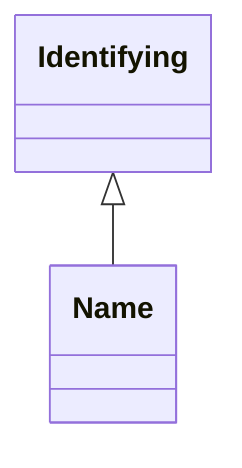

---
search:
  boost: 10.0
---

# Class: Name 


_Information about names associated or used as given name or nickname_


<div data-search-exclude markdown="1">


URI: [pd:Name](https://w3id.org/lmodel/dpv/pd/Name)





## Inheritance
* [External](External.md)
    * [Identifying](Identifying.md)
        * **Name**


## Class Properties

| Property | Value |
| --- | --- |
| Class URI | [pd:Name](https://w3id.org/lmodel/dpv/pd/Name) |


## Slots

| Name | Cardinality and Range | Description | Inheritance |
| ---  | --- | --- | --- |


## In Subsets


* [PdSubset](PdSubset.md)


## Aliases


* Name


## Identifier and Mapping Information


### Annotations

| property | value |
| --- | --- |
| upstream_iri | https://w3id.org/dpv/pd/owl#Name |
| dpv_extension_slug | pd |


### Schema Source


* from schema: https://w3id.org/lmodel/dpv/pd


## Mappings

| Mapping Type | Mapped Value |
| ---  | ---  |
| self | pd:Name |
| native | pd:Name |
| exact | dpv_pd:Name, dpv_pd_owl:Name |
| close | iso29100:PersonallyIdentifiableInformation |


## LinkML Source

<!-- TODO: investigate https://stackoverflow.com/questions/37606292/how-to-create-tabbed-code-blocks-in-mkdocs-or-sphinx -->

### Direct

<details>
```yaml
name: Name
annotations:
  upstream_iri:
    tag: upstream_iri
    value: https://w3id.org/dpv/pd/owl#Name
  dpv_extension_slug:
    tag: dpv_extension_slug
    value: pd
description: Information about names associated or used as given name or nickname
in_subset:
- pd_subset
from_schema: https://w3id.org/lmodel/dpv/pd
aliases:
- Name
exact_mappings:
- dpv_pd:Name
- dpv_pd_owl:Name
close_mappings:
- iso29100:PersonallyIdentifiableInformation
is_a: Identifying
class_uri: pd:Name

```
</details>

### Induced

<details>
```yaml
name: Name
annotations:
  upstream_iri:
    tag: upstream_iri
    value: https://w3id.org/dpv/pd/owl#Name
  dpv_extension_slug:
    tag: dpv_extension_slug
    value: pd
description: Information about names associated or used as given name or nickname
in_subset:
- pd_subset
from_schema: https://w3id.org/lmodel/dpv/pd
aliases:
- Name
exact_mappings:
- dpv_pd:Name
- dpv_pd_owl:Name
close_mappings:
- iso29100:PersonallyIdentifiableInformation
is_a: Identifying
class_uri: pd:Name

```
</details></div>