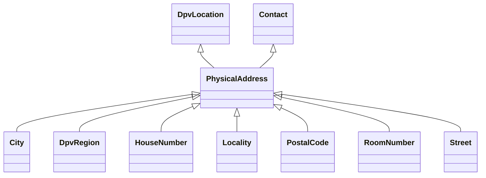

---
search:
  boost: 10.0
---

# Class: PhysicalAddress 


_Information about physical address_


<div data-search-exclude markdown="1">


URI: [pd:PhysicalAddress](https://w3id.org/lmodel/dpv/pd/PhysicalAddress)





## Inheritance
* [Tracking](Tracking.md)
    * [Contact](Contact.md)
        * **PhysicalAddress** [ [DpvLocation](DpvLocation.md)]
            * [City](City.md) [ [DpvLocation](DpvLocation.md)]
            * [DpvRegion](DpvRegion.md) [ [DpvLocation](DpvLocation.md)]
            * [HouseNumber](HouseNumber.md) [ [DpvLocation](DpvLocation.md)]
            * [Locality](Locality.md) [ [DpvLocation](DpvLocation.md)]
            * [PostalCode](PostalCode.md) [ [DpvLocation](DpvLocation.md)]
            * [RoomNumber](RoomNumber.md) [ [DpvLocation](DpvLocation.md)]
            * [Street](Street.md) [ [DpvLocation](DpvLocation.md)]


## Class Properties

| Property | Value |
| --- | --- |
| Class URI | [pd:PhysicalAddress](https://w3id.org/lmodel/dpv/pd/PhysicalAddress) |


## Slots

| Name | Cardinality and Range | Description | Inheritance |
| ---  | --- | --- | --- |


## In Subsets


* [PdSubset](PdSubset.md)


## Aliases


* Physical Address


## Identifier and Mapping Information


### Annotations

| property | value |
| --- | --- |
| upstream_iri | https://w3id.org/dpv/pd/owl#PhysicalAddress |
| dpv_extension_slug | pd |


### Schema Source


* from schema: https://w3id.org/lmodel/dpv/pd


## Mappings

| Mapping Type | Mapped Value |
| ---  | ---  |
| self | pd:PhysicalAddress |
| native | pd:PhysicalAddress |
| exact | dpv_pd:PhysicalAddress, dpv_pd_owl:PhysicalAddress |
| close | iso29100:PersonallyIdentifiableInformation |


## LinkML Source

<!-- TODO: investigate https://stackoverflow.com/questions/37606292/how-to-create-tabbed-code-blocks-in-mkdocs-or-sphinx -->

### Direct

<details>
```yaml
name: PhysicalAddress
annotations:
  upstream_iri:
    tag: upstream_iri
    value: https://w3id.org/dpv/pd/owl#PhysicalAddress
  dpv_extension_slug:
    tag: dpv_extension_slug
    value: pd
description: Information about physical address
in_subset:
- pd_subset
from_schema: https://w3id.org/lmodel/dpv/pd
aliases:
- Physical Address
exact_mappings:
- dpv_pd:PhysicalAddress
- dpv_pd_owl:PhysicalAddress
close_mappings:
- iso29100:PersonallyIdentifiableInformation
is_a: Contact
mixins:
- DpvLocation
class_uri: pd:PhysicalAddress

```
</details>

### Induced

<details>
```yaml
name: PhysicalAddress
annotations:
  upstream_iri:
    tag: upstream_iri
    value: https://w3id.org/dpv/pd/owl#PhysicalAddress
  dpv_extension_slug:
    tag: dpv_extension_slug
    value: pd
description: Information about physical address
in_subset:
- pd_subset
from_schema: https://w3id.org/lmodel/dpv/pd
aliases:
- Physical Address
exact_mappings:
- dpv_pd:PhysicalAddress
- dpv_pd_owl:PhysicalAddress
close_mappings:
- iso29100:PersonallyIdentifiableInformation
is_a: Contact
mixins:
- DpvLocation
class_uri: pd:PhysicalAddress

```
</details></div>