---
search:
  boost: 10.0
---

# Class: Professional 


_Information about educational or professional career_


<div data-search-exclude markdown="1">


URI: [pd:Professional](https://w3id.org/lmodel/dpv/pd/Professional)

```mermaid
 classDiagram
    class Professional
    click Professional href "../Professional/"
      Social <|-- Professional
        click Social href "../Social/"
      

      Professional <|-- DisciplinaryAction
        click DisciplinaryAction href "../DisciplinaryAction/"
      Professional <|-- Education
        click Education href "../Education/"
      Professional <|-- EmploymentHistory
        click EmploymentHistory href "../EmploymentHistory/"
      Professional <|-- Job
        click Job href "../Job/"
      Professional <|-- PerformanceAtWork
        click PerformanceAtWork href "../PerformanceAtWork/"
      Professional <|-- ProfessionalCertification
        click ProfessionalCertification href "../ProfessionalCertification/"
      Professional <|-- ProfessionalEvaluation
        click ProfessionalEvaluation href "../ProfessionalEvaluation/"
      Professional <|-- ProfessionalExperience
        click ProfessionalExperience href "../ProfessionalExperience/"
      Professional <|-- ProfessionalInterview
        click ProfessionalInterview href "../ProfessionalInterview/"
      Professional <|-- ProfessionalTraining
        click ProfessionalTraining href "../ProfessionalTraining/"
      Professional <|-- Reference
        click Reference href "../Reference/"
      Professional <|-- Salary
        click Salary href "../Salary/"
      Professional <|-- School
        click School href "../School/"
      Professional <|-- WorkEnvironment
        click WorkEnvironment href "../WorkEnvironment/"
      Professional <|-- WorkHistory
        click WorkHistory href "../WorkHistory/"
      

      
```





## Inheritance
* [Social](Social.md)
    * **Professional**
        * [DisciplinaryAction](DisciplinaryAction.md)
        * [Education](Education.md)
        * [EmploymentHistory](EmploymentHistory.md)
        * [Job](Job.md)
        * [ProfessionalCertification](ProfessionalCertification.md)
        * [ProfessionalEvaluation](ProfessionalEvaluation.md)
        * [ProfessionalExperience](ProfessionalExperience.md)
        * [ProfessionalInterview](ProfessionalInterview.md)
        * [ProfessionalTraining](ProfessionalTraining.md)
        * [Reference](Reference.md)
        * [Salary](Salary.md)
        * [School](School.md)
        * [WorkEnvironment](WorkEnvironment.md)
        * [WorkHistory](WorkHistory.md)


## Class Properties

| Property | Value |
| --- | --- |
| Class URI | [pd:Professional](https://w3id.org/lmodel/dpv/pd/Professional) |


## Slots

| Name | Cardinality and Range | Description | Inheritance |
| ---  | --- | --- | --- |


## In Subsets


* [PdSubset](PdSubset.md)


## Aliases


* Professional


## Identifier and Mapping Information


### Annotations

| property | value |
| --- | --- |
| upstream_iri | https://w3id.org/dpv/pd/owl#Professional |
| dpv_extension_slug | pd |


### Schema Source


* from schema: https://w3id.org/lmodel/dpv/pd


## Mappings

| Mapping Type | Mapped Value |
| ---  | ---  |
| self | pd:Professional |
| native | pd:Professional |
| exact | dpv_pd:Professional, dpv_pd_owl:Professional |


## LinkML Source

<!-- TODO: investigate https://stackoverflow.com/questions/37606292/how-to-create-tabbed-code-blocks-in-mkdocs-or-sphinx -->

### Direct

<details>
```yaml
name: Professional
annotations:
  upstream_iri:
    tag: upstream_iri
    value: https://w3id.org/dpv/pd/owl#Professional
  dpv_extension_slug:
    tag: dpv_extension_slug
    value: pd
description: Information about educational or professional career
in_subset:
- pd_subset
from_schema: https://w3id.org/lmodel/dpv/pd
aliases:
- Professional
exact_mappings:
- dpv_pd:Professional
- dpv_pd_owl:Professional
is_a: Social
class_uri: pd:Professional

```
</details>

### Induced

<details>
```yaml
name: Professional
annotations:
  upstream_iri:
    tag: upstream_iri
    value: https://w3id.org/dpv/pd/owl#Professional
  dpv_extension_slug:
    tag: dpv_extension_slug
    value: pd
description: Information about educational or professional career
in_subset:
- pd_subset
from_schema: https://w3id.org/lmodel/dpv/pd
aliases:
- Professional
exact_mappings:
- dpv_pd:Professional
- dpv_pd_owl:Professional
is_a: Social
class_uri: pd:Professional

```
</details></div>