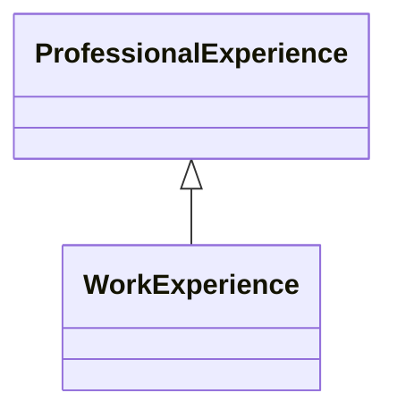

---
search:
  boost: 10.0
---

# Class: WorkExperience 


_Information about work experiences_


<div data-search-exclude markdown="1">


URI: [pd:WorkExperience](https://w3id.org/lmodel/dpv/pd/WorkExperience)





## Inheritance
* [Social](Social.md)
    * [Professional](Professional.md)
        * [ProfessionalExperience](ProfessionalExperience.md)
            * **WorkExperience**


## Class Properties

| Property | Value |
| --- | --- |
| Class URI | [pd:WorkExperience](https://w3id.org/lmodel/dpv/pd/WorkExperience) |


## Slots

| Name | Cardinality and Range | Description | Inheritance |
| ---  | --- | --- | --- |


## In Subsets


* [PdSubset](PdSubset.md)


## Aliases


* Work Experience


## Identifier and Mapping Information


### Annotations

| property | value |
| --- | --- |
| upstream_iri | https://w3id.org/dpv/pd/owl#WorkExperience |
| dpv_extension_slug | pd |


### Schema Source


* from schema: https://w3id.org/lmodel/dpv/pd


## Mappings

| Mapping Type | Mapped Value |
| ---  | ---  |
| self | pd:WorkExperience |
| native | pd:WorkExperience |
| exact | dpv_pd:WorkExperience, dpv_pd_owl:WorkExperience |


## LinkML Source

<!-- TODO: investigate https://stackoverflow.com/questions/37606292/how-to-create-tabbed-code-blocks-in-mkdocs-or-sphinx -->

### Direct

<details>
```yaml
name: WorkExperience
annotations:
  upstream_iri:
    tag: upstream_iri
    value: https://w3id.org/dpv/pd/owl#WorkExperience
  dpv_extension_slug:
    tag: dpv_extension_slug
    value: pd
description: Information about work experiences
in_subset:
- pd_subset
from_schema: https://w3id.org/lmodel/dpv/pd
aliases:
- Work Experience
exact_mappings:
- dpv_pd:WorkExperience
- dpv_pd_owl:WorkExperience
is_a: ProfessionalExperience
class_uri: pd:WorkExperience

```
</details>

### Induced

<details>
```yaml
name: WorkExperience
annotations:
  upstream_iri:
    tag: upstream_iri
    value: https://w3id.org/dpv/pd/owl#WorkExperience
  dpv_extension_slug:
    tag: dpv_extension_slug
    value: pd
description: Information about work experiences
in_subset:
- pd_subset
from_schema: https://w3id.org/lmodel/dpv/pd
aliases:
- Work Experience
exact_mappings:
- dpv_pd:WorkExperience
- dpv_pd_owl:WorkExperience
is_a: ProfessionalExperience
class_uri: pd:WorkExperience

```
</details></div>