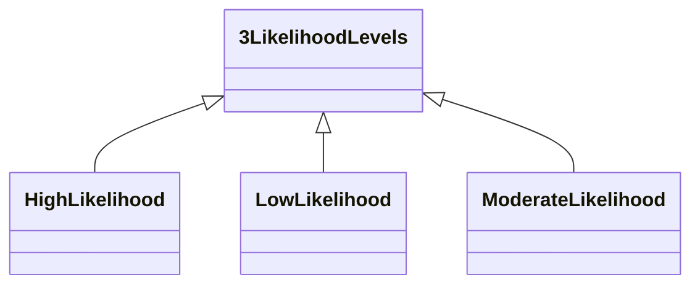

---
search:
  boost: 10.0
---

# Class: 3LikelihoodLevels 


_Scale with 3 Likelihood Levels from High to Low_


<div data-search-exclude markdown="1">


URI: [risk:3LikelihoodLevels](https://w3id.org/lmodel/dpv/risk/3LikelihoodLevels)





## Inheritance
* **3LikelihoodLevels**
    * [HighLikelihood](HighLikelihood.md) [ [5LikelihoodLevels](5LikelihoodLevels.md) [7LikelihoodLevels](7LikelihoodLevels.md)]
    * [LowLikelihood](LowLikelihood.md) [ [5LikelihoodLevels](5LikelihoodLevels.md) [7LikelihoodLevels](7LikelihoodLevels.md)]
    * [ModerateLikelihood](ModerateLikelihood.md) [ [5LikelihoodLevels](5LikelihoodLevels.md) [7LikelihoodLevels](7LikelihoodLevels.md)]


## Class Properties

| Property | Value |
| --- | --- |
| Class URI | [risk:3LikelihoodLevels](https://w3id.org/lmodel/dpv/risk/3LikelihoodLevels) |


## Slots

| Name | Cardinality and Range | Description | Inheritance |
| ---  | --- | --- | --- |


## In Subsets


* [RiskSubset](RiskSubset.md)


## Aliases


* 3 Likelihood Levels


## Identifier and Mapping Information


### Annotations

| property | value |
| --- | --- |
| upstream_iri | https://w3id.org/dpv/risk/owl#3LikelihoodLevels |
| dpv_extension_slug | risk |


### Schema Source


* from schema: https://w3id.org/lmodel/dpv/risk


## Mappings

| Mapping Type | Mapped Value |
| ---  | ---  |
| self | risk:3LikelihoodLevels |
| native | risk:3LikelihoodLevels |
| exact | dpv_risk:3LikelihoodLevels, dpv_risk_owl:3LikelihoodLevels |


## LinkML Source

<!-- TODO: investigate https://stackoverflow.com/questions/37606292/how-to-create-tabbed-code-blocks-in-mkdocs-or-sphinx -->

### Direct

<details>
```yaml
name: 3LikelihoodLevels
annotations:
  upstream_iri:
    tag: upstream_iri
    value: https://w3id.org/dpv/risk/owl#3LikelihoodLevels
  dpv_extension_slug:
    tag: dpv_extension_slug
    value: risk
description: Scale with 3 Likelihood Levels from High to Low
in_subset:
- risk_subset
from_schema: https://w3id.org/lmodel/dpv/risk
aliases:
- 3 Likelihood Levels
exact_mappings:
- dpv_risk:3LikelihoodLevels
- dpv_risk_owl:3LikelihoodLevels
class_uri: risk:3LikelihoodLevels

```
</details>

### Induced

<details>
```yaml
name: 3LikelihoodLevels
annotations:
  upstream_iri:
    tag: upstream_iri
    value: https://w3id.org/dpv/risk/owl#3LikelihoodLevels
  dpv_extension_slug:
    tag: dpv_extension_slug
    value: risk
description: Scale with 3 Likelihood Levels from High to Low
in_subset:
- risk_subset
from_schema: https://w3id.org/lmodel/dpv/risk
aliases:
- 3 Likelihood Levels
exact_mappings:
- dpv_risk:3LikelihoodLevels
- dpv_risk_owl:3LikelihoodLevels
class_uri: risk:3LikelihoodLevels

```
</details></div>