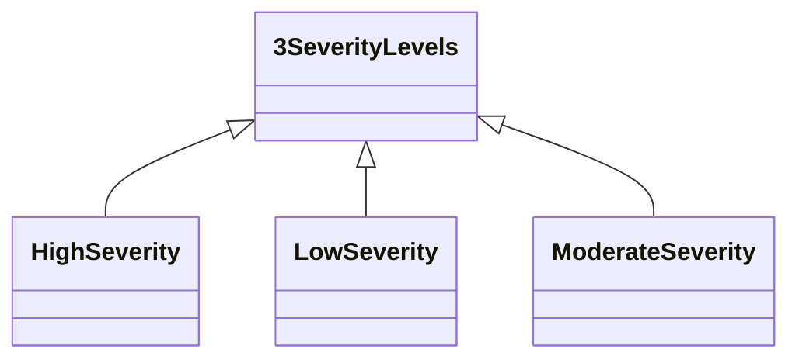

---
search:
  boost: 10.0
---

# Class: 3SeverityLevels 


_Scale with 3 Severity Levels from High to Low_


<div data-search-exclude markdown="1">


URI: [risk:3SeverityLevels](https://w3id.org/lmodel/dpv/risk/3SeverityLevels)





## Inheritance
* **3SeverityLevels**
    * [HighSeverity](HighSeverity.md) [ [5SeverityLevels](5SeverityLevels.md) [7SeverityLevels](7SeverityLevels.md)]
    * [LowSeverity](LowSeverity.md) [ [5SeverityLevels](5SeverityLevels.md) [7SeverityLevels](7SeverityLevels.md)]
    * [ModerateSeverity](ModerateSeverity.md) [ [5SeverityLevels](5SeverityLevels.md) [7SeverityLevels](7SeverityLevels.md)]


## Class Properties

| Property | Value |
| --- | --- |
| Class URI | [risk:3SeverityLevels](https://w3id.org/lmodel/dpv/risk/3SeverityLevels) |


## Slots

| Name | Cardinality and Range | Description | Inheritance |
| ---  | --- | --- | --- |


## In Subsets


* [RiskSubset](RiskSubset.md)


## Aliases


* 3 Severity Levels


## Identifier and Mapping Information


### Annotations

| property | value |
| --- | --- |
| upstream_iri | https://w3id.org/dpv/risk/owl#3SeverityLevels |
| dpv_extension_slug | risk |


### Schema Source


* from schema: https://w3id.org/lmodel/dpv/risk


## Mappings

| Mapping Type | Mapped Value |
| ---  | ---  |
| self | risk:3SeverityLevels |
| native | risk:3SeverityLevels |
| exact | dpv_risk:3SeverityLevels, dpv_risk_owl:3SeverityLevels |


## LinkML Source

<!-- TODO: investigate https://stackoverflow.com/questions/37606292/how-to-create-tabbed-code-blocks-in-mkdocs-or-sphinx -->

### Direct

<details>
```yaml
name: 3SeverityLevels
annotations:
  upstream_iri:
    tag: upstream_iri
    value: https://w3id.org/dpv/risk/owl#3SeverityLevels
  dpv_extension_slug:
    tag: dpv_extension_slug
    value: risk
description: Scale with 3 Severity Levels from High to Low
in_subset:
- risk_subset
from_schema: https://w3id.org/lmodel/dpv/risk
aliases:
- 3 Severity Levels
exact_mappings:
- dpv_risk:3SeverityLevels
- dpv_risk_owl:3SeverityLevels
class_uri: risk:3SeverityLevels

```
</details>

### Induced

<details>
```yaml
name: 3SeverityLevels
annotations:
  upstream_iri:
    tag: upstream_iri
    value: https://w3id.org/dpv/risk/owl#3SeverityLevels
  dpv_extension_slug:
    tag: dpv_extension_slug
    value: risk
description: Scale with 3 Severity Levels from High to Low
in_subset:
- risk_subset
from_schema: https://w3id.org/lmodel/dpv/risk
aliases:
- 3 Severity Levels
exact_mappings:
- dpv_risk:3SeverityLevels
- dpv_risk_owl:3SeverityLevels
class_uri: risk:3SeverityLevels

```
</details></div>