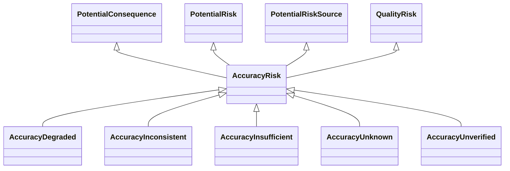

---
search:
  boost: 10.0
---

# Class: AccuracyRisk 


_Concepts representing risks and issues where Accuracy is Risk_


<div data-search-exclude markdown="1">


URI: [risk:AccuracyRisk](https://w3id.org/lmodel/dpv/risk/AccuracyRisk)





## Inheritance
* [TechnicalRiskConcept](TechnicalRiskConcept.md) [ [PotentialConsequence](PotentialConsequence.md) [PotentialImpact](PotentialImpact.md) [PotentialRisk](PotentialRisk.md) [PotentialRiskSource](PotentialRiskSource.md)]
    * [OperationalSecurityRisk](OperationalSecurityRisk.md) [ [PotentialConsequence](PotentialConsequence.md) [PotentialRisk](PotentialRisk.md) [PotentialRiskSource](PotentialRiskSource.md)]
        * [QualityRisk](QualityRisk.md) [ [PotentialConsequence](PotentialConsequence.md) [PotentialRisk](PotentialRisk.md) [PotentialRiskSource](PotentialRiskSource.md)]
            * **AccuracyRisk** [ [PotentialConsequence](PotentialConsequence.md) [PotentialRisk](PotentialRisk.md) [PotentialRiskSource](PotentialRiskSource.md)]
                * [AccuracyDegraded](AccuracyDegraded.md) [ [PotentialConsequence](PotentialConsequence.md) [PotentialRisk](PotentialRisk.md) [PotentialRiskSource](PotentialRiskSource.md) [QualityDegraded](QualityDegraded.md)]
                * [AccuracyInconsistent](AccuracyInconsistent.md) [ [PotentialConsequence](PotentialConsequence.md) [PotentialRisk](PotentialRisk.md) [PotentialRiskSource](PotentialRiskSource.md) [QualityInconsistent](QualityInconsistent.md)]
                * [AccuracyInsufficient](AccuracyInsufficient.md) [ [PotentialConsequence](PotentialConsequence.md) [PotentialRisk](PotentialRisk.md) [PotentialRiskSource](PotentialRiskSource.md) [QualityInsufficient](QualityInsufficient.md)]
                * [AccuracyUnknown](AccuracyUnknown.md) [ [PotentialConsequence](PotentialConsequence.md) [PotentialRisk](PotentialRisk.md) [PotentialRiskSource](PotentialRiskSource.md) [QualityUnknown](QualityUnknown.md)]
                * [AccuracyUnverified](AccuracyUnverified.md) [ [PotentialConsequence](PotentialConsequence.md) [PotentialRisk](PotentialRisk.md) [PotentialRiskSource](PotentialRiskSource.md) [QualityUnverified](QualityUnverified.md)]


## Class Properties

| Property | Value |
| --- | --- |
| Class URI | [risk:AccuracyRisk](https://w3id.org/lmodel/dpv/risk/AccuracyRisk) |


## Slots

| Name | Cardinality and Range | Description | Inheritance |
| ---  | --- | --- | --- |


## In Subsets


* [RiskSubset](RiskSubset.md)


## Aliases


* Accuracy Risk


## Identifier and Mapping Information


### Annotations

| property | value |
| --- | --- |
| upstream_iri | https://w3id.org/dpv/risk/owl#AccuracyRisk |
| dpv_extension_slug | risk |


### Schema Source


* from schema: https://w3id.org/lmodel/dpv/risk


## Mappings

| Mapping Type | Mapped Value |
| ---  | ---  |
| self | risk:AccuracyRisk |
| native | risk:AccuracyRisk |
| exact | dpv_risk:AccuracyRisk, dpv_risk_owl:AccuracyRisk |


## LinkML Source

<!-- TODO: investigate https://stackoverflow.com/questions/37606292/how-to-create-tabbed-code-blocks-in-mkdocs-or-sphinx -->

### Direct

<details>
```yaml
name: AccuracyRisk
annotations:
  upstream_iri:
    tag: upstream_iri
    value: https://w3id.org/dpv/risk/owl#AccuracyRisk
  dpv_extension_slug:
    tag: dpv_extension_slug
    value: risk
description: Concepts representing risks and issues where Accuracy is Risk
in_subset:
- risk_subset
from_schema: https://w3id.org/lmodel/dpv/risk
aliases:
- Accuracy Risk
exact_mappings:
- dpv_risk:AccuracyRisk
- dpv_risk_owl:AccuracyRisk
is_a: QualityRisk
mixins:
- PotentialConsequence
- PotentialRisk
- PotentialRiskSource
class_uri: risk:AccuracyRisk

```
</details>

### Induced

<details>
```yaml
name: AccuracyRisk
annotations:
  upstream_iri:
    tag: upstream_iri
    value: https://w3id.org/dpv/risk/owl#AccuracyRisk
  dpv_extension_slug:
    tag: dpv_extension_slug
    value: risk
description: Concepts representing risks and issues where Accuracy is Risk
in_subset:
- risk_subset
from_schema: https://w3id.org/lmodel/dpv/risk
aliases:
- Accuracy Risk
exact_mappings:
- dpv_risk:AccuracyRisk
- dpv_risk_owl:AccuracyRisk
is_a: QualityRisk
mixins:
- PotentialConsequence
- PotentialRisk
- PotentialRiskSource
class_uri: risk:AccuracyRisk

```
</details></div>