---
search:
  boost: 10.0
---

# Class: AvailabilityConcept 


_Indicates a concept is relevant to 'Availability' in CIA InfoSec model_


<div data-search-exclude markdown="1">


URI: [risk:AvailabilityConcept](https://w3id.org/lmodel/dpv/risk/AvailabilityConcept)

```mermaid
 classDiagram
    class AvailabilityConcept
    click AvailabilityConcept href "../AvailabilityConcept/"
      AvailabilityConcept <|-- AvailabilityBreach
        click AvailabilityBreach href "../AvailabilityBreach/"
      AvailabilityConcept <|-- ComponentFailure
        click ComponentFailure href "../ComponentFailure/"
      AvailabilityConcept <|-- ComponentMalfunction
        click ComponentMalfunction href "../ComponentMalfunction/"
      AvailabilityConcept <|-- CompromiseAccount
        click CompromiseAccount href "../CompromiseAccount/"
      AvailabilityConcept <|-- Cryptojacking
        click Cryptojacking href "../Cryptojacking/"
      AvailabilityConcept <|-- DataBreach
        click DataBreach href "../DataBreach/"
      AvailabilityConcept <|-- DenialServiceAttack
        click DenialServiceAttack href "../DenialServiceAttack/"
      AvailabilityConcept <|-- DistributedDenialServiceAttack
        click DistributedDenialServiceAttack href "../DistributedDenialServiceAttack/"
      AvailabilityConcept <|-- EquipmentFailure
        click EquipmentFailure href "../EquipmentFailure/"
      AvailabilityConcept <|-- EquipmentMalfunction
        click EquipmentMalfunction href "../EquipmentMalfunction/"
      AvailabilityConcept <|-- MaliciousCodeAttack
        click MaliciousCodeAttack href "../MaliciousCodeAttack/"
      AvailabilityConcept <|-- MalwareAttack
        click MalwareAttack href "../MalwareAttack/"
      AvailabilityConcept <|-- Sabotage
        click Sabotage href "../Sabotage/"
      AvailabilityConcept <|-- SecurityAttack
        click SecurityAttack href "../SecurityAttack/"
      AvailabilityConcept <|-- SecurityBreach
        click SecurityBreach href "../SecurityBreach/"
      AvailabilityConcept <|-- SystemFailure
        click SystemFailure href "../SystemFailure/"
      AvailabilityConcept <|-- SystemIntrusion
        click SystemIntrusion href "../SystemIntrusion/"
      AvailabilityConcept <|-- SystemMalfunction
        click SystemMalfunction href "../SystemMalfunction/"
      AvailabilityConcept <|-- TaskExecutionIncorrect
        click TaskExecutionIncorrect href "../TaskExecutionIncorrect/"
      AvailabilityConcept <|-- TaskOmitted
        click TaskOmitted href "../TaskOmitted/"
      AvailabilityConcept <|-- TaskTimingIncorrect
        click TaskTimingIncorrect href "../TaskTimingIncorrect/"
      AvailabilityConcept <|-- UnauthorisedAccessToPremises
        click UnauthorisedAccessToPremises href "../UnauthorisedAccessToPremises/"
      AvailabilityConcept <|-- UnauthorisedActivity
        click UnauthorisedActivity href "../UnauthorisedActivity/"
      AvailabilityConcept <|-- UnauthorisedResourceUse
        click UnauthorisedResourceUse href "../UnauthorisedResourceUse/"
      AvailabilityConcept <|-- UnwantedCodeDeletion
        click UnwantedCodeDeletion href "../UnwantedCodeDeletion/"
      AvailabilityConcept <|-- UnwantedDataDeletion
        click UnwantedDataDeletion href "../UnwantedDataDeletion/"
      
      
```





<!-- no inheritance hierarchy -->

## Class Properties

| Property | Value |
| --- | --- |
| Class URI | [risk:AvailabilityConcept](https://w3id.org/lmodel/dpv/risk/AvailabilityConcept) |


## Slots

| Name | Cardinality and Range | Description | Inheritance |
| ---  | --- | --- | --- |


## In Subsets


* [RiskSubset](RiskSubset.md)


## Aliases


* Availability Concept


## Comments

* This concept allows indicating the applicability of Impact dimension to
concepts whether they are a risk source, risk, consequence, or impact


## Identifier and Mapping Information


### Annotations

| property | value |
| --- | --- |
| upstream_iri | https://w3id.org/dpv/risk/owl#AvailabilityConcept |
| dpv_extension_slug | risk |


### Schema Source


* from schema: https://w3id.org/lmodel/dpv/risk


## Mappings

| Mapping Type | Mapped Value |
| ---  | ---  |
| self | risk:AvailabilityConcept |
| native | risk:AvailabilityConcept |
| exact | dpv_risk:AvailabilityConcept, dpv_risk_owl:AvailabilityConcept |


## LinkML Source

<!-- TODO: investigate https://stackoverflow.com/questions/37606292/how-to-create-tabbed-code-blocks-in-mkdocs-or-sphinx -->

### Direct

<details>
```yaml
name: AvailabilityConcept
annotations:
  upstream_iri:
    tag: upstream_iri
    value: https://w3id.org/dpv/risk/owl#AvailabilityConcept
  dpv_extension_slug:
    tag: dpv_extension_slug
    value: risk
description: Indicates a concept is relevant to 'Availability' in CIA InfoSec model
comments:
- 'This concept allows indicating the applicability of Impact dimension to

  concepts whether they are a risk source, risk, consequence, or impact'
in_subset:
- risk_subset
from_schema: https://w3id.org/lmodel/dpv/risk
aliases:
- Availability Concept
exact_mappings:
- dpv_risk:AvailabilityConcept
- dpv_risk_owl:AvailabilityConcept
class_uri: risk:AvailabilityConcept

```
</details>

### Induced

<details>
```yaml
name: AvailabilityConcept
annotations:
  upstream_iri:
    tag: upstream_iri
    value: https://w3id.org/dpv/risk/owl#AvailabilityConcept
  dpv_extension_slug:
    tag: dpv_extension_slug
    value: risk
description: Indicates a concept is relevant to 'Availability' in CIA InfoSec model
comments:
- 'This concept allows indicating the applicability of Impact dimension to

  concepts whether they are a risk source, risk, consequence, or impact'
in_subset:
- risk_subset
from_schema: https://w3id.org/lmodel/dpv/risk
aliases:
- Availability Concept
exact_mappings:
- dpv_risk:AvailabilityConcept
- dpv_risk_owl:AvailabilityConcept
class_uri: risk:AvailabilityConcept

```
</details></div>