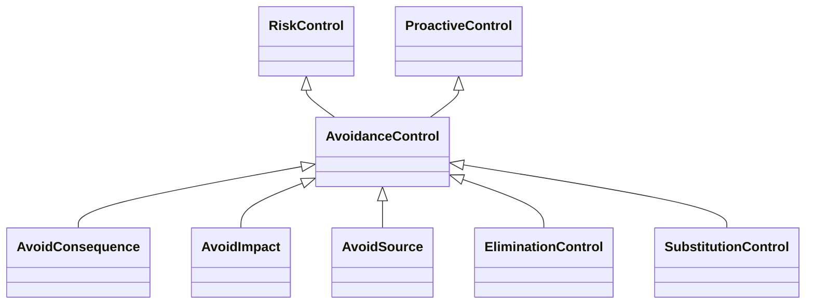

---
search:
  boost: 10.0
---

# Class: AvoidanceControl 


_Control that avoids an event with the goal of removing it completely_


<div data-search-exclude markdown="1">


URI: [risk:AvoidanceControl](https://w3id.org/lmodel/dpv/risk/AvoidanceControl)





## Inheritance
* [RiskControl](RiskControl.md)
    * [ProactiveControl](ProactiveControl.md)
        * **AvoidanceControl** [ [RiskControl](RiskControl.md)]
            * [AvoidConsequence](AvoidConsequence.md) [ [RiskControl](RiskControl.md) [ConsequenceControl](ConsequenceControl.md)]
            * [AvoidImpact](AvoidImpact.md) [ [RiskControl](RiskControl.md) [ImpactControl](ImpactControl.md)]
            * [AvoidSource](AvoidSource.md) [ [RiskControl](RiskControl.md) [SourceControl](SourceControl.md)]
            * [EliminationControl](EliminationControl.md) [ [RiskControl](RiskControl.md)]
            * [SubstitutionControl](SubstitutionControl.md) [ [RiskControl](RiskControl.md)]


## Class Properties

| Property | Value |
| --- | --- |
| Class URI | [risk:AvoidanceControl](https://w3id.org/lmodel/dpv/risk/AvoidanceControl) |


## Slots

| Name | Cardinality and Range | Description | Inheritance |
| ---  | --- | --- | --- |


## In Subsets


* [RiskSubset](RiskSubset.md)


## Aliases


* Avoidance Control


## Comments

* Avoiding is distinct from Mitigation and Modification as the goal to
avoid an event is to prevent it from occurring at all, whereas
mitigation and modification accept an event will occur and focus on
managing it


## Identifier and Mapping Information


### Annotations

| property | value |
| --- | --- |
| upstream_iri | https://w3id.org/dpv/risk/owl#AvoidanceControl |
| dpv_extension_slug | risk |


### Schema Source


* from schema: https://w3id.org/lmodel/dpv/risk


## Mappings

| Mapping Type | Mapped Value |
| ---  | ---  |
| self | risk:AvoidanceControl |
| native | risk:AvoidanceControl |
| exact | dpv_risk:AvoidanceControl, dpv_risk_owl:AvoidanceControl |
| close | iso42001:AIReferenceControl |


## LinkML Source

<!-- TODO: investigate https://stackoverflow.com/questions/37606292/how-to-create-tabbed-code-blocks-in-mkdocs-or-sphinx -->

### Direct

<details>
```yaml
name: AvoidanceControl
annotations:
  upstream_iri:
    tag: upstream_iri
    value: https://w3id.org/dpv/risk/owl#AvoidanceControl
  dpv_extension_slug:
    tag: dpv_extension_slug
    value: risk
description: Control that avoids an event with the goal of removing it completely
comments:
- 'Avoiding is distinct from Mitigation and Modification as the goal to

  avoid an event is to prevent it from occurring at all, whereas

  mitigation and modification accept an event will occur and focus on

  managing it'
in_subset:
- risk_subset
from_schema: https://w3id.org/lmodel/dpv/risk
aliases:
- Avoidance Control
exact_mappings:
- dpv_risk:AvoidanceControl
- dpv_risk_owl:AvoidanceControl
close_mappings:
- iso42001:AIReferenceControl
is_a: ProactiveControl
mixins:
- RiskControl
class_uri: risk:AvoidanceControl

```
</details>

### Induced

<details>
```yaml
name: AvoidanceControl
annotations:
  upstream_iri:
    tag: upstream_iri
    value: https://w3id.org/dpv/risk/owl#AvoidanceControl
  dpv_extension_slug:
    tag: dpv_extension_slug
    value: risk
description: Control that avoids an event with the goal of removing it completely
comments:
- 'Avoiding is distinct from Mitigation and Modification as the goal to

  avoid an event is to prevent it from occurring at all, whereas

  mitigation and modification accept an event will occur and focus on

  managing it'
in_subset:
- risk_subset
from_schema: https://w3id.org/lmodel/dpv/risk
aliases:
- Avoidance Control
exact_mappings:
- dpv_risk:AvoidanceControl
- dpv_risk_owl:AvoidanceControl
close_mappings:
- iso42001:AIReferenceControl
is_a: ProactiveControl
mixins:
- RiskControl
class_uri: risk:AvoidanceControl

```
</details></div>