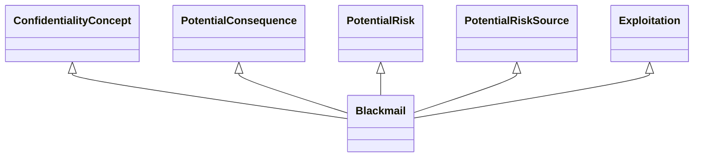

---
search:
  boost: 10.0
---

# Class: Blackmail 


_Concept representing Blackmail_


<div data-search-exclude markdown="1">


URI: [risk:Blackmail](https://w3id.org/lmodel/dpv/risk/Blackmail)





## Inheritance
* [TechnicalRiskConcept](TechnicalRiskConcept.md) [ [PotentialConsequence](PotentialConsequence.md) [PotentialImpact](PotentialImpact.md) [PotentialRisk](PotentialRisk.md) [PotentialRiskSource](PotentialRiskSource.md)]
    * [ExternalSecurityThreat](ExternalSecurityThreat.md) [ [PotentialConsequence](PotentialConsequence.md) [PotentialRisk](PotentialRisk.md) [PotentialRiskSource](PotentialRiskSource.md)]
        * [MaliciousActivity](MaliciousActivity.md) [ [PotentialConsequence](PotentialConsequence.md) [PotentialRisk](PotentialRisk.md) [PotentialRiskSource](PotentialRiskSource.md)]
            * [Exploitation](Exploitation.md) [ [ConfidentialityConcept](ConfidentialityConcept.md) [IntegrityConcept](IntegrityConcept.md) [PotentialConsequence](PotentialConsequence.md) [PotentialRisk](PotentialRisk.md) [PotentialRiskSource](PotentialRiskSource.md)]
                * **Blackmail** [ [ConfidentialityConcept](ConfidentialityConcept.md) [PotentialConsequence](PotentialConsequence.md) [PotentialRisk](PotentialRisk.md) [PotentialRiskSource](PotentialRiskSource.md)]


## Class Properties

| Property | Value |
| --- | --- |
| Class URI | [risk:Blackmail](https://w3id.org/lmodel/dpv/risk/Blackmail) |


## Slots

| Name | Cardinality and Range | Description | Inheritance |
| ---  | --- | --- | --- |


## In Subsets


* [RiskSubset](RiskSubset.md)


## Aliases


* Blackmail


## Identifier and Mapping Information


### Annotations

| property | value |
| --- | --- |
| upstream_iri | https://w3id.org/dpv/risk/owl#Blackmail |
| dpv_extension_slug | risk |


### Schema Source


* from schema: https://w3id.org/lmodel/dpv/risk


## Mappings

| Mapping Type | Mapped Value |
| ---  | ---  |
| self | risk:Blackmail |
| native | risk:Blackmail |
| exact | dpv_risk:Blackmail, dpv_risk_owl:Blackmail |


## LinkML Source

<!-- TODO: investigate https://stackoverflow.com/questions/37606292/how-to-create-tabbed-code-blocks-in-mkdocs-or-sphinx -->

### Direct

<details>
```yaml
name: Blackmail
annotations:
  upstream_iri:
    tag: upstream_iri
    value: https://w3id.org/dpv/risk/owl#Blackmail
  dpv_extension_slug:
    tag: dpv_extension_slug
    value: risk
description: Concept representing Blackmail
in_subset:
- risk_subset
from_schema: https://w3id.org/lmodel/dpv/risk
aliases:
- Blackmail
exact_mappings:
- dpv_risk:Blackmail
- dpv_risk_owl:Blackmail
is_a: Exploitation
mixins:
- ConfidentialityConcept
- PotentialConsequence
- PotentialRisk
- PotentialRiskSource
class_uri: risk:Blackmail

```
</details>

### Induced

<details>
```yaml
name: Blackmail
annotations:
  upstream_iri:
    tag: upstream_iri
    value: https://w3id.org/dpv/risk/owl#Blackmail
  dpv_extension_slug:
    tag: dpv_extension_slug
    value: risk
description: Concept representing Blackmail
in_subset:
- risk_subset
from_schema: https://w3id.org/lmodel/dpv/risk
aliases:
- Blackmail
exact_mappings:
- dpv_risk:Blackmail
- dpv_risk_owl:Blackmail
is_a: Exploitation
mixins:
- ConfidentialityConcept
- PotentialConsequence
- PotentialRisk
- PotentialRiskSource
class_uri: risk:Blackmail

```
</details></div>