---
search:
  boost: 10.0
---

# Class: ConfidentialityConcept 


_Indicates a concept is relevant to 'Confidentiality' in CIA InfoSec_

_model_


<div data-search-exclude markdown="1">


URI: [risk:ConfidentialityConcept](https://w3id.org/lmodel/dpv/risk/ConfidentialityConcept)

```mermaid
 classDiagram
    class ConfidentialityConcept
    click ConfidentialityConcept href "../ConfidentialityConcept/"
      ConfidentialityConcept <|-- AuthorisationFailure
        click AuthorisationFailure href "../AuthorisationFailure/"
      ConfidentialityConcept <|-- Blackmail
        click Blackmail href "../Blackmail/"
      ConfidentialityConcept <|-- BruteForceAuthorisations
        click BruteForceAuthorisations href "../BruteForceAuthorisations/"
      ConfidentialityConcept <|-- Coercion
        click Coercion href "../Coercion/"
      ConfidentialityConcept <|-- CompromiseAccount
        click CompromiseAccount href "../CompromiseAccount/"
      ConfidentialityConcept <|-- CompromiseAccountCredentials
        click CompromiseAccountCredentials href "../CompromiseAccountCredentials/"
      ConfidentialityConcept <|-- ConfidentialityBreach
        click ConfidentialityBreach href "../ConfidentialityBreach/"
      ConfidentialityConcept <|-- DataBreach
        click DataBreach href "../DataBreach/"
      ConfidentialityConcept <|-- Deception
        click Deception href "../Deception/"
      ConfidentialityConcept <|-- Exploitation
        click Exploitation href "../Exploitation/"
      ConfidentialityConcept <|-- Extortion
        click Extortion href "../Extortion/"
      ConfidentialityConcept <|-- Fraud
        click Fraud href "../Fraud/"
      ConfidentialityConcept <|-- IdentityFraud
        click IdentityFraud href "../IdentityFraud/"
      ConfidentialityConcept <|-- IdentityTheft
        click IdentityTheft href "../IdentityTheft/"
      ConfidentialityConcept <|-- IntentionalManipulation
        click IntentionalManipulation href "../IntentionalManipulation/"
      ConfidentialityConcept <|-- InterceptCommunications
        click InterceptCommunications href "../InterceptCommunications/"
      ConfidentialityConcept <|-- MaliciousCodeAttack
        click MaliciousCodeAttack href "../MaliciousCodeAttack/"
      ConfidentialityConcept <|-- MalwareAttack
        click MalwareAttack href "../MalwareAttack/"
      ConfidentialityConcept <|-- PhishingScam
        click PhishingScam href "../PhishingScam/"
      ConfidentialityConcept <|-- Reidentification
        click Reidentification href "../Reidentification/"
      ConfidentialityConcept <|-- Scam
        click Scam href "../Scam/"
      ConfidentialityConcept <|-- SecurityAttack
        click SecurityAttack href "../SecurityAttack/"
      ConfidentialityConcept <|-- SecurityBreach
        click SecurityBreach href "../SecurityBreach/"
      ConfidentialityConcept <|-- Spoofing
        click Spoofing href "../Spoofing/"
      ConfidentialityConcept <|-- SystemIntrusion
        click SystemIntrusion href "../SystemIntrusion/"
      ConfidentialityConcept <|-- UnauthorisedAccessToPremises
        click UnauthorisedAccessToPremises href "../UnauthorisedAccessToPremises/"
      ConfidentialityConcept <|-- UnauthorisedActivity
        click UnauthorisedActivity href "../UnauthorisedActivity/"
      ConfidentialityConcept <|-- UnauthorisedCodeAccess
        click UnauthorisedCodeAccess href "../UnauthorisedCodeAccess/"
      ConfidentialityConcept <|-- UnauthorisedCodeDisclosure
        click UnauthorisedCodeDisclosure href "../UnauthorisedCodeDisclosure/"
      ConfidentialityConcept <|-- UnauthorisedDataAccess
        click UnauthorisedDataAccess href "../UnauthorisedDataAccess/"
      ConfidentialityConcept <|-- UnauthorisedDataDisclosure
        click UnauthorisedDataDisclosure href "../UnauthorisedDataDisclosure/"
      ConfidentialityConcept <|-- UnauthorisedInformationDisclosure
        click UnauthorisedInformationDisclosure href "../UnauthorisedInformationDisclosure/"
      ConfidentialityConcept <|-- UnauthorisedReidentification
        click UnauthorisedReidentification href "../UnauthorisedReidentification/"
      ConfidentialityConcept <|-- UnauthorisedSystemAccess
        click UnauthorisedSystemAccess href "../UnauthorisedSystemAccess/"
      ConfidentialityConcept <|-- UnwantedDisclosureData
        click UnwantedDisclosureData href "../UnwantedDisclosureData/"
      
      
```





<!-- no inheritance hierarchy -->

## Class Properties

| Property | Value |
| --- | --- |
| Class URI | [risk:ConfidentialityConcept](https://w3id.org/lmodel/dpv/risk/ConfidentialityConcept) |


## Slots

| Name | Cardinality and Range | Description | Inheritance |
| ---  | --- | --- | --- |


## In Subsets


* [RiskSubset](RiskSubset.md)


## Aliases


* Confidentiality Concept


## Comments

* This concept allows indicating the applicability of Confidentiality
dimension to concepts whether they are a risk source, risk, consequence,
or impact


## Identifier and Mapping Information


### Annotations

| property | value |
| --- | --- |
| upstream_iri | https://w3id.org/dpv/risk/owl#ConfidentialityConcept |
| dpv_extension_slug | risk |


### Schema Source


* from schema: https://w3id.org/lmodel/dpv/risk


## Mappings

| Mapping Type | Mapped Value |
| ---  | ---  |
| self | risk:ConfidentialityConcept |
| native | risk:ConfidentialityConcept |
| exact | dpv_risk:ConfidentialityConcept, dpv_risk_owl:ConfidentialityConcept |


## LinkML Source

<!-- TODO: investigate https://stackoverflow.com/questions/37606292/how-to-create-tabbed-code-blocks-in-mkdocs-or-sphinx -->

### Direct

<details>
```yaml
name: ConfidentialityConcept
annotations:
  upstream_iri:
    tag: upstream_iri
    value: https://w3id.org/dpv/risk/owl#ConfidentialityConcept
  dpv_extension_slug:
    tag: dpv_extension_slug
    value: risk
description: 'Indicates a concept is relevant to ''Confidentiality'' in CIA InfoSec

  model'
comments:
- 'This concept allows indicating the applicability of Confidentiality

  dimension to concepts whether they are a risk source, risk, consequence,

  or impact'
in_subset:
- risk_subset
from_schema: https://w3id.org/lmodel/dpv/risk
aliases:
- Confidentiality Concept
exact_mappings:
- dpv_risk:ConfidentialityConcept
- dpv_risk_owl:ConfidentialityConcept
class_uri: risk:ConfidentialityConcept

```
</details>

### Induced

<details>
```yaml
name: ConfidentialityConcept
annotations:
  upstream_iri:
    tag: upstream_iri
    value: https://w3id.org/dpv/risk/owl#ConfidentialityConcept
  dpv_extension_slug:
    tag: dpv_extension_slug
    value: risk
description: 'Indicates a concept is relevant to ''Confidentiality'' in CIA InfoSec

  model'
comments:
- 'This concept allows indicating the applicability of Confidentiality

  dimension to concepts whether they are a risk source, risk, consequence,

  or impact'
in_subset:
- risk_subset
from_schema: https://w3id.org/lmodel/dpv/risk
aliases:
- Confidentiality Concept
exact_mappings:
- dpv_risk:ConfidentialityConcept
- dpv_risk_owl:ConfidentialityConcept
class_uri: risk:ConfidentialityConcept

```
</details></div>