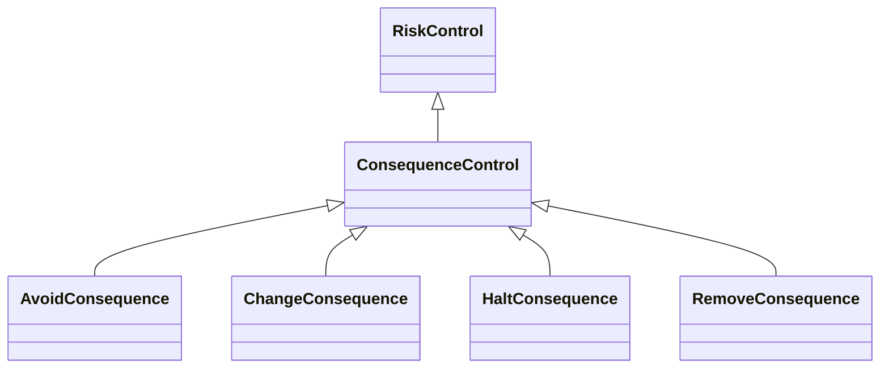

---
search:
  boost: 10.0
---

# Class: ConsequenceControl 


_Risk control for managing consequences_


<div data-search-exclude markdown="1">


URI: [risk:ConsequenceControl](https://w3id.org/lmodel/dpv/risk/ConsequenceControl)





## Inheritance
* [RiskControl](RiskControl.md)
    * **ConsequenceControl**
        * [ChangeConsequence](ChangeConsequence.md) [ [RiskControl](RiskControl.md) [SubstitutionControl](SubstitutionControl.md)]
        * [HaltConsequence](HaltConsequence.md) [ [RiskControl](RiskControl.md) [InterruptionControl](InterruptionControl.md)]
        * [RemoveConsequence](RemoveConsequence.md) [ [RiskControl](RiskControl.md) [EliminationControl](EliminationControl.md)]


## Class Properties

| Property | Value |
| --- | --- |
| Class URI | [risk:ConsequenceControl](https://w3id.org/lmodel/dpv/risk/ConsequenceControl) |


## Slots

| Name | Cardinality and Range | Description | Inheritance |
| ---  | --- | --- | --- |


## In Subsets


* [RiskSubset](RiskSubset.md)


## Aliases


* Consequence Control


## Identifier and Mapping Information


### Annotations

| property | value |
| --- | --- |
| upstream_iri | https://w3id.org/dpv/risk/owl#ConsequenceControl |
| dpv_extension_slug | risk |


### Schema Source


* from schema: https://w3id.org/lmodel/dpv/risk


## Mappings

| Mapping Type | Mapped Value |
| ---  | ---  |
| self | risk:ConsequenceControl |
| native | risk:ConsequenceControl |
| exact | dpv_risk:ConsequenceControl, dpv_risk_owl:ConsequenceControl |
| close | iso42001:AIReferenceControl |


## LinkML Source

<!-- TODO: investigate https://stackoverflow.com/questions/37606292/how-to-create-tabbed-code-blocks-in-mkdocs-or-sphinx -->

### Direct

<details>
```yaml
name: ConsequenceControl
annotations:
  upstream_iri:
    tag: upstream_iri
    value: https://w3id.org/dpv/risk/owl#ConsequenceControl
  dpv_extension_slug:
    tag: dpv_extension_slug
    value: risk
description: Risk control for managing consequences
in_subset:
- risk_subset
from_schema: https://w3id.org/lmodel/dpv/risk
aliases:
- Consequence Control
exact_mappings:
- dpv_risk:ConsequenceControl
- dpv_risk_owl:ConsequenceControl
close_mappings:
- iso42001:AIReferenceControl
is_a: RiskControl
class_uri: risk:ConsequenceControl

```
</details>

### Induced

<details>
```yaml
name: ConsequenceControl
annotations:
  upstream_iri:
    tag: upstream_iri
    value: https://w3id.org/dpv/risk/owl#ConsequenceControl
  dpv_extension_slug:
    tag: dpv_extension_slug
    value: risk
description: Risk control for managing consequences
in_subset:
- risk_subset
from_schema: https://w3id.org/lmodel/dpv/risk
aliases:
- Consequence Control
exact_mappings:
- dpv_risk:ConsequenceControl
- dpv_risk_owl:ConsequenceControl
close_mappings:
- iso42001:AIReferenceControl
is_a: RiskControl
class_uri: risk:ConsequenceControl

```
</details></div>