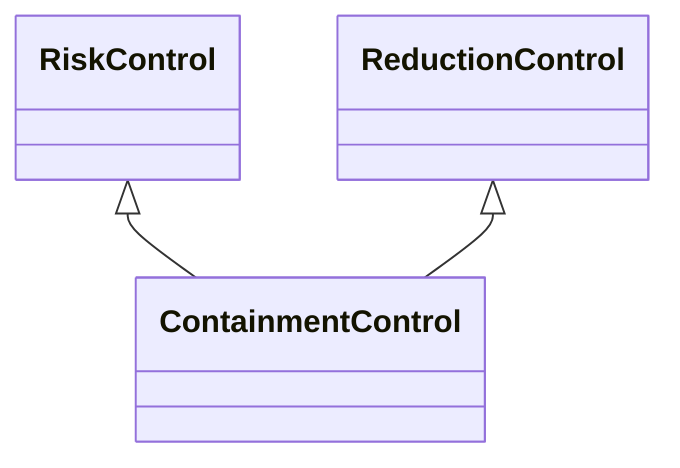

---
search:
  boost: 10.0
---

# Class: ContainmentControl 


_Control that aims to contain the event in terms of limiting its_

_occurrence or effects_


<div data-search-exclude markdown="1">


URI: [risk:ContainmentControl](https://w3id.org/lmodel/dpv/risk/ContainmentControl)





## Inheritance
* [RiskControl](RiskControl.md)
    * [ReactiveControl](ReactiveControl.md)
        * [ReductionControl](ReductionControl.md) [ [RiskControl](RiskControl.md)]
            * **ContainmentControl** [ [RiskControl](RiskControl.md)]


## Class Properties

| Property | Value |
| --- | --- |
| Class URI | [risk:ContainmentControl](https://w3id.org/lmodel/dpv/risk/ContainmentControl) |


## Slots

| Name | Cardinality and Range | Description | Inheritance |
| ---  | --- | --- | --- |


## In Subsets


* [RiskSubset](RiskSubset.md)


## Aliases


* Containment Control


## Comments

* Containment implies either changing the event or the context such that
the event's effects are restricted, such as by establishing a physical
or digital boundary within which the effects can occur or to prevent the
effects from affecting things inside the boundary


## Identifier and Mapping Information


### Annotations

| property | value |
| --- | --- |
| upstream_iri | https://w3id.org/dpv/risk/owl#ContainmentControl |
| dpv_extension_slug | risk |


### Schema Source


* from schema: https://w3id.org/lmodel/dpv/risk


## Mappings

| Mapping Type | Mapped Value |
| ---  | ---  |
| self | risk:ContainmentControl |
| native | risk:ContainmentControl |
| exact | dpv_risk:ContainmentControl, dpv_risk_owl:ContainmentControl |
| close | iso42001:AIReferenceControl |


## LinkML Source

<!-- TODO: investigate https://stackoverflow.com/questions/37606292/how-to-create-tabbed-code-blocks-in-mkdocs-or-sphinx -->

### Direct

<details>
```yaml
name: ContainmentControl
annotations:
  upstream_iri:
    tag: upstream_iri
    value: https://w3id.org/dpv/risk/owl#ContainmentControl
  dpv_extension_slug:
    tag: dpv_extension_slug
    value: risk
description: 'Control that aims to contain the event in terms of limiting its

  occurrence or effects'
comments:
- 'Containment implies either changing the event or the context such that

  the event''s effects are restricted, such as by establishing a physical

  or digital boundary within which the effects can occur or to prevent the

  effects from affecting things inside the boundary'
in_subset:
- risk_subset
from_schema: https://w3id.org/lmodel/dpv/risk
aliases:
- Containment Control
exact_mappings:
- dpv_risk:ContainmentControl
- dpv_risk_owl:ContainmentControl
close_mappings:
- iso42001:AIReferenceControl
is_a: ReductionControl
mixins:
- RiskControl
class_uri: risk:ContainmentControl

```
</details>

### Induced

<details>
```yaml
name: ContainmentControl
annotations:
  upstream_iri:
    tag: upstream_iri
    value: https://w3id.org/dpv/risk/owl#ContainmentControl
  dpv_extension_slug:
    tag: dpv_extension_slug
    value: risk
description: 'Control that aims to contain the event in terms of limiting its

  occurrence or effects'
comments:
- 'Containment implies either changing the event or the context such that

  the event''s effects are restricted, such as by establishing a physical

  or digital boundary within which the effects can occur or to prevent the

  effects from affecting things inside the boundary'
in_subset:
- risk_subset
from_schema: https://w3id.org/lmodel/dpv/risk
aliases:
- Containment Control
exact_mappings:
- dpv_risk:ContainmentControl
- dpv_risk_owl:ContainmentControl
close_mappings:
- iso42001:AIReferenceControl
is_a: ReductionControl
mixins:
- RiskControl
class_uri: risk:ContainmentControl

```
</details></div>