---
search:
  boost: 10.0
---

# Class: DataRisk 


_Risks and risk concepts related to data_


<div data-search-exclude markdown="1">


URI: [risk:DataRisk](https://w3id.org/lmodel/dpv/risk/DataRisk)

```mermaid
 classDiagram
    class DataRisk
    click DataRisk href "../DataRisk/"
      PotentialConsequence <|-- DataRisk
        click PotentialConsequence href "../PotentialConsequence/"
      PotentialRisk <|-- DataRisk
        click PotentialRisk href "../PotentialRisk/"
      PotentialRiskSource <|-- DataRisk
        click PotentialRiskSource href "../PotentialRiskSource/"
      TechnicalRiskConcept <|-- DataRisk
        click TechnicalRiskConcept href "../TechnicalRiskConcept/"
      

      DataRisk <|-- DataBias
        click DataBias href "../DataBias/"
      DataRisk <|-- DataInaccurate
        click DataInaccurate href "../DataInaccurate/"
      DataRisk <|-- DataIncomplete
        click DataIncomplete href "../DataIncomplete/"
      DataRisk <|-- DataInconsistent
        click DataInconsistent href "../DataInconsistent/"
      DataRisk <|-- DataLoss
        click DataLoss href "../DataLoss/"
      DataRisk <|-- DataMisclassified
        click DataMisclassified href "../DataMisclassified/"
      DataRisk <|-- DataMisinterpretation
        click DataMisinterpretation href "../DataMisinterpretation/"
      DataRisk <|-- DataNoise
        click DataNoise href "../DataNoise/"
      DataRisk <|-- DataOutdated
        click DataOutdated href "../DataOutdated/"
      DataRisk <|-- DataProcessingError
        click DataProcessingError href "../DataProcessingError/"
      DataRisk <|-- DataSparse
        click DataSparse href "../DataSparse/"
      DataRisk <|-- DataUnavailable
        click DataUnavailable href "../DataUnavailable/"
      DataRisk <|-- DataUnrepresentative
        click DataUnrepresentative href "../DataUnrepresentative/"
      DataRisk <|-- DataUnstructured
        click DataUnstructured href "../DataUnstructured/"
      DataRisk <|-- DataUnverified
        click DataUnverified href "../DataUnverified/"
      

      
```





## Inheritance
* [TechnicalRiskConcept](TechnicalRiskConcept.md) [ [PotentialConsequence](PotentialConsequence.md) [PotentialImpact](PotentialImpact.md) [PotentialRisk](PotentialRisk.md) [PotentialRiskSource](PotentialRiskSource.md)]
    * **DataRisk** [ [PotentialConsequence](PotentialConsequence.md) [PotentialRisk](PotentialRisk.md) [PotentialRiskSource](PotentialRiskSource.md)]
        * [DataInaccurate](DataInaccurate.md) [ [PotentialConsequence](PotentialConsequence.md) [PotentialRisk](PotentialRisk.md) [PotentialRiskSource](PotentialRiskSource.md)]
        * [DataIncomplete](DataIncomplete.md) [ [PotentialConsequence](PotentialConsequence.md) [PotentialRisk](PotentialRisk.md) [PotentialRiskSource](PotentialRiskSource.md)]
        * [DataInconsistent](DataInconsistent.md) [ [PotentialConsequence](PotentialConsequence.md) [PotentialRisk](PotentialRisk.md) [PotentialRiskSource](PotentialRiskSource.md)]
        * [DataLoss](DataLoss.md) [ [PotentialConsequence](PotentialConsequence.md) [PotentialRisk](PotentialRisk.md) [PotentialRiskSource](PotentialRiskSource.md)]
        * [DataMisclassified](DataMisclassified.md) [ [PotentialConsequence](PotentialConsequence.md) [PotentialRisk](PotentialRisk.md) [PotentialRiskSource](PotentialRiskSource.md)]
        * [DataMisinterpretation](DataMisinterpretation.md) [ [PotentialConsequence](PotentialConsequence.md) [PotentialRisk](PotentialRisk.md) [PotentialRiskSource](PotentialRiskSource.md)]
        * [DataNoise](DataNoise.md) [ [PotentialConsequence](PotentialConsequence.md) [PotentialRisk](PotentialRisk.md) [PotentialRiskSource](PotentialRiskSource.md)]
        * [DataOutdated](DataOutdated.md) [ [PotentialConsequence](PotentialConsequence.md) [PotentialRisk](PotentialRisk.md) [PotentialRiskSource](PotentialRiskSource.md)]
        * [DataProcessingError](DataProcessingError.md) [ [PotentialConsequence](PotentialConsequence.md) [PotentialRisk](PotentialRisk.md) [PotentialRiskSource](PotentialRiskSource.md)]
        * [DataSparse](DataSparse.md) [ [PotentialConsequence](PotentialConsequence.md) [PotentialRisk](PotentialRisk.md) [PotentialRiskSource](PotentialRiskSource.md)]
        * [DataUnavailable](DataUnavailable.md) [ [PotentialConsequence](PotentialConsequence.md) [PotentialRisk](PotentialRisk.md) [PotentialRiskSource](PotentialRiskSource.md)]
        * [DataUnrepresentative](DataUnrepresentative.md) [ [PotentialConsequence](PotentialConsequence.md) [PotentialRisk](PotentialRisk.md) [PotentialRiskSource](PotentialRiskSource.md)]
        * [DataUnstructured](DataUnstructured.md) [ [PotentialConsequence](PotentialConsequence.md) [PotentialRisk](PotentialRisk.md) [PotentialRiskSource](PotentialRiskSource.md)]
        * [DataUnverified](DataUnverified.md) [ [PotentialConsequence](PotentialConsequence.md) [PotentialRisk](PotentialRisk.md) [PotentialRiskSource](PotentialRiskSource.md)]


## Class Properties

| Property | Value |
| --- | --- |
| Class URI | [risk:DataRisk](https://w3id.org/lmodel/dpv/risk/DataRisk) |


## Slots

| Name | Cardinality and Range | Description | Inheritance |
| ---  | --- | --- | --- |


## In Subsets


* [RiskSubset](RiskSubset.md)


## Aliases


* Data Risk


## Identifier and Mapping Information


### Annotations

| property | value |
| --- | --- |
| upstream_iri | https://w3id.org/dpv/risk/owl#DataRisk |
| dpv_extension_slug | risk |


### Schema Source


* from schema: https://w3id.org/lmodel/dpv/risk


## Mappings

| Mapping Type | Mapped Value |
| ---  | ---  |
| self | risk:DataRisk |
| native | risk:DataRisk |
| exact | dpv_risk:DataRisk, dpv_risk_owl:DataRisk |
| related | iso42001:AIRisk |


## LinkML Source

<!-- TODO: investigate https://stackoverflow.com/questions/37606292/how-to-create-tabbed-code-blocks-in-mkdocs-or-sphinx -->

### Direct

<details>
```yaml
name: DataRisk
annotations:
  upstream_iri:
    tag: upstream_iri
    value: https://w3id.org/dpv/risk/owl#DataRisk
  dpv_extension_slug:
    tag: dpv_extension_slug
    value: risk
description: Risks and risk concepts related to data
in_subset:
- risk_subset
from_schema: https://w3id.org/lmodel/dpv/risk
aliases:
- Data Risk
exact_mappings:
- dpv_risk:DataRisk
- dpv_risk_owl:DataRisk
related_mappings:
- iso42001:AIRisk
is_a: TechnicalRiskConcept
mixins:
- PotentialConsequence
- PotentialRisk
- PotentialRiskSource
class_uri: risk:DataRisk

```
</details>

### Induced

<details>
```yaml
name: DataRisk
annotations:
  upstream_iri:
    tag: upstream_iri
    value: https://w3id.org/dpv/risk/owl#DataRisk
  dpv_extension_slug:
    tag: dpv_extension_slug
    value: risk
description: Risks and risk concepts related to data
in_subset:
- risk_subset
from_schema: https://w3id.org/lmodel/dpv/risk
aliases:
- Data Risk
exact_mappings:
- dpv_risk:DataRisk
- dpv_risk_owl:DataRisk
related_mappings:
- iso42001:AIRisk
is_a: TechnicalRiskConcept
mixins:
- PotentialConsequence
- PotentialRisk
- PotentialRiskSource
class_uri: risk:DataRisk

```
</details></div>