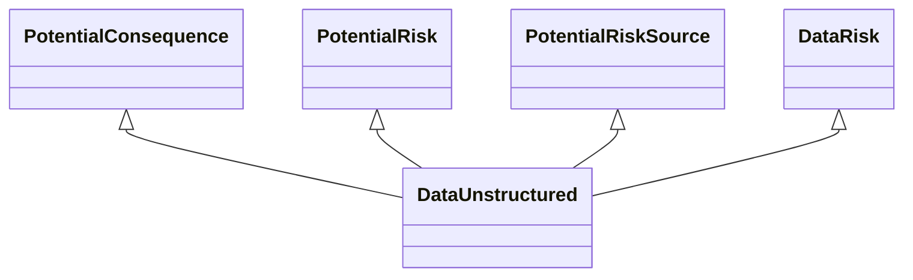

---
search:
  boost: 10.0
---

# Class: DataUnstructured 


_Concept representing data being unstructured_


<div data-search-exclude markdown="1">


URI: [risk:DataUnstructured](https://w3id.org/lmodel/dpv/risk/DataUnstructured)





## Inheritance
* [TechnicalRiskConcept](TechnicalRiskConcept.md) [ [PotentialConsequence](PotentialConsequence.md) [PotentialImpact](PotentialImpact.md) [PotentialRisk](PotentialRisk.md) [PotentialRiskSource](PotentialRiskSource.md)]
    * [DataRisk](DataRisk.md) [ [PotentialConsequence](PotentialConsequence.md) [PotentialRisk](PotentialRisk.md) [PotentialRiskSource](PotentialRiskSource.md)]
        * **DataUnstructured** [ [PotentialConsequence](PotentialConsequence.md) [PotentialRisk](PotentialRisk.md) [PotentialRiskSource](PotentialRiskSource.md)]


## Class Properties

| Property | Value |
| --- | --- |
| Class URI | [risk:DataUnstructured](https://w3id.org/lmodel/dpv/risk/DataUnstructured) |


## Slots

| Name | Cardinality and Range | Description | Inheritance |
| ---  | --- | --- | --- |


## In Subsets


* [RiskSubset](RiskSubset.md)


## Aliases


* Data Unstructured


## Identifier and Mapping Information


### Annotations

| property | value |
| --- | --- |
| upstream_iri | https://w3id.org/dpv/risk/owl#DataUnstructured |
| dpv_extension_slug | risk |


### Schema Source


* from schema: https://w3id.org/lmodel/dpv/risk


## Mappings

| Mapping Type | Mapped Value |
| ---  | ---  |
| self | risk:DataUnstructured |
| native | risk:DataUnstructured |
| exact | dpv_risk:DataUnstructured, dpv_risk_owl:DataUnstructured |


## LinkML Source

<!-- TODO: investigate https://stackoverflow.com/questions/37606292/how-to-create-tabbed-code-blocks-in-mkdocs-or-sphinx -->

### Direct

<details>
```yaml
name: DataUnstructured
annotations:
  upstream_iri:
    tag: upstream_iri
    value: https://w3id.org/dpv/risk/owl#DataUnstructured
  dpv_extension_slug:
    tag: dpv_extension_slug
    value: risk
description: Concept representing data being unstructured
in_subset:
- risk_subset
from_schema: https://w3id.org/lmodel/dpv/risk
aliases:
- Data Unstructured
exact_mappings:
- dpv_risk:DataUnstructured
- dpv_risk_owl:DataUnstructured
is_a: DataRisk
mixins:
- PotentialConsequence
- PotentialRisk
- PotentialRiskSource
class_uri: risk:DataUnstructured

```
</details>

### Induced

<details>
```yaml
name: DataUnstructured
annotations:
  upstream_iri:
    tag: upstream_iri
    value: https://w3id.org/dpv/risk/owl#DataUnstructured
  dpv_extension_slug:
    tag: dpv_extension_slug
    value: risk
description: Concept representing data being unstructured
in_subset:
- risk_subset
from_schema: https://w3id.org/lmodel/dpv/risk
aliases:
- Data Unstructured
exact_mappings:
- dpv_risk:DataUnstructured
- dpv_risk_owl:DataUnstructured
is_a: DataRisk
mixins:
- PotentialConsequence
- PotentialRisk
- PotentialRiskSource
class_uri: risk:DataUnstructured

```
</details></div>