---
search:
  boost: 10.0
---

# Class: Discrimination 


_Discrimination is the treatment of a person or particular group of_

_people differently, in a way that is worse than the way people are_

_usually treated_


<div data-search-exclude markdown="1">


URI: [risk:Discrimination](https://w3id.org/lmodel/dpv/risk/Discrimination)

```mermaid
 classDiagram
    class Discrimination
    click Discrimination href "../Discrimination/"
      PotentialConsequence <|-- Discrimination
        click PotentialConsequence href "../PotentialConsequence/"
      PotentialImpact <|-- Discrimination
        click PotentialImpact href "../PotentialImpact/"
      PotentialRisk <|-- Discrimination
        click PotentialRisk href "../PotentialRisk/"
      SocietalRiskConcept <|-- Discrimination
        click SocietalRiskConcept href "../SocietalRiskConcept/"
      

      Discrimination <|-- AgeDiscrimination
        click AgeDiscrimination href "../AgeDiscrimination/"
      Discrimination <|-- BelievesDiscrimination
        click BelievesDiscrimination href "../BelievesDiscrimination/"
      Discrimination <|-- CasteDiscrimination
        click CasteDiscrimination href "../CasteDiscrimination/"
      Discrimination <|-- DirectDiscrimination
        click DirectDiscrimination href "../DirectDiscrimination/"
      Discrimination <|-- DisabilityDiscrimination
        click DisabilityDiscrimination href "../DisabilityDiscrimination/"
      Discrimination <|-- ExcellenceDiscrimination
        click ExcellenceDiscrimination href "../ExcellenceDiscrimination/"
      Discrimination <|-- GeographicDiscrimination
        click GeographicDiscrimination href "../GeographicDiscrimination/"
      Discrimination <|-- IndirectDiscrimination
        click IndirectDiscrimination href "../IndirectDiscrimination/"
      Discrimination <|-- LanguageDiscrimination
        click LanguageDiscrimination href "../LanguageDiscrimination/"
      Discrimination <|-- NationalityDiscrimination
        click NationalityDiscrimination href "../NationalityDiscrimination/"
      Discrimination <|-- Racism
        click Racism href "../Racism/"
      Discrimination <|-- ReligiousDiscrimination
        click ReligiousDiscrimination href "../ReligiousDiscrimination/"
      Discrimination <|-- ReverseDiscrimination
        click ReverseDiscrimination href "../ReverseDiscrimination/"
      Discrimination <|-- Sexism
        click Sexism href "../Sexism/"
      Discrimination <|-- SexualOrientationDiscrimination
        click SexualOrientationDiscrimination href "../SexualOrientationDiscrimination/"
      Discrimination <|-- UnfavourableTreatment
        click UnfavourableTreatment href "../UnfavourableTreatment/"
      Discrimination <|-- WorkplaceDiscrimination
        click WorkplaceDiscrimination href "../WorkplaceDiscrimination/"
      

      
```





## Inheritance
* [SocietalRiskConcept](SocietalRiskConcept.md) [ [PotentialConsequence](PotentialConsequence.md) [PotentialImpact](PotentialImpact.md) [PotentialRisk](PotentialRisk.md) [PotentialRiskSource](PotentialRiskSource.md)]
    * **Discrimination** [ [PotentialConsequence](PotentialConsequence.md) [PotentialImpact](PotentialImpact.md) [PotentialRisk](PotentialRisk.md)]
        * [AgeDiscrimination](AgeDiscrimination.md) [ [PotentialConsequence](PotentialConsequence.md) [PotentialImpact](PotentialImpact.md) [PotentialRisk](PotentialRisk.md)]
        * [BelievesDiscrimination](BelievesDiscrimination.md) [ [PotentialConsequence](PotentialConsequence.md) [PotentialImpact](PotentialImpact.md) [PotentialRisk](PotentialRisk.md)]
        * [CasteDiscrimination](CasteDiscrimination.md) [ [PotentialConsequence](PotentialConsequence.md) [PotentialImpact](PotentialImpact.md) [PotentialRisk](PotentialRisk.md)]
        * [DirectDiscrimination](DirectDiscrimination.md) [ [PotentialConsequence](PotentialConsequence.md) [PotentialImpact](PotentialImpact.md) [PotentialRisk](PotentialRisk.md)]
        * [DisabilityDiscrimination](DisabilityDiscrimination.md) [ [PotentialConsequence](PotentialConsequence.md) [PotentialImpact](PotentialImpact.md) [PotentialRisk](PotentialRisk.md)]
        * [ExcellenceDiscrimination](ExcellenceDiscrimination.md) [ [PotentialConsequence](PotentialConsequence.md) [PotentialImpact](PotentialImpact.md) [PotentialRisk](PotentialRisk.md)]
        * [GeographicDiscrimination](GeographicDiscrimination.md) [ [PotentialConsequence](PotentialConsequence.md) [PotentialImpact](PotentialImpact.md) [PotentialRisk](PotentialRisk.md)]
        * [IndirectDiscrimination](IndirectDiscrimination.md) [ [PotentialConsequence](PotentialConsequence.md) [PotentialImpact](PotentialImpact.md) [PotentialRisk](PotentialRisk.md)]
        * [LanguageDiscrimination](LanguageDiscrimination.md) [ [PotentialConsequence](PotentialConsequence.md) [PotentialImpact](PotentialImpact.md) [PotentialRisk](PotentialRisk.md)]
        * [NationalityDiscrimination](NationalityDiscrimination.md) [ [PotentialConsequence](PotentialConsequence.md) [PotentialImpact](PotentialImpact.md) [PotentialRisk](PotentialRisk.md)]
        * [Racism](Racism.md) [ [PotentialConsequence](PotentialConsequence.md) [PotentialImpact](PotentialImpact.md) [PotentialRisk](PotentialRisk.md)]
        * [ReligiousDiscrimination](ReligiousDiscrimination.md) [ [PotentialConsequence](PotentialConsequence.md) [PotentialImpact](PotentialImpact.md) [PotentialRisk](PotentialRisk.md)]
        * [ReverseDiscrimination](ReverseDiscrimination.md) [ [PotentialConsequence](PotentialConsequence.md) [PotentialImpact](PotentialImpact.md) [PotentialRisk](PotentialRisk.md)]
        * [Sexism](Sexism.md) [ [PotentialConsequence](PotentialConsequence.md) [PotentialImpact](PotentialImpact.md) [PotentialRisk](PotentialRisk.md)]
        * [SexualOrientationDiscrimination](SexualOrientationDiscrimination.md) [ [PotentialConsequence](PotentialConsequence.md) [PotentialImpact](PotentialImpact.md) [PotentialRisk](PotentialRisk.md)]
        * [UnfavourableTreatment](UnfavourableTreatment.md) [ [PotentialConsequence](PotentialConsequence.md) [PotentialImpact](PotentialImpact.md) [PotentialRisk](PotentialRisk.md)]
        * [WorkplaceDiscrimination](WorkplaceDiscrimination.md) [ [PotentialConsequence](PotentialConsequence.md) [PotentialImpact](PotentialImpact.md) [PotentialRisk](PotentialRisk.md)]


## Class Properties

| Property | Value |
| --- | --- |
| Class URI | [risk:Discrimination](https://w3id.org/lmodel/dpv/risk/Discrimination) |


## Slots

| Name | Cardinality and Range | Description | Inheritance |
| ---  | --- | --- | --- |


## In Subsets


* [RiskSubset](RiskSubset.md)


## Aliases


* Discrimination


## Identifier and Mapping Information


### Annotations

| property | value |
| --- | --- |
| upstream_iri | https://w3id.org/dpv/risk/owl#Discrimination |
| dpv_extension_slug | risk |


### Schema Source


* from schema: https://w3id.org/lmodel/dpv/risk


## Mappings

| Mapping Type | Mapped Value |
| ---  | ---  |
| self | risk:Discrimination |
| native | risk:Discrimination |
| exact | dpv_risk:Discrimination, dpv_risk_owl:Discrimination |


## LinkML Source

<!-- TODO: investigate https://stackoverflow.com/questions/37606292/how-to-create-tabbed-code-blocks-in-mkdocs-or-sphinx -->

### Direct

<details>
```yaml
name: Discrimination
annotations:
  upstream_iri:
    tag: upstream_iri
    value: https://w3id.org/dpv/risk/owl#Discrimination
  dpv_extension_slug:
    tag: dpv_extension_slug
    value: risk
description: 'Discrimination is the treatment of a person or particular group of

  people differently, in a way that is worse than the way people are

  usually treated'
in_subset:
- risk_subset
from_schema: https://w3id.org/lmodel/dpv/risk
aliases:
- Discrimination
exact_mappings:
- dpv_risk:Discrimination
- dpv_risk_owl:Discrimination
is_a: SocietalRiskConcept
mixins:
- PotentialConsequence
- PotentialImpact
- PotentialRisk
class_uri: risk:Discrimination

```
</details>

### Induced

<details>
```yaml
name: Discrimination
annotations:
  upstream_iri:
    tag: upstream_iri
    value: https://w3id.org/dpv/risk/owl#Discrimination
  dpv_extension_slug:
    tag: dpv_extension_slug
    value: risk
description: 'Discrimination is the treatment of a person or particular group of

  people differently, in a way that is worse than the way people are

  usually treated'
in_subset:
- risk_subset
from_schema: https://w3id.org/lmodel/dpv/risk
aliases:
- Discrimination
exact_mappings:
- dpv_risk:Discrimination
- dpv_risk_owl:Discrimination
is_a: SocietalRiskConcept
mixins:
- PotentialConsequence
- PotentialImpact
- PotentialRisk
class_uri: risk:Discrimination

```
</details></div>