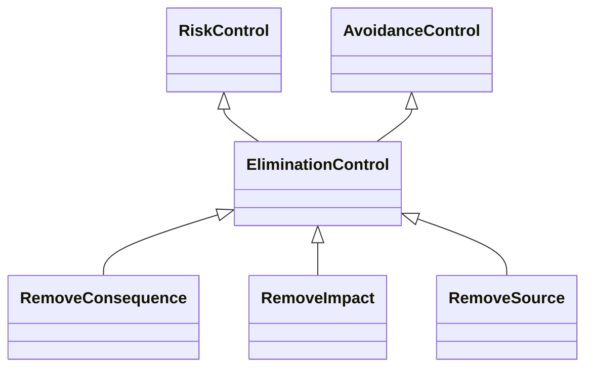

---
search:
  boost: 10.0
---

# Class: EliminationControl 


_Control that eliminates an event entirely such that the event does not_

_occur_


<div data-search-exclude markdown="1">


URI: [risk:EliminationControl](https://w3id.org/lmodel/dpv/risk/EliminationControl)





## Inheritance
* [RiskControl](RiskControl.md)
    * [ProactiveControl](ProactiveControl.md)
        * [AvoidanceControl](AvoidanceControl.md) [ [RiskControl](RiskControl.md)]
            * **EliminationControl** [ [RiskControl](RiskControl.md)]
                * [RemoveImpact](RemoveImpact.md) [ [RiskControl](RiskControl.md) [ImpactControl](ImpactControl.md)]
                * [RemoveSource](RemoveSource.md) [ [RiskControl](RiskControl.md) [SourceControl](SourceControl.md)]


## Class Properties

| Property | Value |
| --- | --- |
| Class URI | [risk:EliminationControl](https://w3id.org/lmodel/dpv/risk/EliminationControl) |


## Slots

| Name | Cardinality and Range | Description | Inheritance |
| ---  | --- | --- | --- |


## In Subsets


* [RiskSubset](RiskSubset.md)


## Aliases


* Elimination Control


## Comments

* Elimination requires the event's likelihood to be reduced to zero such
that the event cannot occur in the context. This can be done by
establishing methods to prevent the event from occurring (e.g.
gatekeeping filters) or by changing the underlying context (e.g.
replacing faulty device). The difference between
risk:ModificationControl and risk:EliminationControl is that
modification works to change the event characteristics whereas
elimination works on the context to prevent the event


## Identifier and Mapping Information


### Annotations

| property | value |
| --- | --- |
| upstream_iri | https://w3id.org/dpv/risk/owl#EliminationControl |
| dpv_extension_slug | risk |


### Schema Source


* from schema: https://w3id.org/lmodel/dpv/risk


## Mappings

| Mapping Type | Mapped Value |
| ---  | ---  |
| self | risk:EliminationControl |
| native | risk:EliminationControl |
| exact | dpv_risk:EliminationControl, dpv_risk_owl:EliminationControl |
| close | iso42001:AIReferenceControl |


## LinkML Source

<!-- TODO: investigate https://stackoverflow.com/questions/37606292/how-to-create-tabbed-code-blocks-in-mkdocs-or-sphinx -->

### Direct

<details>
```yaml
name: EliminationControl
annotations:
  upstream_iri:
    tag: upstream_iri
    value: https://w3id.org/dpv/risk/owl#EliminationControl
  dpv_extension_slug:
    tag: dpv_extension_slug
    value: risk
description: 'Control that eliminates an event entirely such that the event does not

  occur'
comments:
- 'Elimination requires the event''s likelihood to be reduced to zero such

  that the event cannot occur in the context. This can be done by

  establishing methods to prevent the event from occurring (e.g.

  gatekeeping filters) or by changing the underlying context (e.g.

  replacing faulty device). The difference between

  risk:ModificationControl and risk:EliminationControl is that

  modification works to change the event characteristics whereas

  elimination works on the context to prevent the event'
in_subset:
- risk_subset
from_schema: https://w3id.org/lmodel/dpv/risk
aliases:
- Elimination Control
exact_mappings:
- dpv_risk:EliminationControl
- dpv_risk_owl:EliminationControl
close_mappings:
- iso42001:AIReferenceControl
is_a: AvoidanceControl
mixins:
- RiskControl
class_uri: risk:EliminationControl

```
</details>

### Induced

<details>
```yaml
name: EliminationControl
annotations:
  upstream_iri:
    tag: upstream_iri
    value: https://w3id.org/dpv/risk/owl#EliminationControl
  dpv_extension_slug:
    tag: dpv_extension_slug
    value: risk
description: 'Control that eliminates an event entirely such that the event does not

  occur'
comments:
- 'Elimination requires the event''s likelihood to be reduced to zero such

  that the event cannot occur in the context. This can be done by

  establishing methods to prevent the event from occurring (e.g.

  gatekeeping filters) or by changing the underlying context (e.g.

  replacing faulty device). The difference between

  risk:ModificationControl and risk:EliminationControl is that

  modification works to change the event characteristics whereas

  elimination works on the context to prevent the event'
in_subset:
- risk_subset
from_schema: https://w3id.org/lmodel/dpv/risk
aliases:
- Elimination Control
exact_mappings:
- dpv_risk:EliminationControl
- dpv_risk_owl:EliminationControl
close_mappings:
- iso42001:AIReferenceControl
is_a: AvoidanceControl
mixins:
- RiskControl
class_uri: risk:EliminationControl

```
</details></div>