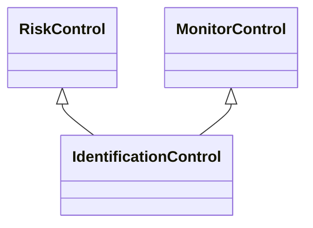

---
search:
  boost: 10.0
---

# Class: IdentificationControl 


_Control that identifies the characteristics of an event_


<div data-search-exclude markdown="1">


URI: [risk:IdentificationControl](https://w3id.org/lmodel/dpv/risk/IdentificationControl)





## Inheritance
* [RiskControl](RiskControl.md)
    * [ProactiveControl](ProactiveControl.md)
        * [MonitorControl](MonitorControl.md) [ [RiskControl](RiskControl.md)]
            * **IdentificationControl** [ [RiskControl](RiskControl.md)]


## Class Properties

| Property | Value |
| --- | --- |
| Class URI | [risk:IdentificationControl](https://w3id.org/lmodel/dpv/risk/IdentificationControl) |


## Slots

| Name | Cardinality and Range | Description | Inheritance |
| ---  | --- | --- | --- |


## In Subsets


* [RiskSubset](RiskSubset.md)


## Aliases


* Identification Control


## Comments

* Identification in the context of an event refers to its characteristics
such as likelihood, severity, as well as contextual metrics such as
amount of data or power being used, or affected entities or things, and
which can be used to categorise the event in terms of risk level or
other contextual groupings


## Identifier and Mapping Information


### Annotations

| property | value |
| --- | --- |
| upstream_iri | https://w3id.org/dpv/risk/owl#IdentificationControl |
| dpv_extension_slug | risk |


### Schema Source


* from schema: https://w3id.org/lmodel/dpv/risk


## Mappings

| Mapping Type | Mapped Value |
| ---  | ---  |
| self | risk:IdentificationControl |
| native | risk:IdentificationControl |
| exact | dpv_risk:IdentificationControl, dpv_risk_owl:IdentificationControl |
| close | iso42001:AIReferenceControl |


## LinkML Source

<!-- TODO: investigate https://stackoverflow.com/questions/37606292/how-to-create-tabbed-code-blocks-in-mkdocs-or-sphinx -->

### Direct

<details>
```yaml
name: IdentificationControl
annotations:
  upstream_iri:
    tag: upstream_iri
    value: https://w3id.org/dpv/risk/owl#IdentificationControl
  dpv_extension_slug:
    tag: dpv_extension_slug
    value: risk
description: Control that identifies the characteristics of an event
comments:
- 'Identification in the context of an event refers to its characteristics

  such as likelihood, severity, as well as contextual metrics such as

  amount of data or power being used, or affected entities or things, and

  which can be used to categorise the event in terms of risk level or

  other contextual groupings'
in_subset:
- risk_subset
from_schema: https://w3id.org/lmodel/dpv/risk
aliases:
- Identification Control
exact_mappings:
- dpv_risk:IdentificationControl
- dpv_risk_owl:IdentificationControl
close_mappings:
- iso42001:AIReferenceControl
is_a: MonitorControl
mixins:
- RiskControl
class_uri: risk:IdentificationControl

```
</details>

### Induced

<details>
```yaml
name: IdentificationControl
annotations:
  upstream_iri:
    tag: upstream_iri
    value: https://w3id.org/dpv/risk/owl#IdentificationControl
  dpv_extension_slug:
    tag: dpv_extension_slug
    value: risk
description: Control that identifies the characteristics of an event
comments:
- 'Identification in the context of an event refers to its characteristics

  such as likelihood, severity, as well as contextual metrics such as

  amount of data or power being used, or affected entities or things, and

  which can be used to categorise the event in terms of risk level or

  other contextual groupings'
in_subset:
- risk_subset
from_schema: https://w3id.org/lmodel/dpv/risk
aliases:
- Identification Control
exact_mappings:
- dpv_risk:IdentificationControl
- dpv_risk_owl:IdentificationControl
close_mappings:
- iso42001:AIReferenceControl
is_a: MonitorControl
mixins:
- RiskControl
class_uri: risk:IdentificationControl

```
</details></div>